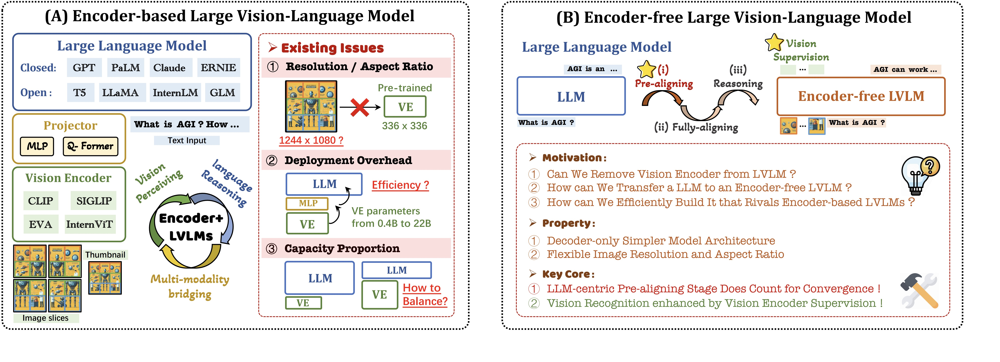
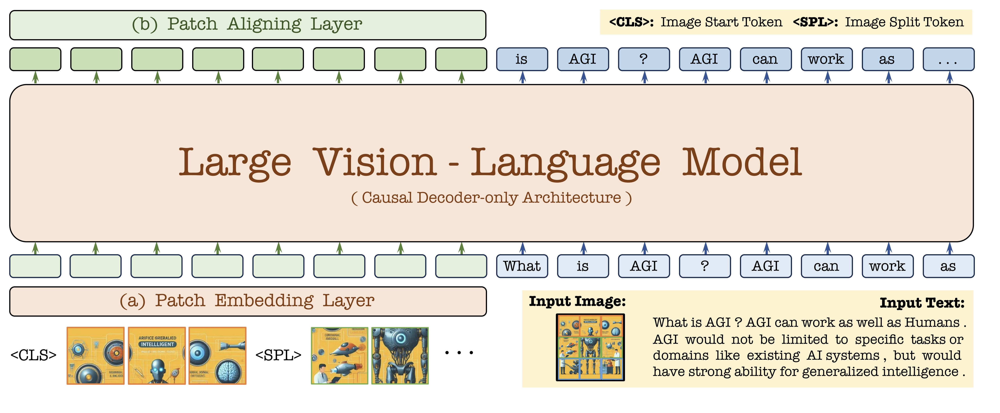
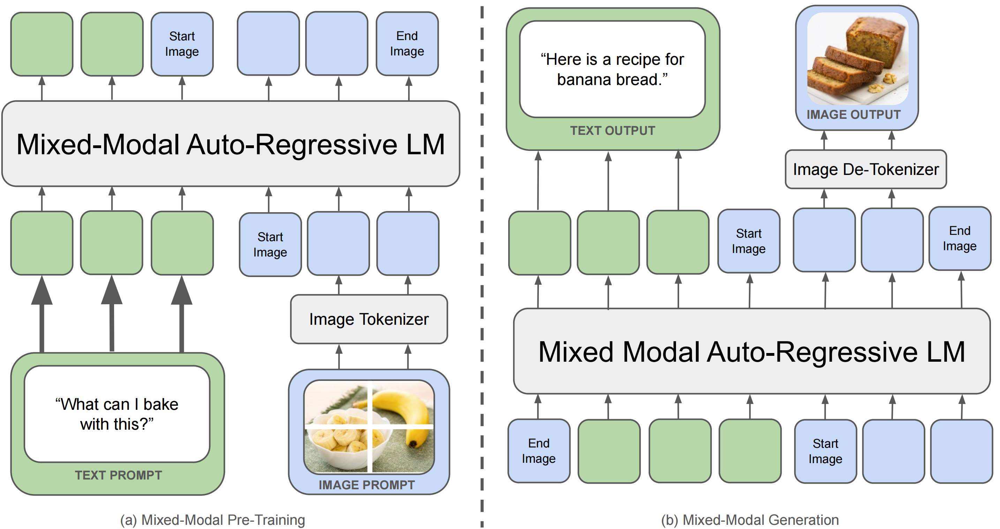
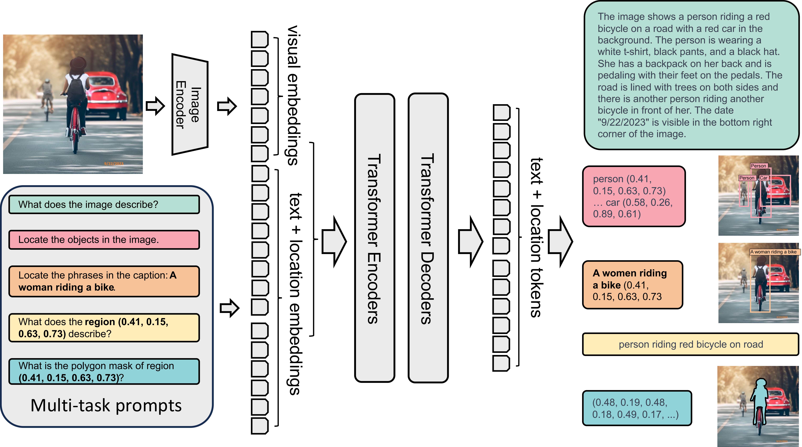

  

<strong>🌐✨关于近期的🔥VLMs🔥的github Awesome List</strong> 
<strong>中文</strong> | <strong><a href="./README_LVLMs.md">English🚀</a></strong> 
<strong><a href="./README_LLM.md">LLMs🚀</a></strong> | <strong>VLMs</strong>

## 基准测试结果汇总

Benchmark结果**精简版**汇总如下：

|                    模型                    |                          语言骨干网                          |                          视觉编码器                          |                           模型链接                           | TextVQA | VQA-v2 | ScienceQA | ScienceQA-IMG |  GQA  | VizWiz | VizWiz-VQA |                      POPE                       | LLaVA-Bench-Wild |  MMB  | MMB_ZH | MMB(T/D)  | MMB_ZH(T/D) |  MME（P/C）  | MM-Vet | MMMU_val | MMMU_test |   MMMU    | MathVista |   SEED    | SEED-IMG  |
| :----------------------------------------: | :----------------------------------------------------------: | :----------------------------------------------------------: | :----------------------------------------------------------: | :-----: | :----: | :-------: | :-----------: | :---: | :----: | :--------: | :---------------------------------------------: | :--------------: | :---: | :----: | :-------: | :---------: | :----------: | :----: | :------: | :-------: | :-------: | :-------: | :-------: | :-------: |
|                   MGM-2B                   |                           Gemma-2B                           |                            CLIP-L                            |        [Link](https://huggingface.co/YanweiLi/MGM-2B)        |  56.2   |        |           |               |       |        |            |                                                 |                  | 59.8  |        |           |             |   1341/312   |  31.1  |   31.7   |   29.1    |           |   29.4    |           |           |
|                   MGM-7B                   |                        Vicuna-7B-v1.5                        |                            CLIP-L                            |        [Link](https://huggingface.co/YanweiLi/MGM-7B)        |  65.2   |        |           |               |       |        |            |                                                 |                  | 69.3  |        |           |             |   1523/316   |  40.8  |   36.1   |   32.8    |           |   31.4    |           |           |
|                  MGM-13B                   |                       Vicuna-13B-v1.5                        |                            CLIP-L                            |       [Link](https://huggingface.co/YanweiLi/MGM-13B)        |  65.9   |        |           |               |       |        |            |                                                 |                  | 68.5  |        |           |             |   1565/322   |   46   |   38.1   |   33.5    |           |    37     |           |           |
|                   MGM-8B                   |                     LLaMA-3-8B-Instruct                      |                            CLIP-L                            |        [Link](https://huggingface.co/YanweiLi/MGM-8B)        |  67.6   |        |           |               |       |        |            |                                                 |                  | 72.7  |        |           |             |   1606/341   |  47.3  |   38.2   |   36.3    |           |           |           |           |
|                  MGM-8x7B                  |                  Mixtral-8x7B-Instruct-v0.1                  |                            CLIP-L                            |       [Link](https://huggingface.co/YanweiLi/MGM-8x7B)       |  69.2   |        |           |               |       |        |            |                                                 |                  | 75.6  |        |           |             |   1639/379   |  45.8  |   41.8   |   37.1    |           |   41.8    |           |           |
|                  MGM-34B                   |                     Nous-Hermes-2-Yi-34B                     |                            CLIP-L                            |       [Link](https://huggingface.co/YanweiLi/MGM-34B)        |  70.1   |        |           |               |       |        |            |                                                 |                  | 79.6  |        |           |             |   1666/439   |   53   |   48.7   |   43.6    |           |   38.9    |           |           |
|                 MGM-7B-HD                  |                        Vicuna-7B-v1.5                        |                            CLIP-L                            |      [Link](https://huggingface.co/YanweiLi/MGM-7B-HD)       |  68.4   |        |           |               |       |        |            |                                                 |                  | 65.8  |        |           |             |   1546/319   |  41.3  |   36.8   |   32.9    |           |   32.2    |           |           |
|                 MGM-13B-HD                 |                       Vicuna-13B-v1.5                        |                            CLIP-L                            |      [Link](https://huggingface.co/YanweiLi/MGM-13B-HD)      |  70.2   |        |           |               |       |        |            |                                                 |                  | 68.6  |        |           |             |   1597/320   |  50.5  |   37.3   |   35.1    |           |    37     |           |           |
|                 MGM-8B-HD                  |                     LLaMA-3-8B-Instruct                      |                            CLIP-L                            |      [Link](https://huggingface.co/YanweiLi/MGM-8B-HD)       |  71.6   |        |           |               |       |        |            |                                                 |                  |       |        |           |             |   1532/357   |        |    37    |           |           |           |           |           |
|                MGM-8x7B-HD                 |                  Mixtral-8x7B-Instruct-v0.1                  |                            CLIP-L                            |     [Link](https://huggingface.co/YanweiLi/MGM-8x7B-HD)      |  71.9   |        |           |               |       |        |            |                                                 |                  | 74.7  |        |           |             |   1633/356   |  53.5  |    40    |    37     |           |   43.1    |           |           |
|                 MGM-34B-HD                 |                     Nous-Hermes-2-Yi-34B                     |                            CLIP-L                            |      [Link](https://huggingface.co/YanweiLi/MGM-34B-HD)      |  74.1   |        |           |               |       |        |            |                                                 |                  | 80.6  |        |           |             |   1659/482   |  59.3  |    48    |   44.9    |           |   43.3    |           |           |
|           bunny-phi-1.5-eva-lora           |                           phi-1.5                            |                           EVA-CLIP                           | [Link](https://huggingface.co/BoyaWu10/bunny-phi-1.5-eva-lora) |         |  76.5  |           |     58.2      | 60.4  |        |            |                      86.1                       |                  |       |        | 60.9/56.8 |             | 1213.7/278.9 |        |    30    |   28.4    |           |           |           |  56.4/-   |
|         bunny-stablelm-2-eva-lora          |                          stablelm-2                          |                           EVA-CLIP                           | [Link](https://huggingface.co/BoyaWu10/bunny-stablelm-2-eva-lora) |         |  74.6  |           |      60       | 56.7  |        |            |                      84.8                       |                  |       |        | 58.4/56.4 |             |   1301/235   |        |   29.8   |   29.4    |           |           |           |  55.3/-   |
|            bunny-phi-2-eva-lora            |                            phi-2                             |                           EVA-CLIP                           | [Link](https://huggingface.co/BoyaWu10/bunny-phi-2-eva-lora) |         |  78.9  |           |     69.1      | 62.3  |        |            |                      87.1                       |                  |       |        | 68.6/67.4 |             |  1421/285.4  |        |   35.9   |   32.6    |           |           |           |  62.2/-   |
|         bunny-phi-1.5-siglip-lora          |                           phi-1.5                            |                            SigLIP                            | [Link](https://huggingface.co/BoyaWu10/bunny-phi-1.5-siglip-lora) |         |   78   |           |     61.3      | 61.1  |        |            |                      85.8                       |                  |       |        | 61.2/59.7 |             |  1230/237.5  |        |    30    |   29.1    |           |           |           |  57.7/-   |
|        bunny-stablelm-2-siglip-lora        |                          stablelm-2                          |                            SigLIP                            | [Link](https://huggingface.co/BoyaWu10/bunny-stablelm-2-siglip-lora) |         |  78.9  |           |     61.1      | 60.9  |        |            |                      85.9                       |                  |       |        | 65.1/62.8 |             | 1366.8/236.1 |        |   29.9   |   29.8    |           |           |           |  58.8/-   |
| Bunny-v1.0-2B-zh/bunny-qwen1.5-1.8b-siglip |                           qwen1.5                            |                            SigLIP                            |     [Link](https://huggingface.co/BAAI/Bunny-v1_0-2B-zh)     |         |  76.6  |           |     64.6      | 59.6  |        |            |                      85.8                       |                  |       |        | 59.8/59.1 |  59.5/58.5  | 1300.8/254.3 |        |   34.4   |   30.4    |           |           |           |  55.4/-   |
|   Bunny-v1.0-3B-zh/bunny-minicpm-siglip    |                           minicpm                            |                            SigLIP                            |     [Link](https://huggingface.co/BAAI/Bunny-v1_0-3B-zh)     |         |  78.6  |           |     68.7      | 60.8  |        |            |                      86.5                       |                  |       |        | 66.1/65.5 |  64.9/63.6  | 1410.4/281.4 |        |   35.4   |   32.4    |           |           |           |  59.6/-   |
|      Bunny-v1.0-3B/bunny-phi-2-siglip      |                            phi-2                             |                            SigLIP                            |      [Link](https://huggingface.co/BAAI/Bunny-v1_0-3B)       |         |  79.8  |           |     70.9      | 62.5  |        |            |                      86.8                       |                  |       |        | 69.2/68.6 |             | 1488.8/289.3 |        |   38.2   |    33     |           |           |           |  62.5/-   |
|               Bunny-v1.0-4B                |                    Phi-3-mini-4k-instruct                    |                            SigLIP                            |          https://huggingface.co/BAAI/Bunny-v1_0-4B           |         |  81.5  |           |     75.1      | 63.5  |        |            |                      86.7                       |                  |       |        | 74.0/73.5 |             | 1495.2/338.9 |        |   40.1   |   39.1    |           |           |           | 64.5/72.1 |
|               Bunny-v1.1-4B                |                    Phi-3-mini-5k-instruct                    |                            SigLIP                            |          https://huggingface.co/BAAI/Bunny-v1_1-4B           |         |  81.7  |           |     76.3      | 63.4  |        |            |                       87                        |                  |       |        | 74.1/74.1 |  66.3/64.8  | 1503.9/362.9 |        |   40.2   |   38.8    |           |           |           | 64.6/71.7 |
|             Bunny-Llama-3-8B-V             |                     Llama-3-8B-Instruct.                     |                            SigLIP                            |    [Link](https://huggingface.co/BAAI/Bunny-Llama-3-8B-V)    |         |  82.6  |           |     80.4      | 64.8  |        |            |                      86.9                       |                  |       |        | 77.2/76.7 |  73.8/72.3  | 1588.9/321.1 |        |   42.8   |    39     |           |           |           | 65.9/73.3 |
|            LLaVA-1.6-vicuna-7b             |                          Vicuna-7B                           |                            CLIP-L                            | [Link](https://huggingface.co/liuhaotian/llava-v1.6-vicuna-7b) |  64.9   |  81.8  |   70.1    |               | 64.2  |  57.6  |            |                      86.5                       |       81.6       | 67.4  |  60.6  |           |             |   1519/332   |  43.9  |          |           |   35.8    |   34.6    |           |   70.2    |
|            LLaVA-1.6-vicuna-13b            |                          Vicuna-13B                          |                            CLIP-L                            | [Link](https://huggingface.co/liuhaotian/llava-v1.6-vicuna-13b) |  67.1   |  82.8  |   73.6    |               | 65.4  |  60.5  |            |                      86.2                       |       87.3       |  70   |  64.4  |           |             |   1575/326   |  48.4  |          |           |   36.2    |   35.3    |           |   71.9    |
|            LLaVA-1.6-mistral-7b            |                          Mistral-7B                          |                            CLIP-L                            | [Link](https://huggingface.co/liuhaotian/llava-v1.6-mistral-7b) |  65.7   |  82.2  |   72.8    |               | 64.8  |   60   |            |                      86.7                       |       83.2       | 68.7  |  61.2  |           |             |   1498/321   |  47.3  |          |           |   35.3    |   37.7    |           |   72.2    |
|               LLaVA-1.6-34b                |                        Hermes-Yi-34B                         |                            CLIP-L                            |   [Link](https://huggingface.co/liuhaotian/llava-v1.6-34b)   |  69.5   |  83.7  |   81.8    |               | 67.1  |  63.8  |            |                      87.7                       |       89.6       | 79.3  |   79   |           |             |   1631/397   |  57.4  |          |           |   51.1    |   46.5    |           |   75.9    |
|                LLaVA-1.5-7b                |                          Vicuna-7B                           |                       CLIP-ViT-L-336px                       |   [Link](https://huggingface.co/liuhaotian/llava-v1.5-7b)    |  58.2   |  78.5  |   66.8    |               |  62   |   50   |            |                      85.9                       |       65.4       | 64.3  |  58.3  |           |             |  1510.7/---  |  31.1  |          |           |           |           |   58.6    |           |
|               LLaVA-1.5-13b                |                          Vicuna-13B                          |                       CLIP-ViT-L-336px                       |   [Link](https://huggingface.co/liuhaotian/llava-v1.5-13b)   |  61.3   |   80   |   71.6    |               | 63.3  |  53.6  |            |                      85.9                       |       72.5       | 67.7  |  63.6  |           |             |  1531.3/---  |  36.1  |          |           |           |           |   61.6    |           |
|             LLaVA-1.5-7b-lora              |                          Vicuna-7B                           |                       CLIP-ViT-L-336px                       | [Link](https://huggingface.co/liuhaotian/llava-v1.5-7b-lora) |  58.2   |  79.1  |   68.4    |               |  63   |  47.8  |            |                      86.4                       |       67.9       | 66.1  |  58.9  |           |             |  1476.9/---  |  30.2  |          |           |           |           |   60.1    |           |
|             LLaVA-1.5-13b-lora             |                          Vicuna-13B                          |                       CLIP-ViT-L-336px                       | [Link](https://huggingface.co/liuhaotian/llava-v1.5-13b-lora) |  60.2   |   80   |   71.2    |               | 63.3  |  58.9  |            |                      86.7                       |       69.5       | 68.5  |  61.5  |           |             |  1541.7/---  |  38.3  |          |           |           |           |   61.3    |           |
|                CogVLM-Chat                 |                        Vicuna-7B-v1.5                        |                         EVA2-CLIP-E                          |     [Link](https://huggingface.co/THUDM/cogvlm-chat-hf)      |  70.4   |  82.3  |   91.2    |     92.72     | 64.87 |        |    75.7    |                      87.9                       |                  | 77.6  |        |           |             |              |  51.1  |          |           |   41.1    |   34.5    |   72.5    |           |
|                  CogAgent                  |                          Vicuna-7B                           |                        CLIP-ViT-L/14                         |     [Link](https://huggingface.co/THUDM/cogagent-vqa-hf)     |  76.1   |  83.7  |           |               |       |        |            |                      85.9                       |                  |       |        |           |             |              |        |          |           |           |           |           |           |
|          HPT 1.5 Air(Llama-3-8B)           |                          Llama-3-8B                          | [siglip-so400m-patch14-384](https://huggingface.co/google/siglip-so400m-patch14-384) | [Link](https://huggingface.co/HyperGAI/HPT1_5-Air-Llama-3-8B-Instruct-multimodal) |         |        |   82.7    |               |       |        |            |                      90.1                       |                  | 75.2  |        |           |             |              |        |          |           |   43.2    |   45.7    |           |   72.5    |
|                MiniGPT4-V2                 |                       LLaMA2-chat (7B)                       |                             EVA                              |                                                              |         |        |           |               | 60.3  |  32.9  |            |                                                 |                  |       |        |           |             |              |        |          |           |           |           |           |           |
|              MiniGPT4-V2-chat              |                       LLaMA2-chat (7B)                       |                             EVA                              |                                                              |         |        |           |               | 60.1  |  53.6  |            |                                                 |                  |       |        |           |             |              |        |          |           |           |           |           |           |
|             TinyGPT-V (Phi-2)              |                            Phi-2                             |                             EVA                              | [Link](https://huggingface.co/HyperGAI/HPT1_5-Air-Llama-3-8B-Instruct-multimodal) |         |        |           |               | 38.9  |  37.8  |            |                                                 |                  |       |        |           |             |              |        |          |           |           |           |           |           |
|            TinyGPT-V (Phi-1.5)             |                           Phi-1.5                            |                             EVA                              |                                                              |         |        |           |               | 34.3  |  28.4  |            |                                                 |                  |       |        |           |             |              |        |          |           |           |           |           |           |
|              PaliGemma-PT-224              |                           Gemma-2B                           |                       SigLIP-So400m/14                       |  [Link](https://huggingface.co/google/paligemma-3b-pt-224)   |  55.47  | 83.19  |   95.39   |               | 65.61 |        |    73.7    | 87.80、85.87、84.27(random/popular/adversarial) |                  |       |        |           |             |              |        |          |           |           |           |           |           |
|              PaliGemma-PT-448              |                           Gemma-2B                           |                       SigLIP-So400m/14                       |  [Link](https://huggingface.co/google/paligemma-3b-pt-448)   |  73.15  | 85.64  |   95.93   |               | 67.03 |        |   75.52    | 88.23、86.77、85.90(random/popular/adversarial) |                  |       |        |           |             |              |        |          |           |           |           |           |           |
|              PaliGemma-PT-896              |                           Gemma-2B                           |                       SigLIP-So400m/14                       |  [Link](https://huggingface.co/google/paligemma-3b-pt-896)   |  76.48  |        |           |               |       |        |            |                                                 |                  |       |        |           |             |              |        |          |           |           |           |           |           |
|             PaliGemma-mix-224              |                           Gemma-2B                           |                       SigLIP-So400m/14                       |  [Link](https://huggingface.co/google/paligemma-3b-mix-224)  |         |        |           |               |       |        |            | 88.00、86.63、85.67(random/popular/adversarial) |                  |       |        |           |             |              |        |          |           |           |           |           |           |
|             PaliGemma-mix-448              |                           Gemma-2B                           |                       SigLIP-So400m/14                       |  [Link](https://huggingface.co/google/paligemma-3b-mix-448)  |         |        |           |               |       |        |            | 89.37、88.40、87.47(random/popular/adversarial) |                  |       |        |           |             |              |        |          |           |           |           |           |           |
|               MobileVLM-1.7B               |                       MobileLLaMA 1.4B                       |                        CLIP ViT-L/14                         |      [Link](https://huggingface.co/mtgv/MobileVLM-1.7B)      |  41.5   |        |           |     57.3      | 56.1  |        |            |                      84.5                       |                  | 53.2  |        |           |             |  ---/1196.2  |        |          |           |           |           |           |           |
|             MobileVLM V2 1.7B              |                       MobileLLaMA 1.4B                       |                        CLIP ViT-L/14                         |    [Link](https://huggingface.co/mtgv/MobileVLM_V2-1.7B)     |  52.1   |        |           |     66.7      | 59.3  |        |            |                      84.3                       |                  | 57.7  |        |           |             |  ---/1302.8  |        |          |           |           |           |           |           |
|                MobileVLM-3B                |                       MobileLLaMA 2.7B                       |                        CLIP ViT-L/14                         |       [Link](https://huggingface.co/mtgv/MobileVLM-3B)       |  47.5   |        |           |     61.2      | 59.0  |        |            |                      84.9                       |                  | 59.6  |        |           |             |  ---/1288.9  |        |          |           |           |           |           |           |
|              MobileVLM V2 3B               |                       MobileLLaMA 2.7B                       |                        CLIP ViT-L/14                         |     [Link](https://huggingface.co/mtgv/MobileVLM_V2-3B)      |  57.5   |        |           |     70.0      | 61.1  |        |            |                      84.7                       |                  | 63.2  |        |           |             |  ---/1440.5  |        |          |           |           |           |           |           |
|              MobileVLM V2 7B               |                          Vicuna-7B                           |                        CLIP ViT-L/14                         |     [Link](https://huggingface.co/mtgv/MobileVLM_V2-7B)      |  62.3   |        |           |     74.8      | 62.6  |        |            |                      85.3                       |                  | 69.2  |        |           |             |  ---/1560.7  |        |          |           |           |           |           |           |
|                LLaVA-Phi-3B                |                          Phi-2-2.7B                          |                            SigLIP                            |                                                              |  48.6   |  71.4  |           |               |       |        |            |                      85.0                       |                  | 59.8  |        |           |             |  ---/1335.1  |  28.9  |          |           |           |           |           |           |
|                 Mipha-1.6B                 |                         Phi-1.5-1.3B                         |                       SigLIP-SO (0.4B)                       |   [Link](https://huggingface.co/zhumj34/Mipha-phi1_5-1.6B)   |  45.6   |  77.5  |           |     68.4      | 62.7  |        |            |                      86.9                       |                  | 57.7  |        |           |             | 247.9/1203.1 |  23.5  |          |           |           |           |           |           |
|                 Mipha-2.4B                 |                           Gemma-2B                           |                            SigLIP                            |                                                              |  52.4   |  79.5  |           |     58.3      | 63.3  |        |            |                      86.6                       |                  | 59.4  |        |           |             | 265.7/1397.1 |  29.9  |          |           |           |           |           |           |
|                  Mipha-3B                  |                          Phi-2-2.7B                          |                          SigLIP-SO                           |       [Link](https://huggingface.co/zhumj34/Mipha-3B)        |  56.6   |  81.3  |           |     65.3      | 63.9  |        |            |                      86.7                       |                  | 69.7  |        |           |             | 295.0/1488.9 |  32.1  |          |           |           |           |           |           |
|              LLaVA-Phi-3-mini              |                    Phi-3-mini-4k-instruct                    |                            CLIP-L                            |  [Link](https://huggingface.co/xtuner/llava-phi-3-mini-hf)   |  57.8   |        |   73.7    |               | 61.5  |        |            |                      87.3                       |                  | 69.2  |        |           |             |   313/1477   |        |   41.4   |           |           |           |           |   70.0    |
|                 Imp-v1-3B                  |                          Phi-2-2.7B                          |                        SigLIP-SO@384                         |           https://huggingface.co/MILVLG/imp-v1-3b            |  59.34  | 81.42  |           |     69.26     | 64.40 |        |            |                      87.85                      |                  | 67.69 |        |           |             |  ---/1502.8  |  33.6  |          |           |           |           |           |           |
|            Imp-v1.5-2B-Qwen1.5             |                        Qwen-1.5-1.8B                         |                        SigLIP-SO@384                         |  [Link](https://huggingface.co/MILVLG/Imp-v1.5-2B-Qwen1.5)   |  54.5   |  79.2  |           |     66.1      | 61.9  |  39.6  |            |                      86.7                       |                  | 63.8  |  61.3  |           |             |  ---/1304.8  |  33.5  |          |           |           |           |           |           |
|              Imp-v1.5-3B-phi2              |                          Phi-2-2.7B                          |                        SigLIP-SO@384                         |    [Link](https://huggingface.co/MILVLG/Imp-v1.5-3B-Phi2)    |  59.8   |  81.2  |           |     72.8      | 63.5  |  54.1  |            |                      88.0                       |                  | 72.9  |  46.7  |           |             |  ---/1446.4  |  43.3  |          |           |           |           |           |           |
|              Imp-v1.5-4B-phi3              |                          Phi-3-3.8B                          |                        SigLIP-SO@384                         |    [Link](https://huggingface.co/MILVLG/Imp-v1.5-4B-Phi3)    |  60.2   |  81.5  |           |     78.0      | 63.5  |  51.2  |            |                      86.9                       |                  | 73.3  |  61.1  |           |             |  ---/1507.7  |  44.6  |          |           |           |           |           |           |
|           MoE-LLaVA-1.6B×4-Top2            |                        StableLM-1.6B                         |                                                              | [Link](https://huggingface.co/LanguageBind/MoE-LLaVA-StableLM-1.6B-4e) [Link](https://modelscope.cn/models/PKU-YuanLab/MoE-LLaVA-StableLM-1.6B-4e) |  50.1   |  76.7  |           |     62.6      | 60.3  |  36.2  |            |                      85.7                       |                  | 60.2  |        |           |             |  ---/1318.1  |  26.9  |          |           |           |           |           |           |
|           MoE-LLaVA-1.8B×4-Top2            |                          Qwen-1.8B                           |                                                              | [Link](https://huggingface.co/LanguageBind/MoE-LLaVA-Qwen-1.8B-4e) [Link]( https://modelscope.cn/models/PKU-YuanLab/MoE-LLaVA-Qwen-1.8B-4e) |  48.0   |  76.2  |           |     63.1      | 61.5  |  32.6  |            |                      87.0                       |                  | 59.6  |        |           |             |  ---/1291.6  |  25.3  |          |           |           |           |           |           |
|           MoE-LLaVA-2.7B×4-Top2            |                          Phi2-2.7B                           |                                                              | [Link](https://huggingface.co/LanguageBind/MoE-LLaVA-Phi2-2.7B-4e) [Link]( https://modelscope.cn/models/PKU-YuanLab/MoE-LLaVA-Phi2-2.7B-4e) |  51.4   |  77.6  |           |     68.5      | 61.4  |  43.9  |            |                      86.3                       |                  | 65.2  |        |           |             |  ---/1423.0  |  34.3  |          |           |           |           |           |           |
|         MoE-LLaVA-1.6B×4-Top2-384          |                        StableLM-1.6B                         |                                                              | [Link](https://huggingface.co/LanguageBind/MoE-LLaVA-StableLM-1.6B-4e-384) [Link]( https://modelscope.cn/models/PKU-YuanLab/MoE-LLaVA-StableLM-1.6B-4e-384) |  54.3   |  78.6  |           |     63.9      | 61.5  |  40.5  |            |                      85.9                       |                  | 63.3  |        |           |             |  ---/1335.7  |  32.3  |          |           |           |           |           |           |
|         MoE-LLaVA-2.7B×4-Top2-384          |                          Phi2-2.7B                           |                                                              | [Link](https://huggingface.co/LanguageBind/MoE-LLaVA-Phi2-2.7B-4e-384) [Link]( https://modelscope.cn/models/PKU-YuanLab/MoE-LLaVA-Phi2-2.7B-4e-384) |  57.0   |  79.9  |           |     70.3      | 62.6  |  43.7  |            |                      85.7                       |                  | 68.0  |        |           |             |  ---/1431.3  |  35.9  |          |           |           |           |           |           |
|                   Cobra                    |                          Mamba-2.8B                          |                        DINOv2、SigLIP                        |         [Link](https://huggingface.co/han1997/cobra)         |         |        |           |               | 58.5  |  52.0  |            |                      88.0                       |                  |       |        |           |             |              |        |          |           |           |           |           |           |
|                  Vary-toy                  |                          Qwen-1.8B                           |                             CLIP                             |      [Link](https://huggingface.co/HaoranWei/Vary-toy)       |         |        |           |               |       |        |            |                                                 |                  |       |        |           |             |              |  29.0  |          |           |           |           |           |           |
|                   ALLaVA                   |                          Phi2-2.7B                           |                      CLIP-ViT-L/14@336                       | [Link](https://huggingface.co/FreedomIntelligence/ALLaVA-3B) |  49.5   |        |           |               | 48.8  |        |            |                                                 |       69.4       | 64.0  |        |           |             |  ---/1623.2  |  32.2  |   35.3   |           |           |           |           |   65.2    |
|               ALLaVA-Longer                |                          Phi2-2.7B                           |                      CLIP-ViT-L/14@336                       | [Link](https://huggingface.co/FreedomIntelligence/ALLaVA-3B-Longer) |  50.3   |        |           |               | 50.0  |        |            |                                                 |       71.7       | 64.6  |        |           |             |  ---/1564.6  |  35.5  |   33.2   |           |           |           |           |   65.6    |
|                   MM1-3B                   |          3B transformer decoder-only language model          |                       ViT-L/14@378x378                       |                                                              |  44.6   |  63.6  |           |               |       |  46.4  |            |                                                 |                  |       |        |           |             |              |        |          |           |           |           |           |           |
|                MM1-3B-Chat                 |          3B transformer decoder-only language model          |                       ViT-L/14@378x378                       |                                                              |  71.9   |  82.0  |           |     69.4      |       |        |            |                      87.4                       |       72.1       | 67.8  |        |           |             | 279.3/1482.5 |  43.7  |          |           | 33.9/33.7 |           | 63.0/68.8 |           |
|              MM1-3B-MoE-Chat               | 3B-MoE using 64 experts, transformer decoder with sparse layers |                       ViT-L/14@378x378                       |                                                              |  72.9   |  82.5  |           |     76.1      |       |        |            |                      87.6                       |       76.8       | 70.8  |        |           |             | 303.1/1469.4 |  42.2  |          |           | 38.6/35.7 |           | 63.9/69.4 |           |
|                   MM1-7B                   |          7B transformer decoder-only language model          |                       ViT-L/14@378x378                       |                                                              |  46.3   |  63.6  |           |               |       |  45.3  |            |                                                 |                  |       |        |           |             |              |        |          |           |           |           |           |           |
|                MM1-7B-Chat                 |          7B transformer decoder-only language model          |                       ViT-L/14@378x378                       |                                                              |  72.8   |  82.8  |           |     72.6      |       |        |            |                      86.6                       |       81.5       | 72.3  |        |           |             | 328.9/1529.3 |  42.1  |          |           | 37.0/35.6 |           | 64.0/69.9 |           |
|              MM1-7B-MoE-Chat               | 7B-MoE using 32 experts, transformer decoder with sparse layers |                       ViT-L/14@378x378                       |                                                              |  73.8   |  83.4  |           |     74.4      |       |        |            |                      87.8                       |       84.7       | 72.7  |        |           |             | 394.6/1597.4 |  45.2  |          |           | 40.9/37.9 |           | 65.5/70.9 |           |
|                  MM1-30B                   |         30B transformer decoder-only language model          |                       ViT-L/14@378x378                       |                                                              |  50.6   |  71.9  |           |               |       |  57.9  |            |                                                 |                  |       |        |           |             |              |        |          |           |           |           |           |           |
|                MM1-30B-Chat                |         30B transformer decoder-only language model          |                       ViT-L/14@378x378                       |                                                              |  73.5   |  83.7  |           |     81.0      |       |        |            |                      87.6                       |       89.3       | 75.1  |        |           |             | 431.4/1637.6 |  48.7  |          |           | 44.7/40.3 |           | 65.9/72.1 |           |
|               MiniCPM-V 1.0                |                                                              |                                                              |       [Link](https://huggingface.co/openbmb/MiniCPM-V)       |  60.6   |        |           |               |       |        |            |                                                 |                  | 64.1  |  62.6  |           |             |  ---/1650.2  |        |   38.3   |           |           |   28.9    |           |           |
|               MiniCPM-V 2.0                |                                                              |                                                              |      [Link](https://huggingface.co/openbmb/MiniCPM-V-2)      |  74.1   |        |           |               |       |        |            |                                                 |                  | 69.1  |  66.5  |           |             |  ---/1808.6  |        |   38.2   |           |           |   38.7    |           |           |
|            MiniCPM-Llama3-V 2.5            |                                                              |                                                              | [Link](https://huggingface.co/openbmb/MiniCPM-Llama3-V-2_5)  |  76.6   |        |           |               |       |        |            |                                                 |                  | 77.2  |  74.2  |           |             |  ---/2024.6  |        |   45.8   |           |           |   54.3    |           |           |
|              DeepSeek-VL 1.3B              |                       DeekSeek-LLM-1B                        |                            SigLIP                            | [Link](https://huggingface.co/deepseek-ai/deepseek-vl-1.3b-chat) |         |        |           |               |       |        |            |                      87.6                       |                  | 64.6  |  61.3  |           |             |              |  34.8  |          |           |   32.2    |           |   66.7    |           |
|               DeepSeek-VL-7B               |                       DeekSeek-LLM-1B                        |                            SigLIP                            | [Link](https://huggingface.co/deepseek-ai/deepseek-vl-1.3b-chat) |         |        |           |               |       |        |            |                      88.1                       |                  | 73.2  |  72.8  |           |             |              |  41.5  |          |           |   36.6    |           |   70.4    |           |

**完整统计**：[link](./benchmark.xlsx)

## 模型细节📊

### Cambrian-1

##### 动机

Cambrian-1研究团队认为现有的多模态大语言模型**视觉部分的设计常常与视觉表示学习研究脱节**，导致在实际场景中的感官基础不够准确。尽管更强大的语言模型可以增强多模态能力，但如果过度依赖语言作为捷径，可能会掩盖视觉表示学习中的不足，从而影响模型在视觉任务中的表现。

此外现有的多模态学习基准测试未能充分反映真实世界的多样化感知挑战，尤其是在视觉为中心的任务中，测试规模和样本数量有限，评估的可靠性和代表性不足。

基于上述弊端，团队提出了Cambrian-1通过视觉为中心的多模态设计，弥补现有多模态学习中视觉组件设计和研究的不足，并且提出了一个新的视觉为中心的基准测试CV-Bench，通过将传统的视觉基准任务转化为视觉问答（VQA）的形式来评估模型的2D和3D理解能力。

##### 创新点

1. **视觉为中心的多模态设计**:

   - 文章首先统性地研究了不同的视觉编码器，包括自监督、强监督及其组合。通过对超过20种视觉编码器的实验，并评估了这些视觉编码器在多模态任务中的表现。这个探索性实验结果表明不同的视觉编码器在不同类型的任务中表现各异。
   - 基于表现各异的视觉编码器，团队提出组合使用多个视觉编码器的策略，通过将不同编码器的优势结合起来，提升模型的整体性能（比如组合使用CLIP、DINOv2和ConvNeXt等模型）。

2. **新型空间视觉聚合器（SVA）**

   - **感应空间特征并动态聚合多视觉编码器特征**：SVA能够动态地聚合来自多个视觉编码器的特征，通过使用可学习的查询token（latent tokens），在模型的多个层次上进行特征聚合。此外SVA通过引入空间感知机制，使得聚合的视觉特征能够保留原始的空间结构。

     > - 查询token会被初始化为一个二维网格，用于从多个视觉编码器提取和聚合特征。每个查询token代表一个特定的空间位置，能够通过学习来适应不同的任务需求。
     > - 空间感知来源每个查询token与视觉特征交互之时，SVA通过将查询token与特定子区域的视觉特征进行匹配和聚合来实现空间感知。每个查询token对应一个特定的空间位置，只与该位置附近的特征进行交互，从而保留了视觉信息的空间结构。

   - **多层次视觉聚合**：SVA在大语言模型（LLM）的不同层次上进行多次特征聚合，允许模型在处理过程中反复访问和整合视觉信息。

     > SVA在模型的多个层次上进行特征聚合。在每一层，查询token与视觉特征进行交互，获取当前层次的视觉信息。这种多层次的聚合方式确保了模型在处理过程中能够反复访问和整合视觉信息，逐层提取和优化特征。

   - **减少视觉token数量**：SVA通过智能聚合特征，减少了输入到LLM的视觉token数量。

     > 多层次视觉聚合能力可以量化为SVA的两个关键超参数，聚合层数（D）和查询组数（G）。聚合层数决定了跨注意力层的数量，查询组数决定了查询token的分组数。调节D和G可以使SVA动态改变控制特征聚合的深度和广度，进而减少token数目。

3. **CV-Bench：视觉为中心的基准测试**:

   - Cambrian-1引入了一个新的视觉为中心的基准测试CV-Bench，将传统的视觉基准任务转化为视觉问答（VQA）形式。CV-Bench涵盖了2D和3D理解任务，如空间关系、对象计数、深度顺序和相对距离评估。
   - CV-Bench的**样本数量远多于现有的视觉为中心的基准**，可以显著提高评估的可靠性。

---

### EVE

##### 动机

作者认为传统视觉语言模型（VLM）中视觉编码器将会限制模型性能，作者基于下面几方面解释了这种限制：

1. **图像分辨率和纵横比的限制**：传统的VLM预训练时使用固定尺寸和方形的图像，这要求对不同形状的图像进行调整（如裁剪、填充或分割），导致图像布局扭曲和额外的计算负担。
2. **部署效率的瓶颈**：传统VLM结构中，视觉编码器和文本编码器串行执行，在文本内容和图像分辨率逐渐上升的情景下，模型部署成本直线升高。
3. **模型容量和能力的不匹配**：预训练中，VM和LLM是分开进行训练的，数据量、数据质量和训练目标的等不一致使得两者无法在一个框架下有机统一起来，此外LLM和LVM的参数规模不同也使得这种不匹配现象凸显（假设LLM的容量远大于LVM，那么即使LVM提取的视觉特征非常丰富，LLM也可能无法充分利用这些信息，导致性能瓶颈）。

##### 创新点

1. **无编码器的架构设计**：基于上述带有视觉编码器的传统视觉语言模型的弊端，作者提出直接将视觉和语言输入融合到**统一的解码器**中进行处理。这种方法避免了视觉编码器带来的输入分辨率、纵横比和语义先验的限制。具体而言EVE做了下面的创新处理。
   - LLM为中心的预对齐阶段：在训练的初始阶段，EVE通过冻结的LLM进行视觉语言预对齐。这一步骤的目的是使LLM能够从零开始理解图像中的视觉概念和实体。也就是说**EVE试图将LLM定位为一个中心支点，并努力迫使LLM本身在保持原始语言能力的同时发展视觉感知。**
   - 剔除视觉编码器后EVE通过**简化的补丁嵌入层（Patch Embedding Layer，PEL）**和**补丁对齐层（Patch Aligning Layer，PAL）**来理解图像信息，前者图像分割成多个小块（patch），并将这些小块直接传递给统一的解码器处理；后者基于分层聚合策略，会对比EVE和预训练视觉编码器在不同层次上的补丁特征，通过跨层的特征对齐，增强视觉感知能力。
2. **新的训练策略**
   - **在训练的初始阶段**，EVE通过冻结的LLM进行视觉语言预对齐。这一步骤的目的是使LLM能够从零开始理解图像中的视觉概念和实体。**这个过程中EVE通过引入额外的视觉监督信息**，利用预训练的视觉编码器（例如CLIP）的特征来增强视觉识别能力。具体来说，在训练过程中，EVE会对比和对齐视觉编码器生成的特征和文本标签，通过这种方式，使模型能够获得细粒度的视觉表示。
   - **生成式预训练阶段**：EVE解冻补丁嵌入层和对齐层，并继续训练整个模型，使其能够更好地理解和处理视觉语言内容。
   - 监督微调阶段：EVE使用多模态对话和问答数据进行监督微调，进一步提升模型的指令跟随能力和对话模式学习能力。

##### VLM结构

  

  

---

### Chameleon

##### 动机

现存大量的多模态大模型都是用视觉编码器和文本编码器分别处理两种模态的特征，作者认为这可能会限制他们跨模态集成信息并生成可包含任意图像和文本序列的多模态文档的能力。这项工作提出了一系列混合模态基础模型，能够生成任意交替的文本和图像内容的混合序列并进行推理。

##### 创新点

1. **对图像和文本模态使用统一的完全基于token的表示**：整个训练过程中，Chameleon的作者们使用sentencepiece库在下面概述的训练数据子集上训练一个新的 BPE tokenizer，词表大小为 65,536，其中包括 8192 个图像code token。
   - **概述**：将文本解析为Token很容易，对于图像端，Chameleon使用一种基于Gafni等人（2022）的图像标记器将512×512的图像编码为1024个离散标记
   - **具体而言**：这个过程和VIT有点类似，将大图像分割成一个个patch，然后一个patch编码成一系列token。而Chameleon使用的图像标记器会查找查找码书，将每个小块匹配到一个码书中的标记（每个码书包含8192个可能的标记）
   - 最后图像标记器将每个小块通过标记器得到一个标记（0到8191之间的一个整数），一个512×512的图像被转换为长度为1024的离散标记序列。

2. **科学的训练方式**
   - **训练图像标记器**：为了提升图像生成性能，Chameleon的作者们着重**考虑到了图像生成过程中人脸的重要性**，在预训练期间特意将人脸图像的百分比上采样了 2 倍。
   - **交错的输入图像token和文本token**：使文本和图像的信息在模型的每一层中都能互相影响，从而实现更好的模态融合。
   - 引入了**查询键规范化**（QK-Norm）和**修订的层规范化**（Norm Reordering）等创新：解决混合模态设置中的优化稳定性问题。特别是在大规模参数模型的训练中，通过规范化技术有效控制了不同模态间的竞争，避免了训练过程中的发散问题。

3. **训练网络的结构**：Chameleon使用统一的变压器架构处理图像和文本标记序列，语言和图像模态通过一个共享的表示空间来编码。

##### VLM架构

  

---

### DenseConnector

DenseConnector 是一种新型的视觉-语言连接器，它通过集成多层次的视觉特征来增强现有多模态大语言模型（MLLMs）的视觉表现。

##### 动机

该研究组发现当前的多模态大语言模型主要集中在语言模型部分，通常使用冻结的视觉编码器提取高层次的视觉特征。然而，不同层次的视觉特征具有不同的关注区域，利用这些多层次特征可以显著增强模型的视觉表现。

##### 创新点

1. **视觉编码器集成**：设计了DenseConnector，包含两个组件：

   - 可以集成多层、多维度视觉特征的组件（下面会提及这个组件的三个直观实例）。
   - 可学习的 MLP ：两层线性层，中间夹一个GELU激活函数。
2. **Dense Connector 的三个直观实例**：

   - **稀疏令牌集成 （STI）**：通过从视觉编码器的不同层次选择视觉特征来增加视觉标记数量（以往工作只是用最高层）。具体步骤如下：

     - **首先选择层次**，从视觉编码器中选择若干指定的层次（如第8层、第16层和最终的第24层）的视觉特征。
     - **随后降采样**，对选定层次的视觉特征进行降采样处理，以减少视觉标记的数量，从而降低计算开销。例如，使用平均池化（average pooling）方法将视觉特征标记数量降为原来的1/α
     - **最后整合与映射**：降采样后的视觉特征与最终层次的视觉特征在标记维度上进行拼接，再通过一个可学习的MLP将整合后的视觉特征映射到语言模型的文本空间
   - **稀疏通道集成 （SCI）**：过在特征维度上连接来自不同层次的视觉特征，避免增加视觉标记的数量。具体步骤如下：
   
     - **选择层次**：从视觉编码器中选择若干指定的层次（如第8层、第16层和最终的第24层）的视觉特征。
   
     - **特征拼接**：将选定层次的视觉特征在特征维度上进行拼接，而不是增加视觉标记数量。
   
     - **映射到文本空间**：凭借后的特征通过一个可学习的MLP将整合后的视觉特征映射到语言模型的文本空间。
   - **密集通道集成 （DCI）**：通过集成所有层次的视觉特征，进一步减少冗余和高维问题。具体步骤如下：

     - **层次分组**：将视觉编码器的所有层次特征划分为若干组（如将24层分为两组，每组12层）。
     - **特征求和**：对每组中的视觉特征进行求和，生成组内的特征表示。
     - **特征拼接与映射**：将各组特征与最终层次的视觉特征在特征维度上进行拼接。最后经过一个可学习的多层感知器（MLP）将拼接后的特征映射到语言模型的文本空间。
3. **插拔式设计**：可以轻松集成到现有的模型中，不需要大幅修改模型结构或增加额外的参数。
4. **零额外计算开销**：巧妙地利用了已经存在的预训练视觉编码器的离线特征。
   - **冻结视觉编码器**：视觉编码器在训练过程中保持冻结状态，不进行参数更新。这意味着无需计算新的梯度，也无需反向传播，从而避免了额外的计算开销。
   - **多层特征集成**：Dense Connector 从视觉编码器的不同层次提取特征，这些特征已经在预训练过程中被计算并存储下来。通过整合这些多层次的特征，可以在不增加计算负担的情况下丰富视觉输入。
   - **简单的特征整合方法**：Dense Connector 提供了三种特征整合方法（STI、SCI、DCI），每种方法都设计为在特征整合过程中不增加显著的计算开销。例如：
     - **STI** 和 **SCI** 方法通过降采样（如平均池化）来减少特征的数量，从而降低计算复杂度。
     - **DCI** 方法通过对特征进行分组和求和来减少维度，从而避免了高维特征带来的计算负担。

> DenseConnector 训练过程中仅使用图像数据，但在视频理解任务上展示出卓越的零样本能力，显著提高了模型在视频基准测试中的表现。

##### 整体架构

  

Dense Connector 在多模态大语言模型（MLLM）中的概述与三种实现方法

---

### MiniGemini

 

##### 动机

为了缩小当前视觉语言模型（VLMs）与先进模型（如GPT-4和Gemini）之间的性能差距，通过挖掘VLMs的潜力，提高其在视觉理解、推理和生成方面的表现。这个动机来源于对VLMs在高分辨率视觉标记、高质量数据和VLM引导生成方面的潜力的探索，以期提升其性能和拓展应用范围。

##### 创新点

主要从以下三个方面挖掘视觉语言模型（VLM）的潜力：

1. **高分辨率视觉标记token**：最初使用卷积神经网络（ConvNets）生成高分辨率图像，以增强图像细节。为了尽量减少计算资源的消耗，作者进一步提出在不增加视觉标记数量的情况下，通过使用额外的视觉编码器来优化高分辨率图像。
2. **高质量数据**：作者汇集了来自不同公共来源的高质量数据集，确保数据集丰富而多样。
3. **VLM引导生成**：通过与文本到图像模型的集成，增强了图像生成的能力。

Mini-Gemini 支持从 2B 到 34B 的一系列密集和专家混合（MoE）大型语言模型（LLMs）。实践证明，在多个零样本基准测试中，Mini-Gemini 取得了领先的性能，甚至超越了开发的私有模型。

##### VLM架构

  

  

总之，采用了双视觉编码器来提供低分辨率视觉嵌入和高分辨率候选项；提出了补丁信息挖掘方法，在高分辨率区域和低分辨率视觉查询之间进行补丁级挖掘；利用大型语言模型（LLM）将文本与图像结合，实现理解和生成的双重功能。

通过采用端到端的工作流程、高低分辨率的双分辨率视觉编码器设计以及补丁信息挖掘模块，进一步增强了模型的性能。详细信息请参阅论文。

---

### Bunny

 

有关 Bunny 模型检查点的更多信息，请参阅上方的 GitHub 链接或点击[这里](https://github.com/BAAI-DCAI/Bunny)。这些信息包括完全训练的检查点（用于评估）、预训练的检查点等。

##### 动机

想要beat the scaling law，解决大型MLLM的计算成本问题，通过构建更具信息性的训练数据来训练出性能优越的较小MLLM，从而提高模型的效率和性能。

##### 创新点

该工作专注于数据优化，以弥补模型尺寸减小带来的影响。，并且通过数据集压缩构建了信息量更大的训练数据，即从更广泛的来源中精选数据。

1. **预训练数据集的构建**：整个过程涉及一个精细的三步核心选择方案，基于CLIP嵌入

   - **聚类和图构建**：受SemDeDup方法的启发，他们首先使用k-means算法对所有20亿个图像嵌入进行聚类。在每个簇中，他们创建一个无向图，其中的节点（图像嵌入）在余弦相似度超过预定义阈值（本例中为0.86）时相连。这一步有助于识别相似的图像并减少冗余。
   - **子图过滤**：对于簇中形成的每个连通子图，只保留一个样本 —— 即其到簇质心的欧几里得距离处于中位数的样本。此方法有效地将样本量减少到9.52亿张图像，同时确保每个簇中最具代表性的样本被保留。
   - **基于文本-图像相似度的质量过滤**：然后，他们通过对样本基于每个样本的文本嵌入和对应图像嵌入的余弦相似度进行排序，继续精炼这个子集。通过选择排名在40%到60%之间的样本，他们消除了较低质量的图像-文本对，将数据集规模进一步缩减到1.9亿。
   - **捕捉多样性和本质**：剩余的样本按照每个图像嵌入与其簇质心的余弦相似度进行排序。这里，他们保留排名在15%到35%之间的样本。这一步确保了最终的子集，现在减少到3800万，捕获了原始LAION-2B数据集的本质和多样性。
   - **最终抽样以提高训练效率**：从这个精炼的3800万核心集中，随机抽取200万个样本，形成最终的数据集，命名为Bunny-pretrain-LAION-2M。选择这个规模是为了平衡数据的丰富性与训练的成本和效率。

2. 该工作收集了一组视觉指令微调数据集 — DataOptim1。基于此数据集，他们探索了更好的微调数据集组合。具体而言，他们利用了SVIT-mix-665K [17] 并在其中用WizardLM-evol-instruct-70K [33] 替换了ShareGPT-40K [26]，从而形成了Bunny-695K数据集。

   >他们发现，将多模态学习语言模型（MLLM）在多模态数据上进行微调可能会损害其从预训练语言模型（LLM）继承的认知能力。这可能是由于多模态训练数据中文本信息较少且多样性较低所致。在微调数据集中保留一定量的高质量纯文本数据可以缓解这个问题。

3. 一个即插即用的VLM框架，设计EVA-CLIP 和 SigLIP等视觉编码器和Phi-1.5、StableLM-2 和、Phi-2等大语言模型.

##### VLM架构

  

##### Bunny-v1.1🔥

最近推出的Bunny模型！

以SigLIP作为视觉编码器，Phi-3-Mini-4K作为语言编码器。相较于Bunny，其v1.1版本有如下新意：

1. **任务特定标识符**：Bunny-v1.1使用了来自 MiniGPT-v2 的任务特定标识符，这些标识符帮助模型在处理不同类型的任务时进行明确区分。模型使用六个不同的任务标识符，每个标识符对应一个特定的任务，例如视觉问答、图像字幕生成等。
2. **多任务指令模板**：也仿照LLaMA-2 的对话模板设计，包括通用输入格式，如图像特征、任务标识符和指令输入。这种模板设计减少了任务处理过程中的歧义，提高了模型的任务区分能力和执行效率。

---

### Llava

 

作为VLMs领域较为早起的工作，Llava结合了预训练的 CLIP ViT-L/14 视觉编码器和 Vicuna 语言模型，并且通过一个简单的投影矩阵连接两者来实现多模态能力。

创新点

1. Llava使用的也是经典的预训练+微调的训练步骤
2. 创新性地提出了**新的数据集组织方式**，就是利用GPT-4 生成与图像相关的指令问题，例如使用包含了大量的图像及其对应的文本描述的COCO数据集，将图文对儿传输给GPT-4并且组织新的问题，**利用AI产出训练数据来训练AI**。
>为了确保生成的数据具有多样性和深度，研究人员设计了三种不同类型的指令-响应对：
>- 对话式数据（Conversation）： 模拟人与助手之间的对话，涉及关于图像内容的多轮问答。这种类型的数据可以帮助模型学习如何进行连贯的多轮对话。
>- 详细描述（Detailed Description）： 生成详细的图像描述，帮助模型理解和生成详细的视觉内容描述。
> - 复杂推理（Complex Reasoning）： 生成需要复杂推理的问题和答案，涉及多步逻辑推理。这种类型的数据能够提升模型的推理能力。
3. 架构上使用了Flash Attention 2 和 LoRA（低秩自适应）等技术优化，提高效率并减少内存资源的使用

##### VLM架构

  

##### Llava的改进

LLaVa 模型最初提出于[视觉指令调优](https://arxiv.org/abs/2304.08485)，并在[改进的视觉指令调优基准](https://arxiv.org/pdf/2310.03744)中得到改进，作者为 Haotian Liu、Chunyuan Li、Yuheng Li 和 Yong Jae Lee。这里就是 LLaVa 1.5 的诞生地。

1. **Llava1.5**
   - Llava1.5依旧使用Vicuna 作为基础语言模型，使用了**两层 MLP** 替代了原来的线性投影，同时还支持更高分辨率的图像（336x336 像素）的交互。使用的是划分图像网格的方式，实现了高分辨率输入的处理，这样的方式也巧妙地减少了“幻觉现象”的产生。
   - 引入了面向学术任务的数据集，如VQA（Visual Question Answering）、OCR（Optical Character Recognition）和区域级理解数据
2. **Llava1.6** 🔥
   - 支持更高的像素数（如 672x672, 336x1344, 1344x336 分辨率）图片的交互
   - 添加了视觉推理和 OCR（光学字符识别）能力

---

### SCA

##### 动机

1. **赋予SAM模型以语义理解能力**：SAM在分割任务中表现出色，但缺乏生成区域描述的能力。通过结合语言模型，SCA赋予SAM生成区域描述的能力，使其在语义理解方面更加强大。

##### 创新点

1. **轻量化查询特征混合器**：SCA通过引入一个轻量化的基于查询的特征混合器，将区域特定的特征与语言模型的嵌入空间对齐，以生成区域描述。这个特征混合器具有较少的可训练参数（通常在几千万级别），因此计算、内存使用和通信带宽的需求都较低，使得训练既快速又具有可扩展性。
2. **弱监督预训练**：为了解决区域描述数据稀缺的问题，SCA首先在目标检测和分割任务上进行预训练，这一步称为弱监督预训练，因为预训练数据只包含类别名称而非完整的句子描述。这允许模型利用许多公开的目标检测和分割数据集进行训练。
3. **与SAM（Segment Anything Model）的结合**：SCA将SAM与因果语言模型结合，通过在SAM的特征混合器上堆叠文本特征混合器，来提取区域特征以进行后续的描述生成。在训练过程中，只优化文本特征混合器，使得区域特定的特征与语言模型的嵌入空间对齐。
4. **高效和可扩展的训练**：由于可训练参数少，SCA在训练过程中需要的计算、内存和通信资源都较少，结果是训练既快速又可扩展。这一点通过实验得到了验证，SCA在Visual Genome基准测试中表现出色，达到了149.8 CIDEr-D、17.5 METEOR和31.4 SPICE的评分。

##### VLM架构

  

---

### Florence-2

##### 动机

Florence-2模型团队认为现有大型视觉模型在处理各种空间层次结构和语义粒度的复杂性还是很高。具体来说：

1. 大型视觉模型通常为特定任务设计（图像分类、目标检测、图像描述生成等），并在相应的任务上表现出色但是缺乏处理多任务的灵活性。
2. 大型视觉模型可以在任务间迁移，但是依赖于大规模特定任务的数据集和适配器来进行任务迁移。当需要处理新的任务时，往往需要重新设计和训练模型。
3. 现有处理视觉特征的架构还是比较复杂：视觉编码器需要模型理解从图像级别到像素级别的多层次空间信息，以及从粗粒度到细粒度的语义信息，现有模型常需要多个独立的模型和专门的设计完成多粒度特征的实现。

##### 创新点

1. **统一的提示（Prompt）驱动的表示**
   - **任务提示符的创新**：传统VLM（比如MiniGPT4和MiniGPT4-V2）设置了任务提示符来提示模型处理任务的类别，Florence-2可以直接接受文本提示作为任务指令。这些提示可以是自然语言描述，如“描述图像中的内容”或“找到图像中的汽车”。这种方法使得模型可以根据不同的提示生成相应的输出，无需专门为每个任务设计不同的模型架构或接口。
   - **统一的端到端（Seq2Seq）训练框架**：集成了图像编码器和多模态编码器-解码器。这种架构使得模型能够处理各种任务，而不需要为每个任务单独设计和训练不同的模型。进而Florence-2 可以使用相同的架构和参数来处理图像描述、目标检测、定位和分割等任务。
   - **拓展了词汇表**：在词汇表中加入了位置标记，可以量化的坐标，表示边框、四边形或多边形的顶点等，这可以使得模型无需设计特定任务的头部。
2. **新颖的数据集构建方法**：Florence-2 实现了一种**自我迭代的自动化**数据标注方法。主要由以下几个阶段
   - **初始标注**：使用多个专门的模型对图像进行标注。（“专家模型”已经在不同的公开数据集上进行训练，专门处理特定类型的标注任务）
   - **数据过滤和增强**：首先使用自然语言处理工具（如 SpaCy）提取对象、属性和动作，过滤掉包含过多对象或不相关信息的文本。再使用非极大值抑制（NMS）去除冗余或重叠的边框。
   - **迭代数据优化**：经过初步过滤和增强的数据用于训练一个多任务模型。这个模型在经过训练后，可以对原始图像进行重新标注，生成比初始标注更准确的标签。这些新的标注会与原始标注进行结合，并再次训练模型。通过多轮这样的迭代优化，逐步提高标注数据的质量。

##### VLM架构

  

---

### Cog Series

#### CogVLM

 

CogVLM 是一款新的开源视觉语言模型（VLM），其价值在于弥合传统语言模型与视觉数据处理之间的差距。它在其架构中引入了一个“视觉专家模块”，以增强视觉和语言特征的整合，而无需增加计算需求。该模块嵌入在预训练语言模型的注意力和前馈神经网络（FFN）层中，允许视觉和语言数据的深度融合。

与以往使用浅层对齐策略的方法不同，CogVLM 通过允许视觉和文本表示在模型层内直接交互，实现了更深层次的整合。这种方法使模型在自然语言处理任务中保持高性能的同时，也在需要理解视觉内容的任务中表现出色。

  |          模型名称           | 输入分辨率 |                             介绍                             |                      Huggingface model                       |                       SAT model                       |
  | :-------------------------: | :--------: | :----------------------------------------------------------: | :----------------------------------------------------------: | :---------------------------------------------------: |
  |      cogvlm-chat-v1.1       |    490     |      支持同时进行多轮聊天和视觉问答，支持自由的提示词。      |     [link](https://huggingface.co/THUDM/cogvlm-chat-hf)      | [link](https://huggingface.co/THUDM/CogVLM/tree/main) |
  |       cogvlm-base-224       |    224     |               文本-图像预训练后的原始检查点。                |   [link](https://huggingface.co/THUDM/cogvlm-base-224-hf)    | [link](https://huggingface.co/THUDM/CogVLM/tree/main) |
  |       cogvlm-base-490       |    490     | 通过从 cogvlm-base-224 进行位置编码插值，将分辨率提升到490。 |   [link](https://huggingface.co/THUDM/cogvlm-base-490-hf)    | [link](https://huggingface.co/THUDM/CogVLM/tree/main) |
  | cogvlm-grounding-generalist |    490     |    此检查点支持不同的视觉定位任务，例如REC，定位字幕等。     | [link](https://huggingface.co/THUDM/cogvlm-grounding-generalist-hf) | [link](https://huggingface.co/THUDM/CogVLM/tree/main) |

##### 动机

CogVLM的作者认为浅层对齐方法之所以性能较差，是因为它们依赖于“冻结”的语言模型权重，这些权重经过内在训练以处理文本标记，存在严重的不匹配。

##### 创新点

1. 为了防止直接在新数据集上训练LLM导致的遗忘问题和对原数据集的不熟悉，想要在保证原有NLP性能的前提下增加设觉理解能力
2. CogVLM在语言模型中增加了一个可训练的视觉专家（visual expert）。在处理视觉和语言信息时，视觉信息会通过一个专门的机制来处理，而不是简单地将图像特征融入原有的文本处理流程。
   - 在每一层中，图像特征使用新的QKV（Query-Key-Value）矩阵和MLP（多层感知机）层，独立于文本特征进行处理。
3. 使用RoPE（Rotary Positional Embedding），而不是传统位置编码（在传统的Transformer模型中，位置编码通常是与输入序列的词嵌入相加的方式来提供序列中每个元素的位置信息。）

CogVLM在语言模型中增加了一个可训练的视觉专家（visual expert）。这意味着在处理视觉和语言信息时，视觉信息会通过一个专门的机制来处理，而不是简单地将图像特征融入原有的文本处理流程。

##### VLM架构

  

##### 细分

- **CogVLM-Chat**: 模型接受自然语言输入和输出，主要处理纯文本输入和输出，适用于多种VQA和多轮对话数据集
- **CogVLM-Grounding**：侧重于处理包含边界框的输入和输出，支持视觉基准相关的多种任务

##### some tips

LLM是在Vicuna-7B的基础上训练得来的，保证其NLP能力的前提下加上了视觉理解

用到了P-Tuning和LoRA两种高效微调方法

#### CogAgent

 

**CogAgent** 是一个基于CogVLM改进的开源视觉语言模型，在CogVLM的基础上主要侧重提升了GUI理解和导航能力，能够识别微小的页面元素和文本，在处理屏幕截图相关的任务上优于基于 LLM 的方法。

> 可以好好看一下github和论文中的示例，可以对Agent的概念有一个直观感受和了解。

  |   模型名称    | 输入分辨率 |                             介绍                             |                   Huggingface model                   |                        SAT model                        |
  | :-----------: | :--------: | :----------------------------------------------------------: | :---------------------------------------------------: | :-----------------------------------------------------: |
  | cogagent-chat |    1120    |    CogAgent的聊天版本。支持GUI代理，多轮聊天和视觉定位。     | [link](https://huggingface.co/THUDM/cogagent-chat-hf) | [link](https://huggingface.co/THUDM/CogAgent/tree/main) |
  | cogagent-vqa  |    1120    | CogAgent的VQA版本。在单轮视觉对话中具有更强的能力。推荐用于VQA基准测试。 | [link](https://huggingface.co/THUDM/cogagent-vqa-hf)  | [link](https://huggingface.co/THUDM/CogAgent/tree/main) |

##### 动机

- 完成一个智能体的构建，改智能体在面向GUI的领域中有着非常好的性能。

##### 创新点

- **可以处理高分辨率图像**：该工作设计了一个交叉注意力分支，允许在适当的计算预算内在分辨率和隐藏大小之间进行权衡，缓解高分辨率图像需要大量资源推理和计算的问题。
  - **高分辨率交叉模块**充当更高分辨率输入的新分支，采用了更小的预训练视觉编码器，并使用小隐藏尺寸的交叉注意力将高分辨率图像特征与VLLM解码器的每一层融合在一起，从而降低计算成本。
  - **与低分辨率输入分支的对比**：不同于原始的低分辨率输入分支，高分辨率交叉模块采用了一个更小的预训练视觉编码器（在这里是 EVA2-CLIP-L 的视觉编码器，有 0.30B 参数）。这个模块使用较小的隐藏层尺寸的交叉注意力（cross-attention）来融合高分辨率图像特征与视觉语言长期记忆模型（VLLM）解码器的每一层。
  - 对于一个输入图像，模型会将其重新调整尺寸到 1120 × 1120 和 224 × 224，分别送入高分辨率交叉模块和低分辨率分支。这两个分支并行工作，将图像编码为特征序列 Xhi（高分辨率图像特征）和 Xlo（低分辨率图像特征）
- **私人构建的数据集**：Cog团队注意到 GUI 图像与自然图像的分布不同。因此，他们构建了一个大规模的关于 GUI 和 OCR 的注释数据集，以进行持续的预训练。

##### VLM架构

  

---

### HPT
 
 

提出的Hyper-Pretrained Transformers（HPT）框架，是一种全新的多模态LLM预训练框架。它能够以高效和可扩展的方式训练出一个大型的多模态基础模型，这个模型能够理解多种模态的输入。有HPT Pro与HPT Air两个版本。

##### 创新点

- 创新特性H-Former作为视觉与语言模态之间的桥梁，是Q-Former的变种
- H-Former 集成了双网络设计，以学习局部和全局特征，以实现视觉语言对齐，使 HPT 能够理解细粒度细节和抽象的高级信息

##### VLM架构

  

---

### MiniGPT4 Series

最近，大多数工作都基于 MiniGPT4 和 MiniGPT4-V2。MiniGPT4 和 MiniGPT4-V2 的架构为后续的多模态大型模型奠定了基础，后续的工作要么采用它们的训练方法，要么对其整个代码结构进行微调。

#### MiniGPT4

 

MiniGPT4总体也是分为视觉端和语言端，包括视觉编码器（ViT 和 Q-Former）和语言模型 Vicuna。使用的是一个简单的线性投影层对齐视觉特征与语言模型。

使用两步训练的方式：

1. 第一阶段使用大量的图像-文本对进行初步训练，获取视觉-语言知识进行**预训练**；经过这一阶段的模型已经可以初步处理一些VQA问题，但是模型有时候还是会输出和提问不相关的内容。
   - 视觉端使用的是ViT 和 Q-Former 
   - 语言端使用的是Vicuna
2. 第二阶段使用高质量高质量的详细图像描述数据集进行**微调**，这一阶段中涉及一个指令数据集，这个数据集的源头是Conceptual Caption数据集，作者使用一阶段训练后的模型生成图片的描述，并且给予足够的提示保证描述足够长，随后使用chatGPT进行进一步的构建和纠错，最后人工选择了3500个左右的图文对作为最后的数据集。

##### VLM架构

  

#### MiniGPT4-V2

 

Minigpt4-v2在MiniGPT4的基础上进行了扩充，主要的创新点和改进如下

1. 使用**任务标识符**区分多模态任务：引入了如[vqa]、[caption]、[grounding]等任务表示符，分别表示视觉问答、图像描述和视觉定位等任务。在训练的时候使用不同下游任务特定的数据集进行微调，同时将任务标识符融入对话模板送入模型，后续在推理的时候人为选择任务标识符告诉gpt完成什么类型的下游任务。这样可以在保证性能的前提下大幅提高模型对下游任务的适配程度，减少幻觉现象和混淆。
2. **三阶段训练策略**
   1. **预训练**：使用弱标注和精细标注的数据集（如LAION、CC3M、SBU、GRIT-20M）训练模型，获取广泛的视觉-语言知识。
   2. **第二阶段：多任务训练**：仅使用精细标注的数据集（如COCO、RefCOCO等）进行多任务训练，优化模型在各个任务上的性能。
   3. **第三阶段：多模态指令调优**：使用多模态指令数据集（如LLaVA、Flickr30k等）和语言数据集（如Unnatural Instructions）进行微调，增强模型的对话能力和指令响应能力。
3. 接受**高分辨率**输入：接受更高分辨率的图像（448x448），并通过将相邻的四个视觉标记拼接成一个标记来减少计算量，提升训练和推理效率。

##### VLM架构

  

---

### TinyLLaVA

 

TinyLLaVA选择了几个代表性的LLM，包括 TinyLlama（1.1B 参数）、StableLM-2（1.6B 参数）和 Phi-2（2.7B 参数），并且使用 CLIP 和 SigLIP 两种视觉编码器进行最终多模态模型的组装，初步实验发现 SigLIP 与小规模LLM结合效果更好。。

在视觉端和文本端的链接部分，TinyLLaVA使用的是两层多层感知器（MLP）作为视觉编码器和LLM之间的连接器，激活函数为 GELU。

TinyLLaVA参数量虽然比不上一众大模型，但是由于LLM的性能（比如Google的phi-2）足够给力且数据集的质量足够高，使其在多个基准测试中的表现接近甚至超过了一些大规模模型。

##### VLM架构 

  

---

### TinyGPT-V 
 

TinyGPT-V 也是在探究如何使用小型Backbone实现多模态大型语言模型，模型总体依旧是分为视觉端、语言端和映射层，语言端使用的是Phi-2，视觉端使用的是预训练的EVA（Enhanced Vision Attention）ViT（Vision Transformer）模型，映射层采用BLIP-2架构中的Q-Former层作为初始映射层，利用BLIP系统的预训练优势。总体来说可以将TinyGPT-V 的创新与亮点归纳为以下几点：

1. **视觉-语言映射层的结构**：TinyGPT-V 的视觉-语言映射层组合了多个小模块，这些模块来自不同模型（包括视觉模型、其他VLM等），可以分成三个主要层次（详细设计见[下图](#train process)）：

   - **Q-Former层（初始映射层）**：来自BLIP-2架构的Q-Former层作为初始映射层，希望使用这样一个预训练得当且表现很好的结构作为视觉-语言对齐的初始结构，有效地将视觉编码器（EVA ViT）提取的高维度视觉特征转换为适合语言模型处理的表示。
   - **第一层线性投影**：采用来自MiniGPT-4的预训练线性投影层，这样可以适当加快训练过程，因为MiniGPT-4的预训练线性投影层已经包含了丰富的模式和特征，可以直接使用不用重头训练。
   - **第二层线性投影**：通过高斯分布初始化的新线性投影层，确保特征最终整合到Phi-2模型的隐藏空间中。

2. **四阶段训练策略**：

   - **阶段1：热身训练**： 使用大规模图像-文本对数据集（如LAION、Conceptual Captions、SBU）进行初始预训练。用上述数据集进行初步训练，模型识别投影层的输出作为软提示（soft prompt），指导其生成相关文本。（使用共计约500万对图像-文本对）。
   - **阶段2：再预训练**： 专门训练LoRA模块，进一步减少图像-文本对的损失。此阶段的训练目的是使LoRA模块在处理多模态数据时发挥作用，提高模型的学习能力和性能。
   - **阶段3：指令微调**： 使用MiniGPT-4或LLaVA的数据集进行指令微调，提高模型生成一致且自然响应的能力。
   - **阶段4：多任务学习**： 通过多模态指令数据集（如LLaVA、Flickr30k）进行多任务学习，提高模型在多轮对话中的任务处理能力。

3. **规范化与LoRA**：作者还发现小型大规模语言模型在进行迁移的时候有很多弊端需要克服。small VLM由于参数较少，在数据计算中对NaN或INF值比较敏感，这将导致初始批前向传播失败。TinyGPT-V使用了多样的归一化技巧解决这些问题：

   - **RMSNorm（RMS归一化）**：RMSNorm用于解决梯度消失或爆炸的问题，确保模型在训练过程中的稳定性。具体而言，RMSNorm在每个多头注意力层（MHA）之后应用，以规范化数据。【下面公式中，x~post~是MHA后的输入，N是 ~post~ 的维度。】

$$
\text{RMSNorm}(x_{\text{post}}) = \frac{x_{\text{post}}}{\sqrt{\frac{1}{N} \sum_{i=1}^{N} x_i^2 + \epsilon}}
$$

   - **Query-Key Normalization（查询-键归一化）**：Query-Key Normalization在低资源学习场景中特别有效，帮助模型在处理多模态数据时保持计算的稳定性。【下面公式中，d~k~ 表示Q或K的维度。】

$$
\text{Attention}(Q, K, V) = \text{softmax}\left(\frac{\text{LayerNorm}(Q) \cdot \text{LayerNorm}(K)^T}{\sqrt{d_k}}\right) V
$$

   - **Layer Normalization（层归一化）**：在每一层中应用Layer Normalization，通过标准化输入来防止NaN值的产生。【下面公式中，其中，x~hidden~ 是该层的输入，*μ* 和 *σ*^2^ 分别是输入的均值和方差，*γ* 和 *β* 是可训练的参数。】

$$
\text{LayerNorm}(x_{\text{hidden}}) = \gamma \frac{x_{\text{hidden}} - \mu}{\sqrt{\sigma^2 + \epsilon}} + \beta
$$

   -  **LoRA（Low-Rank Adaptation）**：LoRA通过在冻结预训练权重的情况下引入低秩矩阵进行参数高效微调，减少训练时的参数调整量，避免梯度消失。

4. **任务特定标识符与指令模板**：类似于MiniGPT4和MiniGPT-v2，TinyGPT-V 也在指令模板中融入了任务特定标识符，这样可以提高模型在多任务和多轮对话中的表现。TinyGPT-V利用从MiniGPT-v2中借鉴的多任务指令模板，总体而言的修改并不多，**在空间位置识别方面有一些改进**。具体来说，对于需要识别引用对象空间位置的任务，TinyGPT-V使用文本表示的边界框，并将坐标归一化到0到100之间。除了这个改进以外其他的没有提及。

   

##### VLM架构

  

##### Train process

  

---

### PaLI-3

 

PaLI-3，这是 PaLI 系列的第三代模型。通过一个仅有 5B 参数的预训练基线模型，他们优化了训练方法，并在多个 VLM 基准上实现了有竞争力以及新的 SOTA 结果。

新的方法主要由三个步骤：

1. **单模态预训练**：预训练图像编码器和文本编码器，使它们能够单独处理各自的输入。

   - **图像编码器预训练**：使用网页规模的图像-文本对数据集（如 WebLI）。采用 SigLIP 训练方法，对图像和文本进行对比预训练

     >1. **嵌入**：将图像和文本嵌入到同一高维向量空间中。
     >2. **对比损失**：使用 Sigmoid Cross-Entropy 损失函数，使正确的图像-文本对的点积较高，而不正确的对较低。

   - **文本编码器预训练**：使用 UL2 模型，采用“去噪器混合”（mixture of denoisers）的方法进行训练。

2. **多模态训练**

   - 将预训练的图像编码器（ViT-G/142）与一个 3B 参数的 UL2 编码器-解码器语言模型结合。图像编码器将图像转换为视觉令牌，这些令牌与文本令牌一起输入到语言模型中。
   - 在这个阶段，**图像编码器保持冻结状态，只训练语言模型部分**，以确保图像编码器的嵌入质量。
   - **高分辨率训练**:开始时使用较低分辨率的图像，逐步提高分辨率，以提高模型对图像细节的感知能力。中间会在 812×812 和 1064×1064 分辨率上保存检查点。

3. **分辨率增加和任务专用微调**:

   - 进一步提高模型的输入分辨率，进行短期微调，解冻图像编码器，确保模型能够在高分辨率下处理图像。
   - **任务专用微调**：在微调过程中，通常使用 812×812 分辨率检查点，但对于某些需要更高分辨率的任务（如文档理解任务），会使用 1064×1064 分辨率进行微调。

##### VLM架构

  

---

### PaliGemma

 

 

PaliGemma 由 [Transformer 解码器](https://arxiv.org/abs/1706.03762)和 [Vision Transformer 图像编码器](https://arxiv.org/abs/2010.11929)组成，共计有 30 亿个参数。文本解码器从 [Gemma-2B](https://www.kaggle.com/models/google/gemma) 初始化。图片编码器使用 [SigLIP-So400m/14](https://colab.research.google.com/github/google-research/big_vision/blob/main/big_vision/configs/proj/image_text/SigLIP_demo.ipynb?hl=zh-cn) 进行初始化。PaliGemma 是按照 PaLI-3 方法训练的。

PaliGemma 共开源了三类模型：
（1）预训练的多模态基座模型（模型在huggingface上标注为pt）；
（2）在单个任务上（如：DocVQA，AI2D 等）Finetune 得到的模型（模型在huggingface上标注为ft）；
（3）混合数据集上 Finetune 的模型（模型在huggingface上标注为mix）。

这些模型有三种不同的分辨率（224x224、448x448）、896x896和三种不同的精度 （bf16、f16和f32）。每个存储库都包含给定分辨率和任务的检查点，每个可用精度都有三个修订版。每个存储库的main分支都包含float32检查点，其中bf16as 和f16revisions 包含相应的精度。对于与 Transformer 和原始 JAX 实现兼容的模型，有单独的存储库，高分辨率模型需要更大的内存来运行，因为输入序列要长得多。它们可能有助于处理颗粒度较为精细的任务（如 OCR），但对于大多数任务来说，质量提升很小。

##### VLM架构

same as [PaLI-3](#palI-3)

  

---

### MobileVLM

#### MobileVLM(base)

 

MobileVLM是首个专门为移动和物联网设备设计的多模态视觉语言模型，视觉端使用的是CLIP ViT-L/14@336 ，语言端使用的是MobileLLaMA ，连接视觉与语言的投影层是一个有着独特设计的网络结构。MobileVLM主要的特点有以下几个方面

1. **轻量化下采样投影器（LDP）**：通过减少视觉tokens的数量，提高多模态特征的对齐效率，同时降低计算开销。（详细设计见[下图](#vlm架构-15)）
   - 使用**深度卷积**（Depthwise Convolution）和**逐点卷积**（Pointwise Convolution）相结合的方式。用深度卷积用于捕获局部空间特征，而逐点卷积用于特征压缩和特征对齐。
   - **高效的下采样策略**：采用步长为2的卷积操作来实现视觉特征的下采样，将视觉tokens数量减少75%。有效地保留了关键视觉信息，同时大幅减少了需要处理的tokens数量
   - **使用层归一化**（Layer Normalization）代替批归一化（Batch Normalization），以确保训练稳定且不受批量大小的影响。
   - **多层次的特征交互**：在卷积层前后添加逐点卷积层，实现了特征空间和token之间的多层次交互。
2. **全栈重制多模态视觉语言模型**：MobileVLM是一个从头开始构建的专门针对移动设备优化的多模态模型，详细的训练流程如下
   - **基础语言模型的预训练**：使用RedPajama v1数据集（包含1.3万亿个token）训练LLM，LLM选择的是基于LLaMA的24层和32层的变体，分别具有1.4B和2.7B参数。
   - **监督微调（Supervised Fine-Tuning, SFT）**：使用的是基于Vicuna的多轮对话数据集（包括用户与ChatGPT的对话记录）
   - **多模态模型训练（Training of Multimodal Models）**：使用CC-595K和LLaVA-Instruct-158K数据集进行预训练和指令微调。
     - **预训练（Pre-training）**：冻结视觉编码器和语言模型，仅训练轻量化下采样投影器（LDP）。
     - **指令微调（Instruction Tuning）**：微调投影器和语言模型，增强视觉理解和表达能力。

3. **低秩适应（LoRA）**：视觉指令微调阶段应用LoRA，仅更新8.87%和7.41%的LLM参数，就能实现与完全微调相媲美的性能
4. **消融实验**：针对新提出的LDP还进行了相关消融实验，对比了传统的减少分辨率的方法和轻量化下采样投影器（LDP）方法，结果显示LDP）能够减少75%的视觉tokens数量（从576减少到144），并最终实现与基线相当甚至更好的性能，这表明在减少tokens数量的同时，视觉tokens的质量得到了进一步提升。

##### VLM架构

  

#### MobileVLM V2

MobileVLM V2继续在低资源的VLM领域探索方向，相比MobileVLM，v2版本有以下几方面的改进：

1. **增强的训练数据**：

   - MobileVLMv2在预训练阶段使用了来自ShareGPT4V的120万高质量图文对齐数据，数据质量的提升提高了训练效率和模型性能

     > ShareGPT4V数据集是从GPT-4V（Vision）生成的，这些模型本身已经经过大量高质量数据的训练，能够生成准确且详细的图文对齐数据。而且ShareGPT4V数据集涵盖了多个领域和场景，**还经过细致的标注**，这种广泛的覆盖和标注的准确性有助于模型在不同任务中表现良好。

   - 还引入了多个学术任务数据集，如ScienceQA、TextVQA和SBU，增加了数据的多样性和指令跟随能力。

2. **优化了投影器的结构**：新的投影器包含三个组件——特征转换、token 减少和位置信息增强。

   - **特征转换**：使用两个逐点卷积层（Pointwise Convolution）对图像tokens进行特征转换，使其特征维度与大语言模型（LLM）匹配。
   - **token 减少**：引入平均池化层（Average Pooling）对图像tokens进行大幅压缩。具体操作为使用2×2的平均池化层，将图像tokens数量减少到原来的1/4。
   - **位置信息增强**：应用了一个简单但有效的模块 PEG（Position Encoding Generator），并使用skip connection（跳跃连接）增强位置信息。这种方法显著减少了参数数量，同时略微提升了运行速度。

3. **新的训练策略**：

   - **预训练**：
     - **初始化**：视觉端使用预训练的CLIP ViT-L/14模型权重。语言端使用预训练的MobileLLaMA模型权重。投影器参数为随机初始化
     - **活动与冻结**：冻结视觉编码器，仅训练投影器和语言模型，使得模型的训练目标集中在预测下一个token上。
   - **多任务训练和微调**：本工作引入了多个视觉-语言相关的下游任务，**解冻并训练所有组件，包括投影器和语言模型**。
     - Visual Dialog：123K 样本
     - Text-VQA：35K 样本
     - VSR：13K 样本
     - VIGC：37K 样本
     - IConQA：107K 样本
     - SQA：13K 样本
     - COCO：592K 样本
     - SBU：844K 样本
     - ShareGPT4V：665K 样本
     - **总样本数**：360万个样本

##### VLM架构

  

---

### LLaVA-Phi

LLaVA-Phi（也称作LLaVA-φ）是组合了两个视觉端和语言端的小模型组成的多模态小模型，将LLava中的vicuna换成了phi实现了很多benchmark的SOTA。LLaVA-Phi接受336x336尺寸的图片（用的是分辨率为336*336的预训练CLIP ViT-L/14），以两层MLP作为视觉端和语言端的链接部分。

LLaVA-Phi还真对phi-2进行了微调，使用类似Vicuna 格式组织指令模板进行微调。

**具体的两阶段训练策略**：

- **预训练阶段**：使用 CC-595K 数据集的过滤子集进行一轮预训练，学习率为 1e-3，批次大小为 256。
- **指令微调阶段**：在 LLaVA-Instruct-150K 数据集上进行一轮微调，学习率为 2e-5，批次大小为 256。微调过程中使用 Adam 优化器，权重衰减为 0.1，动量参数为 0.9 和 0.98，epsilon 值为 1e-7。

---

### LLaVA-Phi-3-mini

LLaVA-Phi-3-Mini系列模型是在 LLaVA-Phi 基础上进一步微调的，使用了 Phi-3-mini 和 CLIP-ViT-Large-patch14-336，结合了 ShareGPT4V-PT 和 InternVL-SFT 数据集进行训练，还支持多种量化。

---

### IMP

 

IMP is build upon a small yet powerful SLM [Phi-2](https://huggingface.co/microsoft/phi-2) (2.7B) and a powerful visual encoder [SigLIP](https://huggingface.co/google/siglip-so400m-patch14-384) (0.4B), and trained on the [LLaVA-v1.5](https://github.com/haotian-liu/LLaVA) training set.`imp-v1-3b`

在 Qualcomm Snapdragon 8Gen3 移动芯片上实现了每秒约 13 个 tokens 的高推理速度，使得模型在移动设备上高效运行。

**两阶段训练策略**：

- **第一阶段：多模态对齐预训练**。仅训练多模态连接器，同时冻结视觉编码器和语言模型。
- **第二阶段：多模态指令微调**。同时优化语言模型和多模态连接器，增强模型的指令跟随能力。

**模型架构优化**：

- 通过选择合适的语言模型和视觉编码器，并进行优化，提升了模型的整体性能和效率。

**训练策略改进**：

- 采用 LoRA（低秩适应）微调机制和优化的训练轮数，确保模型在有限资源下达到最佳性能。

**数据增强**：

- 引入 OCR 和图表数据、GPT4V 注释数据等，丰富了训练数据的多样性和质量，提升了模型的泛化能力。

🔥IMP最近推出了[Imp-v1.5](https://huggingface.co/collections/MILVLG/imp-v15-664c07c27a71afa504f69cec)系列模型。包括 Imp-v1.5-2B、Imp-v1.5-3B 和 Imp-v1.5-4B，进一步扩展了 Imp 模型的能力范围。

---

### MoE-LLaVA
 

MoE-LLaVA也是基于MoE（混合专家模型）的VLM，该VLM结合多个专家模型（专家网络）以增强其多模态能力和泛化性能。但是对于大型的VLM，参数的提升虽然可以带来性能的增强，但是训练和推理所需的计算资源也迅速增加，该工作就解决了这个方面的问题。

##### 动机

为了在有限的计算资源上训练高性能的VLM，来自北京大学、中山大学等机构发布的MoE-LLaVA提出了一种巧妙而新颖的叫做MoE-Tuning的训练策略，可以实现参数量大的同时保证其所需的计算资源恒定。

##### 创新点

1. **三阶段的基于MoE-Tuning的训练策略**（图示参见[link](#train process-2)）

   - **阶段 I: 适应视觉输入**：主要目标是将图像token适应LLM，使得LLM能够理解图像中的实例
     - 使用一个多层感知机（MLP）将图像token投影到LLM的输入域中，将图像块视为伪文本token。
     - 在这个阶段，仅训练MLP层，而不训练LLM的其他参数。
   - **阶段 II——增强多模态理解能力**：目标是通过多模态指令数据的调优，使LLM具备多模态理解能力。
     - 解冻并训练LLM的所有参数，增强其处理多模态数据的能力。
     - 使用包含复杂任务的多模态指令数据进行训练，如图像逻辑推理和文本识别，这些任务要求模型具备更强的多模态理解能力。
     - 在这个阶段完成后，LVLM已具备初步的多模态理解能力，为下一阶段的稀疏化打下基础。
   - **阶段 III——引入MoE层的稀疏化**：目标是通过引入稀疏化机制，使模型在保持高性能的同时降低计算成本，具体来说有以下几个步骤：
     - **初始化专家权重**：将阶段II中的FFN权重复制为每个专家的初始化权重。
     - **训练MoE层**：仅训练MoE层，确保每个token由前k个概率最高的专家处理，其余专家保持不活动状态。
     - **路由器计算权重**：使用线性层路由器预测每个token分配给每个专家的概率，并根据软最大值函数进行归一化。每个token由前k个专家处理，并基于路由器权重进行加权求和。

2. **基于MoE的稀疏LVLM架构**

   - 起初，图像通过视觉编码器处理得到视觉token序列Z，文本通过词嵌入层处理得到文本token序列T，视觉token和文本token拼接成一个序列，并作为LLM的输入。
   - 随后，在模型的前向传播过程中，在每个MoE层中，路由器计算每个token被分配到每个专家的概率，选择前k个专家进行处理，并通过加权求和得到最终输出。
   - 实现了在保持计算成本不变的情况下显著扩展模型参数数量

3. **MoE层工作机制和FFN细节**：MoE层引入多个专家（每个专家都是一个独立的FFN）并动态选择最适合处理当前输入的专家，以此提升模型性能

   - **初始化**：在第三阶段训练策略中，FFN的权重被复制并初始化为多个专家的权重。这些专家组成一个集合E = [e1, e2, ..., eE]
   - **路由器计算权重**：路由器是一个线性层，它接收输入token并生成每个专家的权重logits，进随后权重经过softmax归一化后得到选择每个专家的概率
   - **选择专家**：选择前k个概率最高的专家进行处理，这些被选择的专家称为“激活专家”。
   - **专家处理**：每个激活专家对输入token进行处理，计算得到输出，激活专家的输出通过加权求和得到最终的MoE层输出

   > 未被选中的专家保持不活动状态，不参与计算，从而减少了计算开销。

   

##### VLM架构

  

架构总体包含以下组件

1. **视觉编码器（Vision Encoder）**：
   - 输入RGB图像，将其处理为视觉token序列。图像的原始分辨率为H×W，视觉编码器将其转化为P个视觉token，每个token的维度为C。
2. **视觉投影层（Visual Projection Layer, MLP）**：
   - 将视觉token序列从维度C映射到LLM的隐藏尺寸D。
3. **词嵌入层（Word Embedding Layer）**：
   - 将文本token投影到LLM的隐藏尺寸D。
4. **大语言模型（LLM）**：
   - 由多个堆叠的多头自注意力（MSA）层和前馈神经网络（FFN）层组成，层归一化（LN）和残差连接应用于每个块。
5. **MoE层**：
   - 由多个FFN专家组成，每个token通过可学习的路由器分配给前k个专家，未被激活的专家保持不活动状态。

##### Train process

  

---

### Cobra

 

Cobra多模态大模型是由西湖大学和浙江大学联合推出的一个研究项目，结合了[Mamba](https://github.com/HuBocheng/awesome-list-of-LLM_VLMs/?tab=readme-ov-file#mamba)语言模型和DINOv2、SigLIP等视觉编码器，直接采用。尽管Cobra的参数数量只有LLaVA的约43%，它在多个基准测试中的表现却非常接近甚至优于LLaVA等先进模型

##### 创新点

1. **状态空间模型（SSM）替换Transformer**：直接使用Mamba作为语言端的backbone，将二次方的计算复杂度优化为线性，Cobra在处理速度上比MobileVLM v2和TinyLLaVA等模型快3至4倍，且参数数量只有LLaVA的约43% 。
2. **视觉编码器组合**：Cobra结合了DINOv2和SigLIP两个视觉编码器，分别捕捉低级的图像空间特性和高层的语义特性，最后将两个结果融合起来当作图像编码器的输出。这样的方式可以在准确地捕捉图像的低级空间特性（比如边缘和形状）的同时，还可以准确理解图像的语义内容（例如物体的类别和场景）。
   - **DINOv2**：DINOv2可以捕捉图像中的低级空间特性，使用的是**自监督学习方法**，能够从未标注的数据中提取出稳健的视觉特征。
   - **SigLIP**：SigLIP则是一种能够提供丰富语义信息的视觉编码器。它**结合了语言监督的信息**，可以对图像进行更深层次的语义理解。
   - **融合方法**：在Cobra中，这两个视觉编码器并行处理输入图像，分别提取其特征。具体来说，输入图像被分割成相同大小的补丁，每个编码器将这些补丁作为输入令牌序列进行处理，然后将两个编码器的输出特征进行拼接，形成紧凑的视觉表示 。
3. **独特的训练方案**：在流行的VLM所使用的训练方案的基础上，Cobra做了一些改进和创新。
   - **丢弃预对齐阶段**：Cobra的训练方案中舍弃了传统的预对齐阶段（LLaVA的训练方案），直接对整个LLM骨干和投影层进行微调。这种方法基于最近的研究，表明单独训练预对齐阶段可能是不必要的，而直接微调整个模型能避免模型处于欠拟合状态 。
   - **混合数据集训练**：Cobra在训练过程中使用了一个由多个数据集组合而成的混合数据集。这些数据集包括了学术VQA数据、LLaVA-Instruct数据以及纯文本对话数据等，共计约120万张图像和相应的多轮对话数据 。
   - **高效的数据并行处理**：训练过程中，Cobra使用了Pytorch Fully Sharded Data Parallel框架，并启用了FP32和BF16的自动混合精度，以提高分布式训练的效率 。

##### VLM架构

  

---

### Vary-toy

 

Vary-toy是在 **[Vary](https://varybase.github.io/)** 的基础上优化改进的多模态大模型，为了解决原始Vary模型所需计算资源过多的问题，Vary的开发组进而推出了小模型——Vary-toy，这个小模型不仅参数数目少，还使用了优化后视觉词表，减少了原先Vary模型进行pdf OCR任务时候的网络容量浪费，Vary-toy可以在消费级显卡训练、在8G显存的老显卡运行推理，而且**支持中英文**。

Vary-toy以其开源、轻量、易部署和高性能被称作**“年轻人的第一个多模大模型”**。

##### 创新点

1. **惊人的小型化设计**： 相较于当前流行的大型视觉语言模型（LVLMs），Vary-toy参数量更小，LLM backbone仅有1.8B参数（如 Qwen-1.8B），可以在消费级GPU（如 GTX1080ti）上训练和部署，极大地降低了训练和使用的门槛。
2. **改进的视觉词汇网络**： Vary-toy 引入了改进的视觉词汇网络，不仅继承了 Vary 模型的所有特性，还增加了对自然对象的感知能力。具体来说，它在生成视觉词汇的过程中，用正样本数据（基于目标检测任务）替代了自然图像的负样本数据，从而更充分地利用了词汇网络的容量，提升了视觉信息的编码效率。
   - **改进前**：传统的视觉语言模型（如Vary）中，视觉词汇网络通常采用自然图像的负样本数据来生成视觉词汇。这种方法会导致网络容量的浪费，因为负样本数据在某种程度上并没有充分利用网络的能力来编码视觉信息。
   - **改进后**：Vary-toy 引入了一种新的方法，在生成视觉词汇时用正样本数据替代负样本数据。
3. **多任务训练且涵盖范围广**： Vary-toy 在预训练阶段引入了多种数据格式，包括弱监督图像描述数据、PDF 文档 OCR 数据、目标检测数据、纯文本对话数据和 VQA 数据。这些数据通过对话格式进行组织，使得模型在不同任务中表现优异。所以Vary-toy这个“小”VLM几乎涵盖了目前LVLM主流研究中的所有能力：Document OCR、Visual Grounding、Image Caption、VQA……

##### VLM架构

1. **小型自回归模型 (OPT-125M)**
   - Vary-toy 使用了一个小型的自回归模型 OPT-125M 来生成视觉词汇。输入包括PDF文档和自然图像。针对不同的输入，提供不同的提示，如“提供OCR结果”和“检测泰迪熊”。
2. **视觉词汇生成**
   - 生成视觉词汇的过程中，Vary-toy 采用了改进的方法，使用正样本数据替代负样本数据。
   - 视觉词汇网络利用目标检测任务的数据来更充分地利用网络容量，从而增强了视觉信息的编码效率。
3. **整合视觉词汇与CLIP**
   - Vary-toy 将生成的视觉词汇与 CLIP 进行整合。
   - CLIP 负责处理224×224尺寸的图像，而视觉词汇网络负责处理1024×1024尺寸的图像。
   - 两者输出的256个tokens被拼接作为输入图像tokens传递给语言模型。
4. **1.8B “大型”语言模型 (Qwen-1.8B)**
   - Vary-toy 使用了Qwen-1.8B作为基础语言模型。
   - 通过结合改进的视觉词汇和CLIP的输出，Qwen-1.8B 能够更有效地处理多模态任务。
5. **多任务输入和输出**
   - 输入格式采用了对话模板，如：`USER: "<image>"</img> "texts input" ASSISTANT: "texts output" </s>`
   - 任务包括OCR、目标检测、图像描述和常规对话等。

  

---

### ALLaVA-Longer

 

ALLaVA-Longer港中文深圳推出的开源VLM，研究团队使用GPT-4V 生成的高质量数据进行训练，数据包括详细的图像描述、复杂的问题指令和详细的答案，**这是该工作的侧重点所在**。利用这些数据训练出了ALLaVA-Longer。ALLaVA-Longer的设计源自“输入决定输出原则”，主要尝试在数据端完善“多模态对齐”和“视觉指令微调”的细节（前者主要致力于帮助语言模型识别视觉对象并增强其视觉推理能力，后者着重于使 LVLMs 能够跨更广泛的指令泛化）

##### 数据集构建的细节

1. **多模态对齐数据集的构建**：

   - **现存的多模态对齐数据集的弊端**：现有工作通常使用caption数据来对齐图像和文本，但这些数据集的caption通常是简短且粗粒度的。这些简短的caption引入了噪声信号，阻碍了视觉-语言对齐过程的效果。例如，常用的COCO数据集（Microsoft Common Objects in Context）包含了许多简短的图像描述，这些描述可能缺乏足够的细节来有效地帮助模型理解和关联图像与文本。

   - **新的数据集构造方式**：通过使用GPT-4V生成高质量的caption数据。GPT-4V能够生成详细的图像描述、复杂的指令和详细的答案，这些都比传统数据集中的简短描述更具信息量和精确性。

     > 其实就是[MiniGPT4/MiniGPT-v2](#minigpt4-series)的数据集构建方式的PLUS版本，方法可以参考一下。

2. **视觉指令微调数据集的构建**：

   - **现存的视觉指令微调数据集的弊端**：主要是**问题的相对简单**的问题和**答案简短且信息量少**的弊端。如 Vision-FLAN，其包含的问题相对简单，更多是基础性的任务，而非复杂的推理问题。此外，尽管答案是由人类注释的，但往往很简短，并且缺乏详细的背景和推理过程。
   - 新的数据集构造方式：首先，GPT-4V会为每张图像生成详细的描述，包括主要对象、背景元素、颜色和显著特征等，随后GPT-4V会基于图像描述提出多个复杂的问题，这些问题需要仔细观察图像和较强的推理能力来回答。为保证多样性，GPT-4V会生成多个候选问题，然后随机选择一个进行回答。最后，GPT-4V会为选择的问题生成详细的答案，不仅包含问题的直接回答，还包括解决问题的过程和相关的背景信息。

   >**示例**：对于一个包含一只松鼠和一只鸟的图像，模型会生成如下描述、问题和答案：
   >**描述**：图像展示了一只松鼠站在相机前，看起来像是在拍摄鸟的照片，背景是一个蘑菇形状的物体。
   >**问题**：这幅图像中的幽默感来源于什么？
   >**答案**：幽默感来自于角色的反转和拟人化。通常是人类拍摄野生动物照片，而这里松鼠看起来像是在操作相机拍摄鸟。这种反常的情景以及对动物的拟人化行为创造了一种奇妙和有趣的场景。

---

### MM1
 

来自Apple的MM1这项工作的**一大亮点在于其进行了大量而全面的消融实验**，以确定**模型设计和数据选择的最佳组合**。总体而言，MM1对下面几个方面做了消融实验，随后提出了MM1整体的VLM结构。

1. **模型架构决策**
   - 不同图像编码器和视觉-语言连接器的影响：比较不同图像编码器（如ViT-L和ViT-H）和图像分辨率（224px vs 336px）对模型性能的影响。
   - 图像分辨率和图像token数量的影响：比较不同的视觉-语言连接器设计（如平均池化、注意力池化、卷积映射）和不同图像token数量（64个和144个）。
2. **预训练数据选择**：
   - 不同类型的预训练数据（图像-文本对、交错图像-文本文档和纯文本数据）的组合：比较不同预训练数据类型（图像-文本对、交错图像-文本文档、纯文本数据）和不同混合比例对模型性能的影响。
   - 数据混合比例的影响。
3. **训练过程**：
   - 超参数选择对模型训练的影响：通过不同规模的模型进行学习率和权重衰减的网格搜索，确定最优的训练超参数。

最终得出了下面的结论

1. **高图像分辨率和适量的图像token数量对提升模型性能至关重要**。
2. **C-Abstractor作为视觉-语言连接器在高分辨率设置下表现最佳**。
3. **预训练数据的合理混合比例能够在多模态和文本理解任务中取得良好的平衡**。
4. **通过网格搜索确定的学习率和权重衰减参数能够显著提升模型的训练效果**。

进而MM1的总体架构就确定下来了：

- **图像编码器（Image Encoder）**：ViT-H。
- **语言模型（Language Model）**：从3B到30B参数的Transformer解码器模型，支持更大规模的MoE（Mixture-of-Experts）模型。
- **视觉-语言连接器（Vision-Language Connector）**：C-Abstractor，采用卷积映射保留图像的局部信息，并通过自适应池化调整图像token的数量。使用144个图像token。
- **预训练数据选择和混合比例**：45%的图像-文本对，45%的交错图像-文本文档，10%的纯文本数据。
- MoE策略：详情见[link](#创新点-11)。

##### 创新点

1. **可扩展的专家模型**：

   - MM1模型通过增加语言模型中的专家数量来扩展模型的总体参数。具体而言，MM1设计了两个MoE模型：
     - 一个是具有64个专家的3B-MoE模型，每隔两个标准的密集层（dense layer），就会替换为一个稀疏层（MoE层），有着64B的参数。
     - 另一个是具有32个专家的7B-MoE模型，每隔四个标准的密集层（dense layer），就会替换为一个稀疏层（MoE层），包含47B个参数。
   - **专家选择和负载均衡**：MoE模型采用了顶级专家门控（top-2 gating）策略，这意味着在每次前向传播中，只有两个专家被激活。此外还引入了负载均衡损失（load balance loss）项，系数为0.01，以鼓励各个专家的负载均匀分布。

2. **灵活的视觉-语言连接器设计**：视觉-语言连接器的主要功能是将视觉表示转换到语言模型可以处理的空间，MM1团队实验了几种不同的视觉-语言连接器设计（包括**平均池化（Average Pooling）**、**注意力池化（Attention Pooling）**、**卷积映射（Convolutional Mapping）**）不过最后实现发现视觉-语言连接器的设计对模型的最终性能影响不大，但图像分辨率和图像token的数量对性能影响显著。

   - 为了能够灵活地处理图像token数量，并且通过卷积操作保留了更多的图像细节信息，MM1选择了C-Abstractor作为主要的视觉-语言连接器。

3. **精细的预训练数据选择**

   - MM1团队通过上面提及的消融实验确定了不同数据类型的最佳混合比例：45%的图像-文本对，45%的交错图像-文本文档，10%的纯文本数据
   - 具体而言，实验是通过调整图像-文本对和交错文档数据的比例，观察模型在零样本和少样本任务中的表现，再加入或移除纯文本数据，观察其对少样本和文本理解任务的影响；最后使用不同的图像-文本对、交错文档和纯文本数据的混合比例进行训练，观察其对各种任务的综合影响。

4. **高分辨率图像支持**：MM1使用了一系列技术手段来处理高分辨率图像，包括图像缩放、位置嵌入插值和子图像分解：

   - **图像缩放**：首先，将输入图像缩小到672×672作为高层次表示。同时，将输入图像调整到1344×1344的分辨率，并将调整后的图像分解成4个672×672的子图像。
   - **子图像分解**：对于高分辨率输入图像（例如1344×1344），将其分解为5个672×672的子图像，分别作为独立图像输入到视觉编码器中。这种方法在实验中证明能够支持高达1792×1792的图像分辨率。
   - **位置嵌入插值**：在高分辨率图像处理中，为了适应新的分辨率，MM1采用了位置嵌入插值的方法。这一方法能够使视觉Transformer骨干网在微调过程中适应新的图像分辨率。

   > 研究表明，支持1344×1344图像分辨率可以在SFT（Supervised Fine-Tuning）评估指标上实现15%的相对提升。然而，对于1792×1792的最大图像分辨率，平均性能略有下降，这可能是由于许多评估图像小于这一分辨率，并且调整尺寸时产生的伪影可能会影响模型性能。

   

---

### MiniCPM-V 2.0

 

MiniCPM-V主要是在**OCR能力**方面有明显特色，其技术报告称“该模型在综合性 OCR 能力评测基准 OCRBench 上达到开源社区的最佳水平，甚至在场景文字理解方面实现接近 Gemini Pro 的性能。”

##### MiniCPM-V 2.0特性小结（摘自技术报告）：

1. **领先的 OCR 和多模态理解能力**MiniCPM-V 2.0 显著提升了 OCR 和多模态理解能力，场景文字理解能力接近 Gemini Pro，在多个主流评测基准上性能超过了更大参数规模（例如 17-34B）的主流模型。
2. **可信行为**MiniCPM-V 2.0 是第一个通过多模态 RLHF 对齐的端侧多模态大模型（借助 [RLHF-V](https://rlhf-v.github.io/) [CVPR'24] 系列技术**。**该模型在 Object HalBench 达到和 GPT-4V 相仿的性能。
3. **任意长宽比高清图像高效编码。** MiniCPM-V 2.0 可以接受 180 万像素的任意长宽比图像输入（基于最新的 [LLaVA-UHD](https://arxiv.org/pdf/2403.11703.pdf) 技术），这使得模型可以感知到小物体、密集文字等更加细粒度的视觉信息。
4. **高效部署**MiniCPM-V 2.0 可以高效部署在大多数消费级显卡、个人电脑以及移动手机等终端设备。
5. **双语支持**MiniCPM-V 2.0 提供领先的中英双语多模态能力支持。 该能力通过过 [VisCPM](https://arxiv.org/abs/2308.12038) [ICLR'24] 论文中提出的多模态能力的跨语言泛化技术实现。

##### MiniCPM-Llama3-V 2.5🔥

MiniCPM系列最新的模型，有如下新特性：

1. **强大**的端侧多模态模型：只有8B的激活参数，在一众bench mark中超越很多大参数的多模态模型——比如Gemini Pro 、GPT-4V
   - 视觉编码器使用的是SigLIP-400M；压缩层使用的是perceiver resampler结构；语言模型使用的是Llama-3 8B。
   - **应对输入图片的高分辨率和变长宽比问题**：MiniCPM-Llama3-V 2.5 采用了 LLaVA-UHD 论文提出的自适应视觉编码方法。每张输入图片会首先根据其大小和长宽比计算最优切片方式，然后每个切片会根据 ViT 的预训练分辨率进行适配。最后，MiniCPM-Llama3-V 2.5 将每个处理后切片送入视觉编码器。
2. **OCR能力进一步提升**：OCRBench 得分达到 725，超越 GPT-4o、GPT-4V、Gemini Pro、Qwen-VL-Max 等商用闭源模型，达到最佳水平。
3. **对低计算资源用户十分友好**：有量化版本，部署仅需8G显存，消费级显卡可以顺利跑推理，在移动端也可以实现6-8Tokens/s 的推理速度
4. 支持 **30+ 多种语言**。
5. **可信行为**：在 Object HalBench 的幻觉率降低到了 10.3%，显著低于 GPT-4V-1106 (13.6%)，达到开源社区最佳水平。
6. **移动端优化**：MiniCPM-Llama3-V 2.5 较为系统地通过模型量化、CPU、NPU、编译优化等高效加速技术，通过 4 比特量化和 llama.cpp 框架的配合，可以**实现每秒 8-9 tokens 的语言模型编码速度和每秒 3-4 tokens 的解码速度**

---

### DeepSeek-VL

 

DeepSeek-VL设计的初衷的在不影响NLP能力的前提下拓展多模态能力，使得输出的文字更加接近于人且可以完成很多计算机视觉领域的下游任务。DeepSeek-VL具有以下几个创新点和特性：

1. **数据构建**

   - **多样性和可扩展性**：DeepSeek-VL的数据集覆盖了包括网页截图、PDF、OCR、图表以及基于知识的内容（如专家知识、教科书）在内的实际场景，确保了数据的多样性和广泛性。

   - **实际应用场景**：根据真实用户场景创建了使用案例分类，并构建了相应的指令调优数据集，通过这些数据集的微调大幅提升了模型在实际应用中的用户体验。

2. **模型架构**

   - **混合视觉编码器**：DeepSeek-VL采用了混合视觉编码器，能够在较低计算开销的情况下有效处理高分辨率图像（1024 x 1024），从而捕捉关键语义和细节信息。这种设计在保证视觉信息丰富性的同时也提高了推理效率。

   - **高分辨率与低分辨率结合**：结合了低分辨率（384 x 384）和高分辨率（1024 x 1024）的图像处理能力，确保了模型在处理复杂视觉任务时能够捕捉到足够的细节和语义信息。

3. **训练策略**

   - **语言能力优先**：在多模态预训练过程中，DeepSeek-VL保留了大部分语言数据（至少70%），确保了语言模型能力的保持和提升，同时逐步增加视觉-语言数据的比例，平衡多模态能力和语言能力的发展。

   - **模态预热策略**：引入了“模态预热”策略，通过逐步调整训练过程中不同模态数据的比例，确保了视觉和语言能力的均衡发展，避免了单一模态的过度训练导致的能力退化问题。
