

  

<strong>🌐✨github awesome list of recent 🔥VLMs🔥</strong> 
<strong><a href="./README_VLMs_zh.md">中文🚀</a></strong> | <strong>English</strong> 
<strong><a href="./README_LLM.md">LLMs🚀</a></strong> | <strong>VLMs</strong>

## Quick Start🏁

|   Model    | Publication |       Parameters        |                             Demo                             |                             Paper                             |                             Github                             |                          CheckPoint                          | Details |
| :--------: | :---------------------: | :----------------------------------------------------------: | :----------------------------------------------------------: | :-----: | ------- | :-----: | :-----: |
| 🔥new🔥 DenseConnector |    arXiv     |     2.7B→70B      |                             ---                              |  |  | [DenseConnector](https://huggingface.co/collections/HuanjinYao/denseconnector-66500e173fc8c9f05dc98dea) | [Hyperlink](#denseconnector)   |
| MiniGemini (MGM) | arXiv |       2B/7B/13B/34B       | [MGM](https://huggingface.co/spaces/jiaqianjing/Mini-Gemini) |  |  | [MGM  Family](https://huggingface.co/collections/YanweiLi/mgm-6603c50b9b43d044171d0854) |    [Hyperlink](#minigemini)     |
|   Bunny    | arXiv |         2B/3B/4B/8B         | [Bunny](http://bunny.dataoptim.org/) |  |  | [BAAI](https://huggingface.co/BAAI) |     [Hyperlink](#bunny)    |
|   Llava    | NeurIPS 2023 | 7B/13B | [Llava v1.6](https://huggingface.co/spaces/liuhaotian/LLaVA-1.6) |  |  | [Llava v1.5](https://huggingface.co/collections/liuhaotian/llava-16-65b9e40155f60fd046a5ccf2) [Lava v1.6](https://huggingface.co/collections/liuhaotian/llava-15-653aac15d994e992e2677a7e) |    [Hyperlink](#llava)     |
| Cog Series | CVPR 2024 |    17B/18B    | [CogVLM & CogAgent](https://huggingface.co/spaces/THUDM/CogVLM-CogAgent) |  |  |            [THUDM ](https://huggingface.co/THUDM)            |    [Hyperlink](#cog-series)      |
|    HPT     |    ---    |       3-8B/6B | None |  |  |            [HPT](https://huggingface.co/HyperGAI)            |    [Hyperlink](#hpt)    |
| MiniGPT4 Series | arXiv | 7B/13B | Invalid Now |    |  | [Vision-CAIR ](https://huggingface.co/Vision-CAIR) | [Hyperlink](#minigpt4-series) |
| TinyLLaVA | arXiv | 1.4B/2.4B/3.1B | None |  |  | [TinyLLaVA](https://huggingface.co/tinyllava) | [Hyperlink](#tinyllava) |
| TinyGPT-V | arXiv | --- | [TinyGPT-V](https://huggingface.co/spaces/llizhx/TinyGPT-V) |  |  | [TinyGPT-V](https://huggingface.co/Tyrannosaurus/TinyGPT-V) | [Hyperlink](#tinygpt-v) |
| PaliGemma | --- | 3B | [PaliGemma](https://huggingface.co/spaces/big-vision/paligemma) |  |  | [PaliGemma Family](https://huggingface.co/collections/google/paligemma-ft-models-6643b03efb769dad650d2dda) | [Hyperlink](#paligemma) |
| PaLI-3 | arXiv | 5B | None |  |  | None([PaliGemma](#paligemma) is based on PaLI-3) | [Hyperlink](#pali-3) |
| MobileVLM Series | arXiv | 1.4B/1.7B/2.7B/7B | Invalid Now |    |  | [mtgv](https://huggingface.co/mtgv) | [Hyperlink](#mobilevlm) |
| LLaVA-Phi | arXiv | 3B | None |  |  | None | [Hyperlink](#llava-phi) |
| LLaVA-Phi-3-mini | --- | --- | None |  |  | [LLaVA-Phi-3-mini](https://huggingface.co/collections/xtuner/llava-phi-3-mini-662a5f7b9416630a1ad91102) | [Hyperlink](#llava-phi-3-mini) |
| IMP | arXiv | 3B | [xmbot.net](https://xmbot.net/imp/) |  |  | [imp-v1-3b ](https://huggingface.co/MILVLG/imp-v1-3b) | [Hyperlink](#imp) |
| MoE-LLaVA | arXiv | 3B | [MoE LLaVA](https://huggingface.co/spaces/LanguageBind/MoE-LLaVA) |  |  | [MoE-LLaVA Family](https://huggingface.co/collections/LanguageBind/moe-llava-model-65b607bf2524ac36e733874c) | [Hyperlink](#moe-llava) |
| Cobra | arXiv | 3.5B | [Cobra](https://huggingface.co/spaces/han1997/cobra) |  |  | [Cobra Family](https://huggingface.co/collections/han1997/cobra-6615c3242851ba108027105d) | [Hyperlink](#cobra) |
| Vary-toy | arXiv | --- | [Vary Family ](https://vary.xiaomy.net/) |  |  | [Vary-toy](https://huggingface.co/HaoranWei/Vary-toy) | [Hyperlink](#vary-toy) |
| ALLaVA-Longer | arXiv | 3B | [ALLaVA-Longer](https://allava.freedomai.cn/#/) |  |  | [ALLaVA-3B-Longer ](https://huggingface.co/FreedomIntelligence/ALLaVA-3B-Longer) | [Hyperlink](#allava-longer) |
| MM1 |  | --- | None |  |  | None | [Hyperlink](#mm1) |
| MiniCPM-V Series | --- | 2B/8B | [MiniCPM-Llama3-V-2 5 ](https://huggingface.co/spaces/openbmb/MiniCPM-Llama3-V-2_5) [MiniCPM V 2 ](https://huggingface.co/spaces/openbmb/MiniCPM-V-2) |  |  | [MiniCPM-2B Family](https://huggingface.co/collections/openbmb/minicpm-2b-65d48bf958302b9fd25b698f) | [Hyperlink](#minicpm-v-20) |
| DeepSeek-VL | arXiv | 1.3B/7B | [Chat with DeepSeek VL 7B ](https://huggingface.co/spaces/deepseek-ai/DeepSeek-VL-7B) |  |  | [DeepSeek-VL Family](https://huggingface.co/collections/deepseek-ai/deepseek-vl-65f295948133d9cf92b706d3) | [Hyperlink](#deepseek-vl) |

## Summary of Benchmark Results

The **summarized results** are as follows:

|                   Model                    |                           Base LLM                           |                        Vision Encoder                        |                             Link                             | TextVQA | VQA-v2 | ScienceQA | ScienceQA-IMG |  GQA  | VizWiz | VizWiz-VQA |                      POPE                       | LLaVA-Bench-Wild |  MMB  | MMB_ZH | MMB(T/D)  | MMB_ZH(T/D) |  MME（P/C）  | MM-Vet | MMMU_val | MMMU_test |   MMMU    | MathVista |   SEED    | SEED-IMG  |
| :----------------------------------------: | :----------------------------------------------------------: | :----------------------------------------------------------: | :----------------------------------------------------------: | :-----: | :----: | :-------: | :-----------: | :---: | :----: | :--------: | :---------------------------------------------: | :--------------: | :---: | :----: | :-------: | :---------: | :----------: | :----: | :------: | :-------: | :-------: | :-------: | :-------: | :-------: |
|                   MGM-2B                   |                           Gemma-2B                           |                            CLIP-L                            |        [Link](https://huggingface.co/YanweiLi/MGM-2B)        |  56.2   |        |           |               |       |        |            |                                                 |                  | 59.8  |        |           |             |   1341/312   |  31.1  |   31.7   |   29.1    |           |   29.4    |           |           |
|                   MGM-7B                   |                        Vicuna-7B-v1.5                        |                            CLIP-L                            |        [Link](https://huggingface.co/YanweiLi/MGM-7B)        |  65.2   |        |           |               |       |        |            |                                                 |                  | 69.3  |        |           |             |   1523/316   |  40.8  |   36.1   |   32.8    |           |   31.4    |           |           |
|                  MGM-13B                   |                       Vicuna-13B-v1.5                        |                            CLIP-L                            |       [Link](https://huggingface.co/YanweiLi/MGM-13B)        |  65.9   |        |           |               |       |        |            |                                                 |                  | 68.5  |        |           |             |   1565/322   |   46   |   38.1   |   33.5    |           |    37     |           |           |
|                   MGM-8B                   |                     LLaMA-3-8B-Instruct                      |                            CLIP-L                            |        [Link](https://huggingface.co/YanweiLi/MGM-8B)        |  67.6   |        |           |               |       |        |            |                                                 |                  | 72.7  |        |           |             |   1606/341   |  47.3  |   38.2   |   36.3    |           |           |           |           |
|                  MGM-8x7B                  |                  Mixtral-8x7B-Instruct-v0.1                  |                            CLIP-L                            |       [Link](https://huggingface.co/YanweiLi/MGM-8x7B)       |  69.2   |        |           |               |       |        |            |                                                 |                  | 75.6  |        |           |             |   1639/379   |  45.8  |   41.8   |   37.1    |           |   41.8    |           |           |
|                  MGM-34B                   |                     Nous-Hermes-2-Yi-34B                     |                            CLIP-L                            |       [Link](https://huggingface.co/YanweiLi/MGM-34B)        |  70.1   |        |           |               |       |        |            |                                                 |                  | 79.6  |        |           |             |   1666/439   |   53   |   48.7   |   43.6    |           |   38.9    |           |           |
|                 MGM-7B-HD                  |                        Vicuna-7B-v1.5                        |                            CLIP-L                            |      [Link](https://huggingface.co/YanweiLi/MGM-7B-HD)       |  68.4   |        |           |               |       |        |            |                                                 |                  | 65.8  |        |           |             |   1546/319   |  41.3  |   36.8   |   32.9    |           |   32.2    |           |           |
|                 MGM-13B-HD                 |                       Vicuna-13B-v1.5                        |                            CLIP-L                            |      [Link](https://huggingface.co/YanweiLi/MGM-13B-HD)      |  70.2   |        |           |               |       |        |            |                                                 |                  | 68.6  |        |           |             |   1597/320   |  50.5  |   37.3   |   35.1    |           |    37     |           |           |
|                 MGM-8B-HD                  |                     LLaMA-3-8B-Instruct                      |                            CLIP-L                            |      [Link](https://huggingface.co/YanweiLi/MGM-8B-HD)       |  71.6   |        |           |               |       |        |            |                                                 |                  |       |        |           |             |   1532/357   |        |    37    |           |           |           |           |           |
|                MGM-8x7B-HD                 |                  Mixtral-8x7B-Instruct-v0.1                  |                            CLIP-L                            |     [Link](https://huggingface.co/YanweiLi/MGM-8x7B-HD)      |  71.9   |        |           |               |       |        |            |                                                 |                  | 74.7  |        |           |             |   1633/356   |  53.5  |    40    |    37     |           |   43.1    |           |           |
|                 MGM-34B-HD                 |                     Nous-Hermes-2-Yi-34B                     |                            CLIP-L                            |      [Link](https://huggingface.co/YanweiLi/MGM-34B-HD)      |  74.1   |        |           |               |       |        |            |                                                 |                  | 80.6  |        |           |             |   1659/482   |  59.3  |    48    |   44.9    |           |   43.3    |           |           |
|           bunny-phi-1.5-eva-lora           |                           phi-1.5                            |                           EVA-CLIP                           | [Link](https://huggingface.co/BoyaWu10/bunny-phi-1.5-eva-lora) |         |  76.5  |           |     58.2      | 60.4  |        |            |                      86.1                       |                  |       |        | 60.9/56.8 |             | 1213.7/278.9 |        |    30    |   28.4    |           |           |           |  56.4/-   |
|         bunny-stablelm-2-eva-lora          |                          stablelm-2                          |                           EVA-CLIP                           | [Link](https://huggingface.co/BoyaWu10/bunny-stablelm-2-eva-lora) |         |  74.6  |           |      60       | 56.7  |        |            |                      84.8                       |                  |       |        | 58.4/56.4 |             |   1301/235   |        |   29.8   |   29.4    |           |           |           |  55.3/-   |
|            bunny-phi-2-eva-lora            |                            phi-2                             |                           EVA-CLIP                           | [Link](https://huggingface.co/BoyaWu10/bunny-phi-2-eva-lora) |         |  78.9  |           |     69.1      | 62.3  |        |            |                      87.1                       |                  |       |        | 68.6/67.4 |             |  1421/285.4  |        |   35.9   |   32.6    |           |           |           |  62.2/-   |
|         bunny-phi-1.5-siglip-lora          |                           phi-1.5                            |                            SigLIP                            | [Link](https://huggingface.co/BoyaWu10/bunny-phi-1.5-siglip-lora) |         |   78   |           |     61.3      | 61.1  |        |            |                      85.8                       |                  |       |        | 61.2/59.7 |             |  1230/237.5  |        |    30    |   29.1    |           |           |           |  57.7/-   |
|        bunny-stablelm-2-siglip-lora        |                          stablelm-2                          |                            SigLIP                            | [Link](https://huggingface.co/BoyaWu10/bunny-stablelm-2-siglip-lora) |         |  78.9  |           |     61.1      | 60.9  |        |            |                      85.9                       |                  |       |        | 65.1/62.8 |             | 1366.8/236.1 |        |   29.9   |   29.8    |           |           |           |  58.8/-   |
| Bunny-v1.0-2B-zh/bunny-qwen1.5-1.8b-siglip |                           qwen1.5                            |                            SigLIP                            |     [Link](https://huggingface.co/BAAI/Bunny-v1_0-2B-zh)     |         |  76.6  |           |     64.6      | 59.6  |        |            |                      85.8                       |                  |       |        | 59.8/59.1 |  59.5/58.5  | 1300.8/254.3 |        |   34.4   |   30.4    |           |           |           |  55.4/-   |
|   Bunny-v1.0-3B-zh/bunny-minicpm-siglip    |                           minicpm                            |                            SigLIP                            |     [Link](https://huggingface.co/BAAI/Bunny-v1_0-3B-zh)     |         |  78.6  |           |     68.7      | 60.8  |        |            |                      86.5                       |                  |       |        | 66.1/65.5 |  64.9/63.6  | 1410.4/281.4 |        |   35.4   |   32.4    |           |           |           |  59.6/-   |
|      Bunny-v1.0-3B/bunny-phi-2-siglip      |                            phi-2                             |                            SigLIP                            |      [Link](https://huggingface.co/BAAI/Bunny-v1_0-3B)       |         |  79.8  |           |     70.9      | 62.5  |        |            |                      86.8                       |                  |       |        | 69.2/68.6 |             | 1488.8/289.3 |        |   38.2   |    33     |           |           |           |  62.5/-   |
|               Bunny-v1.0-4B                |                    Phi-3-mini-4k-instruct                    |                            SigLIP                            |          https://huggingface.co/BAAI/Bunny-v1_0-4B           |         |  81.5  |           |     75.1      | 63.5  |        |            |                      86.7                       |                  |       |        | 74.0/73.5 |             | 1495.2/338.9 |        |   40.1   |   39.1    |           |           |           | 64.5/72.1 |
|               Bunny-v1.1-4B                |                    Phi-3-mini-5k-instruct                    |                            SigLIP                            |          https://huggingface.co/BAAI/Bunny-v1_1-4B           |         |  81.7  |           |     76.3      | 63.4  |        |            |                       87                        |                  |       |        | 74.1/74.1 |  66.3/64.8  | 1503.9/362.9 |        |   40.2   |   38.8    |           |           |           | 64.6/71.7 |
|             Bunny-Llama-3-8B-V             |                     Llama-3-8B-Instruct.                     |                            SigLIP                            |    [Link](https://huggingface.co/BAAI/Bunny-Llama-3-8B-V)    |         |  82.6  |           |     80.4      | 64.8  |        |            |                      86.9                       |                  |       |        | 77.2/76.7 |  73.8/72.3  | 1588.9/321.1 |        |   42.8   |    39     |           |           |           | 65.9/73.3 |
|            LLaVA-1.6-vicuna-7b             |                          Vicuna-7B                           |                            CLIP-L                            | [Link](https://huggingface.co/liuhaotian/llava-v1.6-vicuna-7b) |  64.9   |  81.8  |   70.1    |               | 64.2  |  57.6  |            |                      86.5                       |       81.6       | 67.4  |  60.6  |           |             |   1519/332   |  43.9  |          |           |   35.8    |   34.6    |           |   70.2    |
|            LLaVA-1.6-vicuna-13b            |                          Vicuna-13B                          |                            CLIP-L                            | [Link](https://huggingface.co/liuhaotian/llava-v1.6-vicuna-13b) |  67.1   |  82.8  |   73.6    |               | 65.4  |  60.5  |            |                      86.2                       |       87.3       |  70   |  64.4  |           |             |   1575/326   |  48.4  |          |           |   36.2    |   35.3    |           |   71.9    |
|            LLaVA-1.6-mistral-7b            |                          Mistral-7B                          |                            CLIP-L                            | [Link](https://huggingface.co/liuhaotian/llava-v1.6-mistral-7b) |  65.7   |  82.2  |   72.8    |               | 64.8  |   60   |            |                      86.7                       |       83.2       | 68.7  |  61.2  |           |             |   1498/321   |  47.3  |          |           |   35.3    |   37.7    |           |   72.2    |
|               LLaVA-1.6-34b                |                        Hermes-Yi-34B                         |                            CLIP-L                            |   [Link](https://huggingface.co/liuhaotian/llava-v1.6-34b)   |  69.5   |  83.7  |   81.8    |               | 67.1  |  63.8  |            |                      87.7                       |       89.6       | 79.3  |   79   |           |             |   1631/397   |  57.4  |          |           |   51.1    |   46.5    |           |   75.9    |
|                LLaVA-1.5-7b                |                          Vicuna-7B                           |                       CLIP-ViT-L-336px                       |   [Link](https://huggingface.co/liuhaotian/llava-v1.5-7b)    |  58.2   |  78.5  |   66.8    |               |  62   |   50   |            |                      85.9                       |       65.4       | 64.3  |  58.3  |           |             |  1510.7/---  |  31.1  |          |           |           |           |   58.6    |           |
|               LLaVA-1.5-13b                |                          Vicuna-13B                          |                       CLIP-ViT-L-336px                       |   [Link](https://huggingface.co/liuhaotian/llava-v1.5-13b)   |  61.3   |   80   |   71.6    |               | 63.3  |  53.6  |            |                      85.9                       |       72.5       | 67.7  |  63.6  |           |             |  1531.3/---  |  36.1  |          |           |           |           |   61.6    |           |
|             LLaVA-1.5-7b-lora              |                          Vicuna-7B                           |                       CLIP-ViT-L-336px                       | [Link](https://huggingface.co/liuhaotian/llava-v1.5-7b-lora) |  58.2   |  79.1  |   68.4    |               |  63   |  47.8  |            |                      86.4                       |       67.9       | 66.1  |  58.9  |           |             |  1476.9/---  |  30.2  |          |           |           |           |   60.1    |           |
|             LLaVA-1.5-13b-lora             |                          Vicuna-13B                          |                       CLIP-ViT-L-336px                       | [Link](https://huggingface.co/liuhaotian/llava-v1.5-13b-lora) |  60.2   |   80   |   71.2    |               | 63.3  |  58.9  |            |                      86.7                       |       69.5       | 68.5  |  61.5  |           |             |  1541.7/---  |  38.3  |          |           |           |           |   61.3    |           |
|                CogVLM-Chat                 |                        Vicuna-7B-v1.5                        |                         EVA2-CLIP-E                          |     [Link](https://huggingface.co/THUDM/cogvlm-chat-hf)      |  70.4   |  82.3  |   91.2    |     92.72     | 64.87 |        |    75.7    |                      87.9                       |                  | 77.6  |        |           |             |              |  51.1  |          |           |   41.1    |   34.5    |   72.5    |           |
|                  CogAgent                  |                          Vicuna-7B                           |                        CLIP-ViT-L/14                         |     [Link](https://huggingface.co/THUDM/cogagent-vqa-hf)     |  76.1   |  83.7  |           |               |       |        |            |                      85.9                       |                  |       |        |           |             |              |        |          |           |           |           |           |           |
|          HPT 1.5 Air(Llama-3-8B)           |                          Llama-3-8B                          | [siglip-so400m-patch14-384](https://huggingface.co/google/siglip-so400m-patch14-384) | [Link](https://huggingface.co/HyperGAI/HPT1_5-Air-Llama-3-8B-Instruct-multimodal) |         |        |   82.7    |               |       |        |            |                      90.1                       |                  | 75.2  |        |           |             |              |        |          |           |   43.2    |   45.7    |           |   72.5    |
|                MiniGPT4-V2                 |                       LLaMA2-chat (7B)                       |                             EVA                              |                                                              |         |        |           |               | 60.3  |  32.9  |            |                                                 |                  |       |        |           |             |              |        |          |           |           |           |           |           |
|              MiniGPT4-V2-chat              |                       LLaMA2-chat (7B)                       |                             EVA                              |                                                              |         |        |           |               | 60.1  |  53.6  |            |                                                 |                  |       |        |           |             |              |        |          |           |           |           |           |           |
|             TinyGPT-V (Phi-2)              |                            Phi-2                             |                             EVA                              | [Link](https://huggingface.co/HyperGAI/HPT1_5-Air-Llama-3-8B-Instruct-multimodal) |         |        |           |               | 38.9  |  37.8  |            |                                                 |                  |       |        |           |             |              |        |          |           |           |           |           |           |
|            TinyGPT-V (Phi-1.5)             |                           Phi-1.5                            |                             EVA                              |                                                              |         |        |           |               | 34.3  |  28.4  |            |                                                 |                  |       |        |           |             |              |        |          |           |           |           |           |           |
|              PaliGemma-PT-224              |                           Gemma-2B                           |                       SigLIP-So400m/14                       |  [Link](https://huggingface.co/google/paligemma-3b-pt-224)   |  55.47  | 83.19  |   95.39   |               | 65.61 |        |    73.7    | 87.80、85.87、84.27(random/popular/adversarial) |                  |       |        |           |             |              |        |          |           |           |           |           |           |
|              PaliGemma-PT-448              |                           Gemma-2B                           |                       SigLIP-So400m/14                       |  [Link](https://huggingface.co/google/paligemma-3b-pt-448)   |  73.15  | 85.64  |   95.93   |               | 67.03 |        |   75.52    | 88.23、86.77、85.90(random/popular/adversarial) |                  |       |        |           |             |              |        |          |           |           |           |           |           |
|              PaliGemma-PT-896              |                           Gemma-2B                           |                       SigLIP-So400m/14                       |  [Link](https://huggingface.co/google/paligemma-3b-pt-896)   |  76.48  |        |           |               |       |        |            |                                                 |                  |       |        |           |             |              |        |          |           |           |           |           |           |
|             PaliGemma-mix-224              |                           Gemma-2B                           |                       SigLIP-So400m/14                       |  [Link](https://huggingface.co/google/paligemma-3b-mix-224)  |         |        |           |               |       |        |            | 88.00、86.63、85.67(random/popular/adversarial) |                  |       |        |           |             |              |        |          |           |           |           |           |           |
|             PaliGemma-mix-448              |                           Gemma-2B                           |                       SigLIP-So400m/14                       |  [Link](https://huggingface.co/google/paligemma-3b-mix-448)  |         |        |           |               |       |        |            | 89.37、88.40、87.47(random/popular/adversarial) |                  |       |        |           |             |              |        |          |           |           |           |           |           |
|               MobileVLM-1.7B               |                       MobileLLaMA 1.4B                       |                        CLIP ViT-L/14                         |      [Link](https://huggingface.co/mtgv/MobileVLM-1.7B)      |  41.5   |        |           |     57.3      | 56.1  |        |            |                      84.5                       |                  | 53.2  |        |           |             |  ---/1196.2  |        |          |           |           |           |           |           |
|             MobileVLM V2 1.7B              |                       MobileLLaMA 1.4B                       |                        CLIP ViT-L/14                         |    [Link](https://huggingface.co/mtgv/MobileVLM_V2-1.7B)     |  52.1   |        |           |     66.7      | 59.3  |        |            |                      84.3                       |                  | 57.7  |        |           |             |  ---/1302.8  |        |          |           |           |           |           |           |
|                MobileVLM-3B                |                       MobileLLaMA 2.7B                       |                        CLIP ViT-L/14                         |       [Link](https://huggingface.co/mtgv/MobileVLM-3B)       |  47.5   |        |           |     61.2      | 59.0  |        |            |                      84.9                       |                  | 59.6  |        |           |             |  ---/1288.9  |        |          |           |           |           |           |           |
|              MobileVLM V2 3B               |                       MobileLLaMA 2.7B                       |                        CLIP ViT-L/14                         |     [Link](https://huggingface.co/mtgv/MobileVLM_V2-3B)      |  57.5   |        |           |     70.0      | 61.1  |        |            |                      84.7                       |                  | 63.2  |        |           |             |  ---/1440.5  |        |          |           |           |           |           |           |
|              MobileVLM V2 7B               |                          Vicuna-7B                           |                        CLIP ViT-L/14                         |     [Link](https://huggingface.co/mtgv/MobileVLM_V2-7B)      |  62.3   |        |           |     74.8      | 62.6  |        |            |                      85.3                       |                  | 69.2  |        |           |             |  ---/1560.7  |        |          |           |           |           |           |           |
|                LLaVA-Phi-3B                |                          Phi-2-2.7B                          |                            SigLIP                            |                                                              |  48.6   |  71.4  |           |               |       |        |            |                      85.0                       |                  | 59.8  |        |           |             |  ---/1335.1  |  28.9  |          |           |           |           |           |           |
|                 Mipha-1.6B                 |                         Phi-1.5-1.3B                         |                       SigLIP-SO (0.4B)                       |   [Link](https://huggingface.co/zhumj34/Mipha-phi1_5-1.6B)   |  45.6   |  77.5  |           |     68.4      | 62.7  |        |            |                      86.9                       |                  | 57.7  |        |           |             | 247.9/1203.1 |  23.5  |          |           |           |           |           |           |
|                 Mipha-2.4B                 |                           Gemma-2B                           |                            SigLIP                            |                                                              |  52.4   |  79.5  |           |     58.3      | 63.3  |        |            |                      86.6                       |                  | 59.4  |        |           |             | 265.7/1397.1 |  29.9  |          |           |           |           |           |           |
|                  Mipha-3B                  |                          Phi-2-2.7B                          |                          SigLIP-SO                           |       [Link](https://huggingface.co/zhumj34/Mipha-3B)        |  56.6   |  81.3  |           |     65.3      | 63.9  |        |            |                      86.7                       |                  | 69.7  |        |           |             | 295.0/1488.9 |  32.1  |          |           |           |           |           |           |
|              LLaVA-Phi-3-mini              |                    Phi-3-mini-4k-instruct                    |                            CLIP-L                            |  [Link](https://huggingface.co/xtuner/llava-phi-3-mini-hf)   |  57.8   |        |   73.7    |               | 61.5  |        |            |                      87.3                       |                  | 69.2  |        |           |             |   313/1477   |        |   41.4   |           |           |           |           |   70.0    |
|                 Imp-v1-3B                  |                          Phi-2-2.7B                          |                        SigLIP-SO@384                         |           https://huggingface.co/MILVLG/imp-v1-3b            |  59.34  | 81.42  |           |     69.26     | 64.40 |        |            |                      87.85                      |                  | 67.69 |        |           |             |  ---/1502.8  |  33.6  |          |           |           |           |           |           |
|            Imp-v1.5-2B-Qwen1.5             |                        Qwen-1.5-1.8B                         |                        SigLIP-SO@384                         |  [Link](https://huggingface.co/MILVLG/Imp-v1.5-2B-Qwen1.5)   |  54.5   |  79.2  |           |     66.1      | 61.9  |  39.6  |            |                      86.7                       |                  | 63.8  |  61.3  |           |             |  ---/1304.8  |  33.5  |          |           |           |           |           |           |
|              Imp-v1.5-3B-phi2              |                          Phi-2-2.7B                          |                        SigLIP-SO@384                         |    [Link](https://huggingface.co/MILVLG/Imp-v1.5-3B-Phi2)    |  59.8   |  81.2  |           |     72.8      | 63.5  |  54.1  |            |                      88.0                       |                  | 72.9  |  46.7  |           |             |  ---/1446.4  |  43.3  |          |           |           |           |           |           |
|              Imp-v1.5-4B-phi3              |                          Phi-3-3.8B                          |                        SigLIP-SO@384                         |    [Link](https://huggingface.co/MILVLG/Imp-v1.5-4B-Phi3)    |  60.2   |  81.5  |           |     78.0      | 63.5  |  51.2  |            |                      86.9                       |                  | 73.3  |  61.1  |           |             |  ---/1507.7  |  44.6  |          |           |           |           |           |           |
|           MoE-LLaVA-1.6B×4-Top2            |                        StableLM-1.6B                         |                                                              | [Link](https://huggingface.co/LanguageBind/MoE-LLaVA-StableLM-1.6B-4e) [Link](https://modelscope.cn/models/PKU-YuanLab/MoE-LLaVA-StableLM-1.6B-4e) |  50.1   |  76.7  |           |     62.6      | 60.3  |  36.2  |            |                      85.7                       |                  | 60.2  |        |           |             |  ---/1318.1  |  26.9  |          |           |           |           |           |           |
|           MoE-LLaVA-1.8B×4-Top2            |                          Qwen-1.8B                           |                                                              | [Link](https://huggingface.co/LanguageBind/MoE-LLaVA-Qwen-1.8B-4e) [Link]( https://modelscope.cn/models/PKU-YuanLab/MoE-LLaVA-Qwen-1.8B-4e) |  48.0   |  76.2  |           |     63.1      | 61.5  |  32.6  |            |                      87.0                       |                  | 59.6  |        |           |             |  ---/1291.6  |  25.3  |          |           |           |           |           |           |
|           MoE-LLaVA-2.7B×4-Top2            |                          Phi2-2.7B                           |                                                              | [Link](https://huggingface.co/LanguageBind/MoE-LLaVA-Phi2-2.7B-4e) [Link]( https://modelscope.cn/models/PKU-YuanLab/MoE-LLaVA-Phi2-2.7B-4e) |  51.4   |  77.6  |           |     68.5      | 61.4  |  43.9  |            |                      86.3                       |                  | 65.2  |        |           |             |  ---/1423.0  |  34.3  |          |           |           |           |           |           |
|         MoE-LLaVA-1.6B×4-Top2-384          |                        StableLM-1.6B                         |                                                              | [Link](https://huggingface.co/LanguageBind/MoE-LLaVA-StableLM-1.6B-4e-384) [Link]( https://modelscope.cn/models/PKU-YuanLab/MoE-LLaVA-StableLM-1.6B-4e-384) |  54.3   |  78.6  |           |     63.9      | 61.5  |  40.5  |            |                      85.9                       |                  | 63.3  |        |           |             |  ---/1335.7  |  32.3  |          |           |           |           |           |           |
|         MoE-LLaVA-2.7B×4-Top2-384          |                          Phi2-2.7B                           |                                                              | [Link](https://huggingface.co/LanguageBind/MoE-LLaVA-Phi2-2.7B-4e-384) [Link]( https://modelscope.cn/models/PKU-YuanLab/MoE-LLaVA-Phi2-2.7B-4e-384) |  57.0   |  79.9  |           |     70.3      | 62.6  |  43.7  |            |                      85.7                       |                  | 68.0  |        |           |             |  ---/1431.3  |  35.9  |          |           |           |           |           |           |
|                   Cobra                    |                          Mamba-2.8B                          |                        DINOv2、SigLIP                        |         [Link](https://huggingface.co/han1997/cobra)         |         |        |           |               | 58.5  |  52.0  |            |                      88.0                       |                  |       |        |           |             |              |        |          |           |           |           |           |           |
|                  Vary-toy                  |                          Qwen-1.8B                           |                             CLIP                             |      [Link](https://huggingface.co/HaoranWei/Vary-toy)       |         |        |           |               |       |        |            |                                                 |                  |       |        |           |             |              |  29.0  |          |           |           |           |           |           |
|                   ALLaVA                   |                          Phi2-2.7B                           |                      CLIP-ViT-L/14@336                       | [Link](https://huggingface.co/FreedomIntelligence/ALLaVA-3B) |  49.5   |        |           |               | 48.8  |        |            |                                                 |       69.4       | 64.0  |        |           |             |  ---/1623.2  |  32.2  |   35.3   |           |           |           |           |   65.2    |
|               ALLaVA-Longer                |                          Phi2-2.7B                           |                      CLIP-ViT-L/14@336                       | [Link](https://huggingface.co/FreedomIntelligence/ALLaVA-3B-Longer) |  50.3   |        |           |               | 50.0  |        |            |                                                 |       71.7       | 64.6  |        |           |             |  ---/1564.6  |  35.5  |   33.2   |           |           |           |           |   65.6    |
|                   MM1-3B                   |          3B transformer decoder-only language model          |                       ViT-L/14@378x378                       |                                                              |  44.6   |  63.6  |           |               |       |  46.4  |            |                                                 |                  |       |        |           |             |              |        |          |           |           |           |           |           |
|                MM1-3B-Chat                 |          3B transformer decoder-only language model          |                       ViT-L/14@378x378                       |                                                              |  71.9   |  82.0  |           |     69.4      |       |        |            |                      87.4                       |       72.1       | 67.8  |        |           |             | 279.3/1482.5 |  43.7  |          |           | 33.9/33.7 |           | 63.0/68.8 |           |
|              MM1-3B-MoE-Chat               | 3B-MoE using 64 experts, transformer decoder with sparse layers |                       ViT-L/14@378x378                       |                                                              |  72.9   |  82.5  |           |     76.1      |       |        |            |                      87.6                       |       76.8       | 70.8  |        |           |             | 303.1/1469.4 |  42.2  |          |           | 38.6/35.7 |           | 63.9/69.4 |           |
|                   MM1-7B                   |          7B transformer decoder-only language model          |                       ViT-L/14@378x378                       |                                                              |  46.3   |  63.6  |           |               |       |  45.3  |            |                                                 |                  |       |        |           |             |              |        |          |           |           |           |           |           |
|                MM1-7B-Chat                 |          7B transformer decoder-only language model          |                       ViT-L/14@378x378                       |                                                              |  72.8   |  82.8  |           |     72.6      |       |        |            |                      86.6                       |       81.5       | 72.3  |        |           |             | 328.9/1529.3 |  42.1  |          |           | 37.0/35.6 |           | 64.0/69.9 |           |
|              MM1-7B-MoE-Chat               | 7B-MoE using 32 experts, transformer decoder with sparse layers |                       ViT-L/14@378x378                       |                                                              |  73.8   |  83.4  |           |     74.4      |       |        |            |                      87.8                       |       84.7       | 72.7  |        |           |             | 394.6/1597.4 |  45.2  |          |           | 40.9/37.9 |           | 65.5/70.9 |           |
|                  MM1-30B                   |         30B transformer decoder-only language model          |                       ViT-L/14@378x378                       |                                                              |  50.6   |  71.9  |           |               |       |  57.9  |            |                                                 |                  |       |        |           |             |              |        |          |           |           |           |           |           |
|                MM1-30B-Chat                |         30B transformer decoder-only language model          |                       ViT-L/14@378x378                       |                                                              |  73.5   |  83.7  |           |     81.0      |       |        |            |                      87.6                       |       89.3       | 75.1  |        |           |             | 431.4/1637.6 |  48.7  |          |           | 44.7/40.3 |           | 65.9/72.1 |           |
|               MiniCPM-V 1.0                |                                                              |                                                              |       [Link](https://huggingface.co/openbmb/MiniCPM-V)       |  60.6   |        |           |               |       |        |            |                                                 |                  | 64.1  |  62.6  |           |             |  ---/1650.2  |        |   38.3   |           |           |   28.9    |           |           |
|               MiniCPM-V 2.0                |                                                              |                                                              |      [Link](https://huggingface.co/openbmb/MiniCPM-V-2)      |  74.1   |        |           |               |       |        |            |                                                 |                  | 69.1  |  66.5  |           |             |  ---/1808.6  |        |   38.2   |           |           |   38.7    |           |           |
|            MiniCPM-Llama3-V 2.5            |                                                              |                                                              | [Link](https://huggingface.co/openbmb/MiniCPM-Llama3-V-2_5)  |  76.6   |        |           |               |       |        |            |                                                 |                  | 77.2  |  74.2  |           |             |  ---/2024.6  |        |   45.8   |           |           |   54.3    |           |           |
|              DeepSeek-VL 1.3B              |                       DeekSeek-LLM-1B                        |                            SigLIP                            | [Link](https://huggingface.co/deepseek-ai/deepseek-vl-1.3b-chat) |         |        |           |               |       |        |            |                      87.6                       |                  | 64.6  |  61.3  |           |             |              |  34.8  |          |           |   32.2    |           |   66.7    |           |
|               DeepSeek-VL-7B               |                       DeekSeek-LLM-1B                        |                            SigLIP                            | [Link](https://huggingface.co/deepseek-ai/deepseek-vl-1.3b-chat) |         |        |           |               |       |        |            |                      88.1                       |                  | 73.2  |  72.8  |           |             |              |  41.5  |          |           |   36.6    |           |   70.4    |           |

For **complete statistics**, please refer to [link](https://chatgpt.com/c/benchmark.xlsx).

## Details Regarding Models Above📊

### DenseConnector

DenseConnector is a novel vision-language connector that enhances the visual performance of existing multimodal large language models (MLLMs) by integrating multi-layer visual features.

##### Motivation

The research group identified that current multimodal large language models mainly focus on the language model part, typically using frozen visual encoders to extract high-level visual features. However, different layers of visual features emphasize different regions of interest. Leveraging these multi-layer features can significantly enhance the model's visual performance.

##### Innovations

1. **Visual Encoder Integration**: The design of DenseConnector includes two components:
   - A component that integrates multi-layer, multi-dimensional visual features (three intuitive examples of this component will be discussed below).
   - A learnable MLP: Consisting of two linear layers with a GELU activation function in between.

2. **Three Intuitive Examples of Dense Connector**:
   - **Sparse Token Integration (STI)**: This method increases the number of visual tokens by selecting visual features from different layers of the visual encoder (previous works only used the highest layer). The specific steps are as follows:
     - **Layer Selection**: Choose visual features from specified layers of the visual encoder (e.g., 8th, 16th, and final 24th layers).
     - **Downsampling**: Downsample the selected visual features to reduce the number of visual tokens, thereby reducing computational overhead. For example, using average pooling to reduce the number of visual tokens to 1/α of the original.
     - **Integration and Mapping**: Concatenate the downsampled visual features with the final layer's visual features along the token dimension, and then map the integrated visual features to the text space of the language model using a learnable MLP.

   - **Sparse Channel Integration (SCI)**: This method connects visual features from different layers along the feature dimension, avoiding an increase in the number of visual tokens. The specific steps are as follows:
     - **Layer Selection**: Choose visual features from specified layers of the visual encoder (e.g., 8th, 16th, and final 24th layers).
     - **Feature Concatenation**: Concatenate the selected visual features along the feature dimension instead of increasing the number of visual tokens.
     - **Mapping to Text Space**: Map the concatenated features to the text space of the language model using a learnable MLP.

   - **Dense Channel Integration (DCI)**: This method integrates all layers of visual features, further reducing redundancy and high-dimensional issues. The specific steps are as follows:
     - **Layer Grouping**: Divide all layers of the visual encoder into several groups (e.g., divide 24 layers into two groups, each with 12 layers).
     - **Feature Summation**: Sum the visual features within each group to generate the group's feature representation.
     - **Feature Concatenation and Mapping**: Concatenate the features from all groups with the final layer's visual features along the feature dimension. Finally, map the concatenated features to the text space of the language model using a learnable MLP.

3. **Plug-and-Play Design**: Can be easily integrated into existing models without significant modifications to the model structure or adding extra parameters.

4. **Zero Additional Computational Overhead**: Cleverly utilizes the offline features of pre-trained visual encoders.
   - **Frozen Visual Encoders**: The visual encoder remains frozen during training, meaning its parameters are not updated. This avoids the need to calculate new gradients or backpropagation, thereby avoiding additional computational overhead.
   - **Multi-layer Feature Integration**: Dense Connector extracts features from different layers of the visual encoder, which have already been computed and stored during pre-training. By integrating these multi-layer features, it enriches the visual input without adding computational burden.
   - **Simple Feature Integration Methods**: Dense Connector provides three feature integration methods (STI, SCI, DCI), each designed to avoid significant computational overhead during feature integration. For example:
     - **STI** and **SCI** methods reduce the number of features through downsampling (e.g., average pooling), thereby lowering computational complexity.
     - **DCI** method reduces dimensionality by grouping and summing features, avoiding the computational burden of high-dimensional features.

> DenseConnector is trained using only image data but demonstrates exceptional zero-shot capabilities in video understanding tasks, significantly improving performance on video benchmarks.

##### Overall Architecture

  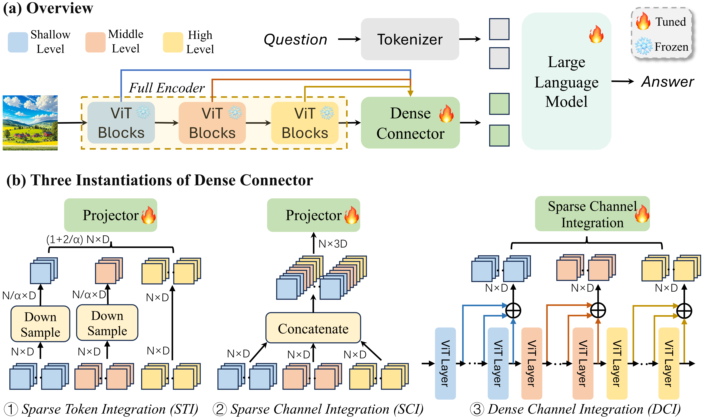

Dense Connector in MLLM: Overview and Three Instantiations.

---

### MiniGemini

 

##### Motivation

To bridge the performance gap between current Visual Language Models (VLMs) and advanced models such as GPT-4 and Gemini, efforts have been made to enhance VLMs' capabilities in visual understanding, reasoning, and generation. This motivation arises from exploring the potential of VLMs in high-resolution visual tagging, high-quality data utilization, and VLM-guided generation, with the goal of improving their performance and expanding their application scope.

##### Innovations

This work explore the potential of VLMs primarily from the following three aspects:

1. **High-Resolution Visual Tokens**: Initially, ConvNets are used to generate high-resolution images to enhance image detail. To minimize computational resource expenditure, the author further proposes optimizing for high-resolution without increasing the number of visual tokens, by employing an additional visual encoder.
2. **High-Quality Data**: To bolster data quality, the author amalgamates high-quality datasets from diverse public sources, ensuring a rich and varied foundational dataset.
3. **VLM Guided Generation**: By integrating with a text-to-image model, the capability for image generation is enhanced.

Mini-Gemini supports a series of dense and MoE Large Language Models (LLMs) from 2B to 34B. It is demonstrated to achieve leading performance in several zero-shot benchmarks and even surpasses the developed private models

##### Architecture

  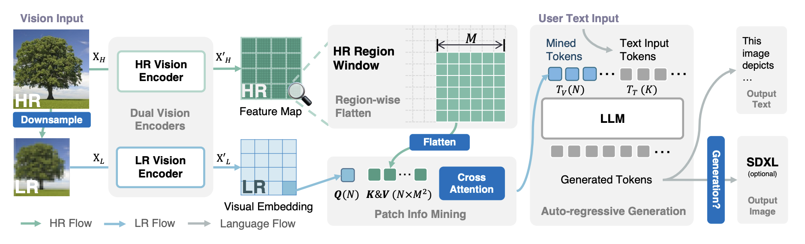

  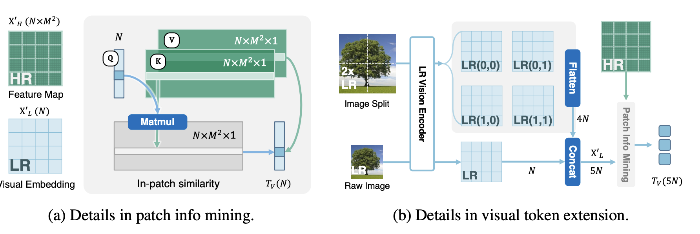

In conclusion, dual vision encoders are utilized to provide low-resolution visual embedding and high-resolution candidates; patch info mining is proposed to conduct patch-level mining between high-resolution regions and low-resolution visual queries; LLM is utilized to marry text with images for both comprehension and generation at the same time.

The enhancements are further supported by employing an end-to-end workflow, a dual-resolution visual encoder design for high and low resolution, and a patch info mining module. For detailed information, refer to the paper.

---

### Bunny

 

For more information on the Bunny model checkpoints, please refer to the GitHub link above or click [here](https://github.com/BAAI-DCAI/Bunny). This includes the fully trained checkpoints (for evaluation), the pre-trained checkpoints, and more.

##### Motivation

Bunny aims to beat the scaling law and address the computational cost issues of large Multimodal Large Language Models (MLLMs) by constructing more informative training data. The goal is to train smaller, yet highly efficient and performant MLLMs, thereby enhancing model efficiency and performance.

##### Innovations

Bunny focuses on data optimization to compensate for the reduction in model size, constructing more informative training data through dataset compression by selectively curating data from a broader range of sources.

1. **Construction of Pre-training Dataset**: The entire process involves a meticulous three-step core selection scheme based on CLIP embeddings:

   - **Clustering and Graph Construction**: Inspired by the SemDeDup method, k-means clustering is first applied to all 2 billion image embeddings. Within each cluster, an undirected graph is created where nodes (image embeddings) are connected if their cosine similarity exceeds a predefined threshold (0.86 in this case). This step helps identify similar images and reduce redundancy.
   - **Subgraph Filtering**: For each connected subgraph formed within the clusters, only one sample is retained—the one whose Euclidean distance to the cluster centroid is at the median. This effectively reduces the sample size to 952 million images while ensuring the most representative samples in each cluster are preserved.
   - **Quality Filtering Based on Text-Image Similarity**: The subset is further refined by ranking samples based on the cosine similarity between their text embeddings and corresponding image embeddings. By selecting samples ranked between the 40th and 60th percentiles, lower quality image-text pairs are eliminated, further reducing the dataset size to 190 million.
   - **Capturing Diversity and Essence**: The remaining samples are ranked by the cosine similarity of each image embedding to its cluster centroid. Samples ranked between the 15th and 35th percentiles are retained, ensuring the final subset, now reduced to 38 million, captures the essence and diversity of the original LAION-2B dataset.
   - **Final Sampling for Training Efficiency**: From this refined core set of 38 million, 2 million samples are randomly selected to form the final dataset, named Bunny-pretrain-LAION-2M. This size is chosen to balance data richness with training cost and efficiency.

2. This work also collects a set of visual instruction fine-tuning datasets—DataOptim1. Based on this dataset, they explore better fine-tuning dataset combinations. Specifically, they utilize SVIT-mix-665K and replace ShareGPT-40K with WizardLM-evol-instruct-70K to form the Bunny-695K dataset.

   > They discovered that fine-tuning Multimodal Large Language Models (MLLMs) on multimodal data might impair the cognitive abilities inherited from pre-trained language models (LLMs). This could be due to the lower amount and diversity of textual information in multimodal training data. Retaining a certain amount of high-quality pure text data in the fine-tuning dataset can mitigate this issue.

3. A plug-and-play VLM framework is designed, incorporating visual encoders like EVA-CLIP and SigLIP, as well as large language models such as Phi-1.5, StableLM-2, and Phi-2.

##### Architecture

  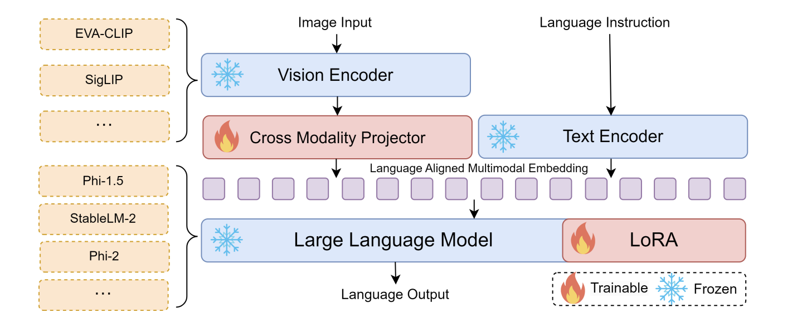

##### Bunny-v1.1🔥

The recently launched Bunny model!

Using SigLIP as the visual encoder and Phi-3-Mini-4K as the language encoder. Compared to its predecessor, Bunny, the v1.1 version introduces the following innovations:

1. **Task-Specific Identifiers**: Bunny-v1.1 employs task-specific identifiers from MiniGPT-v2, which assist the model in clearly distinguishing between different types of tasks. The model utilizes six distinct task identifiers, each corresponding to a specific task, such as visual question answering, image captioning, and more.
2. **Multi-task Instruction Templates**: Inspired by the dialogue template design of LLaMA-2, Bunny-v1.1 includes a general input format encompassing image features, task identifiers, and instruction inputs. This template design reduces ambiguity during task processing, enhancing the model's task differentiation capability and execution efficiency.

---

### Llava

 

As one of the early works in the field of Visual Language Models (VLMs), Llava combines the pre-trained CLIP ViT-L/14 visual encoder with the Vicuna language model, achieving multimodal capability through a simple projection matrix connecting the two.

##### Innovations

1. Llava employs the classic pre-training + fine-tuning training steps.
2. Innovatively, it proposes a **new data organization method** by utilizing GPT-4 to generate instruction questions related to images. For example, using the COCO dataset, which contains a large number of images and their corresponding textual descriptions, the image-text pairs are fed to GPT-4 to organize new questions, thus **leveraging AI-generated training data to train AI**.

> To ensure the generated data is diverse and deep, the researchers designed three different types of instruction-response pairs:
>
> - **Conversation**: Simulating a dialogue between a person and an assistant, involving multiple rounds of questions and answers about the image content. This type of data helps the model learn how to conduct coherent multi-turn conversations.
> - **Detailed Description**: Generating detailed image descriptions to help the model understand and generate comprehensive visual content descriptions.
> - **Complex Reasoning**: Generating questions and answers that require complex reasoning, involving multi-step logical deduction. This type of data enhances the model's reasoning capabilities.

3. Architecturally, Llava uses techniques such as Flash Attention 2 and LoRA (Low-Rank Adaptation) to optimize performance, improve efficiency, and reduce memory usage.

##### Architecture

  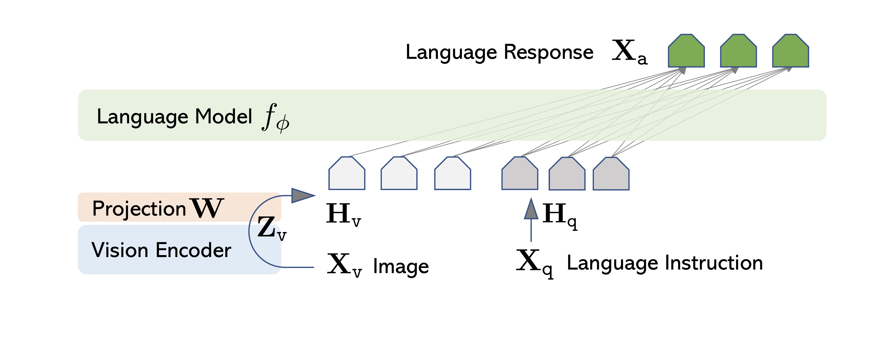

##### Llava's Improvements

The LLaVa model was proposed in [Visual Instruction Tuning](https://arxiv.org/abs/2304.08485) and improved in [Improved Baselines with Visual Instruction Tuning](https://arxiv.org/pdf/2310.03744) by Haotian Liu, Chunyuan Li, Yuheng Li, and Yong Jae Lee. This marks the inception of Llava1.5.

1. **Llava1.5**
   - Llava1.5 continues to use Vicuna as the base language model, replacing the original linear projection with a **two-layer MLP**. It also supports interaction with higher-resolution images (336x336 pixels). The method of dividing images into grids allows for the processing of high-resolution inputs, which also cleverly reduces the occurrence of "hallucinations."
   - It introduces datasets for academic tasks such as Visual Question Answering (VQA), Optical Character Recognition (OCR), and region-level understanding data.
   
2. **Llava1.6** 🔥
   - Supports interaction with images of even higher pixel counts (e.g., 672x672, 336x1344, 1344x336 resolutions).
   - Adds capabilities for visual reasoning and Optical Character Recognition (OCR).

---

### Cog Series

#### CogVLM

 

CogVLM is an innovative open-source visual language model (VLM) designed to bridge the gap between traditional language models and visual data processing. It introduces a "visual expert module" within its architecture to enhance the integration of visual and language features without increasing computational demands. This module is embedded in both the attention and feedforward neural network (FFN) layers of a pre-trained language model, allowing for a deep fusion of visual and linguistic data.

Unlike previous methods that often used a shallow alignment strategy, CogVLM achieves a more profound integration by allowing direct interactions between visual and textual representations within the model's layers. This approach enables the model to maintain high performance on natural language processing tasks while also excelling in tasks that require understanding of visual content

|            Model            | Resolution |                         Introduction                         |                      Huggingface model                       |                       SAT model                       |
| :-------------------------: | :--------: | :----------------------------------------------------------: | :----------------------------------------------------------: | :---------------------------------------------------: |
|      cogvlm-chat-v1.1       |    490     |      Supports simultaneous multi-turn chat and visual question answering, with the ability to use flexible prompts.      |     [link](https://huggingface.co/THUDM/cogvlm-chat-hf)      | [link](https://huggingface.co/THUDM/CogVLM/tree/main) |
|       cogvlm-base-224       |    224     |               The original checkpoint after text-image pretraining.               |   [link](https://huggingface.co/THUDM/cogvlm-base-224-hf)    | [link](https://huggingface.co/THUDM/CogVLM/tree/main) |
|       cogvlm-base-490       |    490     | The resolution is increased to 490 by performing positional encoding interpolation from cogvlm-base-224. |   [link](https://huggingface.co/THUDM/cogvlm-base-490-hf)    | [link](https://huggingface.co/THUDM/CogVLM/tree/main) |
| cogvlm-grounding-generalist |    490     |    This checkpoint supports various visual localization tasks, such as REC and localization captions.     | [link](https://huggingface.co/THUDM/cogvlm-grounding-generalist-hf) | [link](https://huggingface.co/THUDM/CogVLM/tree/main) |

##### Motivation

The authors of CogVLM believe that the poor performance of shallow alignment methods is due to their reliance on "frozen" language model weights, which are inherently trained to process textual tokens and exhibit significant mismatches.

##### Innovations

1. To prevent the forgetting problem caused by directly training LLMs on new datasets and to maintain familiarity with the original datasets, the aim is to enhance visual understanding capabilities while preserving existing NLP performance.
2. CogVLM introduces a trainable visual expert within the language model. When processing visual and linguistic information, visual information is handled through a dedicated mechanism rather than simply integrating image features into the existing text processing workflow.
   - In each layer, image features are processed independently of text features using new QKV (Query-Key-Value) matrices and MLP (Multi-Layer Perceptron) layers.
3. It utilizes RoPE (Rotary Positional Embedding) instead of traditional positional encoding (in traditional Transformer models, positional encoding is typically added to the input sequence's word embeddings to provide positional information for each element in the sequence).

CogVLM introduces a trainable visual expert within the language model. This means that when processing visual and linguistic information, visual information is handled through a dedicated mechanism rather than simply integrating image features into the existing text processing workflow.

##### Architecture

  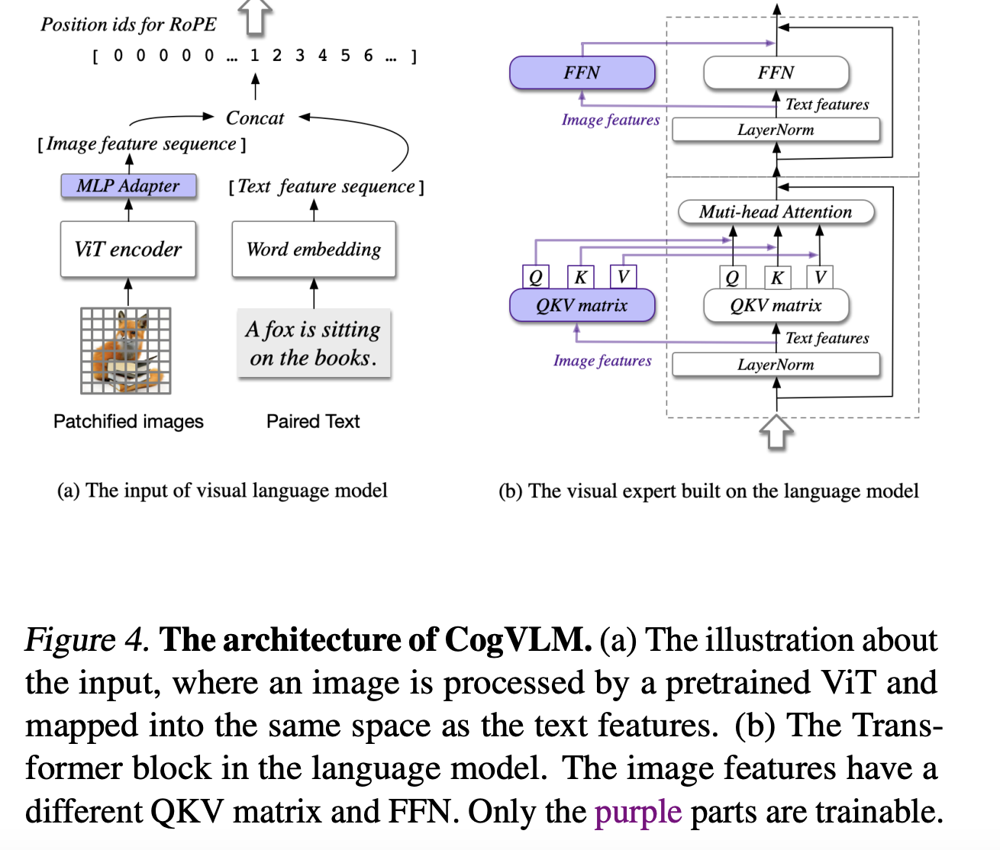

##### Model Subdivision

- **CogVLM-Chat**: This model accepts natural language inputs and outputs, primarily handling pure text inputs and outputs. It is suitable for various VQA (Visual Question Answering) and multi-turn dialogue datasets.
- **CogVLM-Grounding**: This model focuses on handling inputs and outputs that include bounding boxes, supporting a variety of tasks related to visual benchmarks.

##### Some Tips

The LLM is trained based on Vicuna-7B, ensuring its NLP capabilities while incorporating visual understanding. Efficient fine-tuning methods such as P-Tuning and LoRA have been utilized.

#### CogAgent

 

**CogAgent** is an improved open-source visual language model based on CogVLM. It primarily focuses on enhancing GUI understanding and navigation capabilities, allowing it to recognize minute page elements and text. This model outperforms traditional LLM-based methods in tasks involving screen shots.

> Reviewing the examples provided on GitHub and in the paper can offer an intuitive understanding of the concept of CogAgent.

|     Model     | Resolution |                         Introduction                         |                   Huggingface model                   |                        SAT model                        |
| :-----------: | :--------: | :----------------------------------------------------------: | :---------------------------------------------------: | :-----------------------------------------------------: |
| cogagent-chat |    1120    |    The chat version of CogAgent. Supports GUI agents, multi-turn chat, and visual localization.     | [link](https://huggingface.co/THUDM/cogagent-chat-hf) | [link](https://huggingface.co/THUDM/CogAgent/tree/main) |
| cogagent-vqa  |    1120    | The VQA version of CogAgent. It has enhanced capabilities for single-turn visual dialogue. Recommended for VQA benchmarking. | [link](https://huggingface.co/THUDM/cogagent-vqa-hf)  | [link](https://huggingface.co/THUDM/CogAgent/tree/main) |

##### Motivation

- To develop an agent that exhibits exceptional performance in GUI-oriented tasks.

##### Innovations

- **Capability to Handle High-Resolution Images**: This work designs a cross-attention branch that allows for a trade-off between resolution and hidden size within an appropriate computational budget, addressing the issue of high-resolution images requiring substantial resources for inference and computation.
  - **High-Resolution Cross Module**: This new branch for higher-resolution inputs adopts a smaller pre-trained visual encoder and uses cross-attention with a smaller hidden size to integrate high-resolution image features into each layer of the VLLM decoder, thereby reducing computational costs.
  - **Contrast with Low-Resolution Input Branch**: Unlike the original low-resolution input branch, the high-resolution cross module employs a smaller pre-trained visual encoder (in this case, the EVA2-CLIP-L visual encoder with 0.30B parameters). This module uses cross-attention with a smaller hidden size to merge high-resolution image features with the VLLM decoder at each layer.
  - For an input image, the model resizes it to 1120 × 1120 and 224 × 224, feeding these into the high-resolution cross module and the low-resolution branch, respectively. These two branches work in parallel, encoding the image into feature sequences Xhi (high-resolution image features) and Xlo (low-resolution image features).
- Privately Constructed Dataset: They observe that GUI images have a different distribution from natural images. Consequently, they construct a large-scale annotated dataset focused on GUIs and OCR for continual pre-training.

##### Architecture

  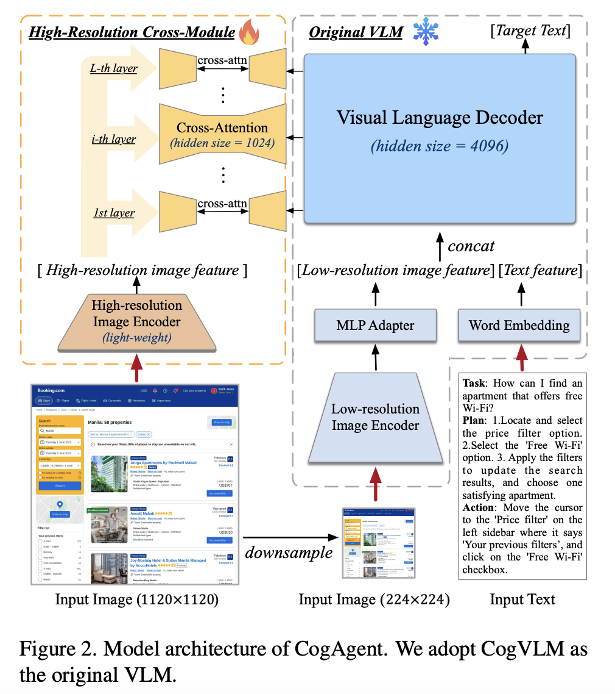

---

### HPT

 
 

The proposed Hyper-Pretrained Transformers (HPT) framework represents a novel multimodal LLM pre-training framework. It efficiently and scalably trains a large multimodal foundational model capable of understanding various modalities of input. There are two versions: HPT Pro and HPT Air.

##### Innovations

- **Innovative Feature H-Former**: Serving as a bridge between visual and language modalities, it is a variant of Q-Former.
- **H-Former**: Integrates a dual-network design to learn both local and global features for achieving visual-language alignment, enabling HPT to understand fine-grained details as well as abstract high-level information.

##### Architecture

  

---

### MiniGPT4 Series

Recently, most of the work is based on MiniGPT4 and MiniGPT4-V2. The architectures of MiniGPT4 & MiniGPT4-V2 lay the foundation for subsequent multimodal large models, with subsequent work either adopting their training methods or fine-tuning their entire code structure.

#### MiniGPT4

 

MiniGPT-4 is generally divided into a visual end and a language end, comprising a visual encoder (ViT and Q-Former) and the Vicuna language model. A simple linear projection layer is used to align the visual features with the language model.

Training is conducted in two stages:

1. **Pre-training Stage**: Initially trained using a large number of image-text pairs to acquire visual-language knowledge. After this stage, the model can handle some VQA problems but may still output content unrelated to the queries.
   - The visual end uses ViT and Q-Former.
   - The language end uses Vicuna.
2. **Fine-tuning Stage**: Involves fine-tuning with a high-quality, detailed image description dataset. This stage includes an instruction dataset sourced from the Conceptual Caption dataset. The authors used the model trained in the first stage to generate image descriptions, providing sufficient prompts to ensure the descriptions were detailed. Subsequently, ChatGPT was used for further construction and error correction. Finally, around 3,500 image-text pairs were manually selected to form the final dataset.

##### Architecture

  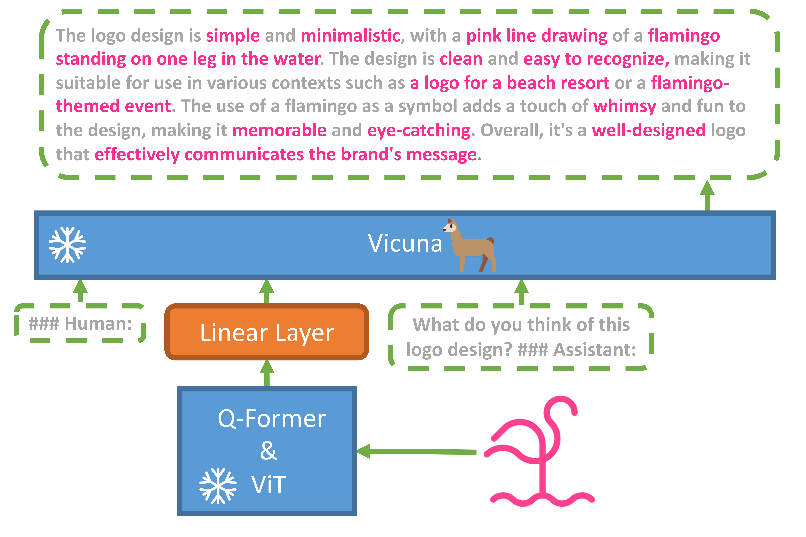

#### MiniGPT4-V2

 

MiniGPT-4 v2 builds upon MiniGPT-4 with several significant innovations and improvements:

1. **Task Identifiers for Multimodal Tasks**: Introduces task identifiers such as [vqa], [caption], [grounding] to distinguish between tasks like visual question answering, image captioning, and visual grounding. During training, different datasets specific to downstream tasks are used for fine-tuning, with task identifiers integrated into the dialogue templates and fed into the model. In inference, users manually select task identifiers to inform GPT about the type of downstream task to perform. This approach significantly improves the model's adaptation to downstream tasks, reducing hallucinations and confusion while maintaining performance.

2. **Three-Stage Training Strategy**
   1. **Pre-training**: Utilizes weakly annotated and finely annotated datasets (e.g., LAION, CC3M, SBU, GRIT-20M) to train the model, acquiring broad visual-language knowledge.
   2. **Second Stage: Multi-task Training**: Employs only finely annotated datasets (e.g., COCO, RefCOCO) for multi-task training, optimizing the model's performance across various tasks.
   3. **Third Stage: Multimodal Instruction Tuning**: Fine-tunes the model using multimodal instruction datasets (e.g., LLaVA, Flickr30k) and language datasets (e.g., Unnatural Instructions), enhancing its conversational and instruction-following capabilities.

3. **High-Resolution Input**: Supports higher resolution images (448x448) and reduces computational load by merging adjacent visual tokens into a single token, improving training and inference efficiency.

##### Architecture

  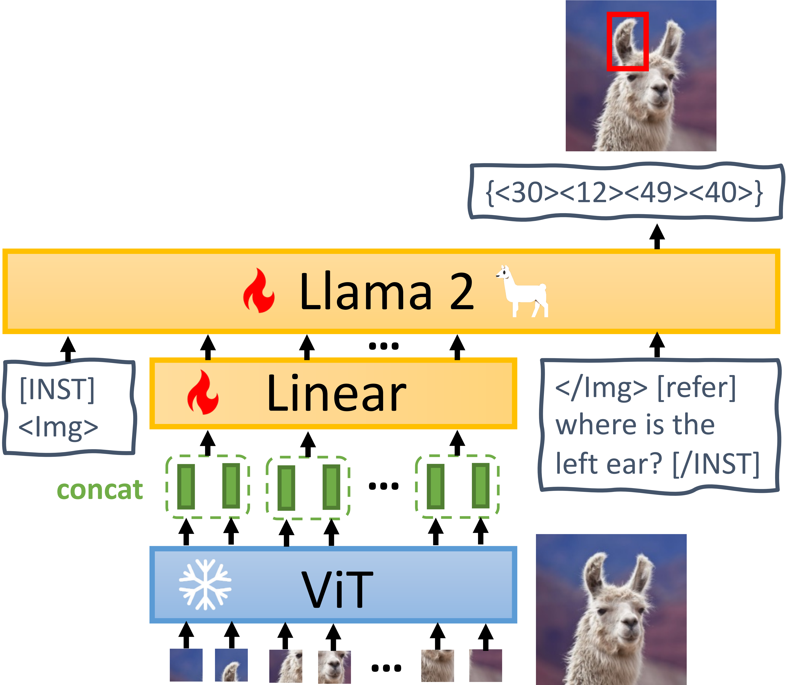

---

### TinyLLaVA

 

TinyLLaVA selects several representative LLMs, including TinyLlama (1.1B parameters), StableLM-2 (1.6B parameters), and Phi-2 (2.7B parameters), and uses CLIP and SigLIP as visual encoders to assemble the final multimodal model. Preliminary experiments have shown that SigLIP performs better when combined with smaller-scale LLMs.

In the linking part between the visual and textual ends, TinyLLaVA uses a two-layer Multi-Layer Perceptron (MLP) as the connector between the visual encoder and the LLM, with the GELU activation function.

Although TinyLLaVA has fewer parameters compared to many large models, the performance of the LLMs (such as Google's Phi-2) and the high quality of the dataset enable it to achieve performance in various benchmarks that is comparable to or even surpasses some large-scale models.

##### Architecture 

  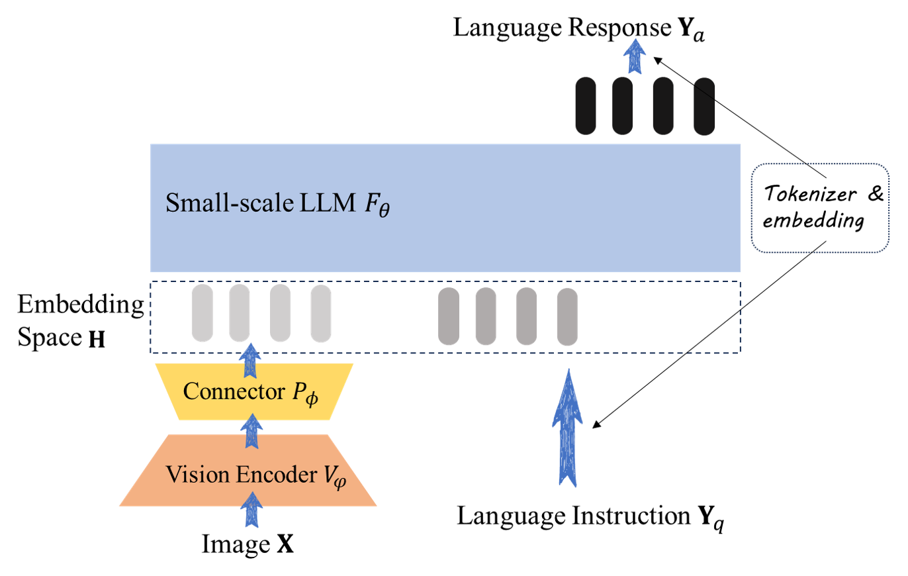

---

### TinyGPT-V 

 

TinyGPT-V is also exploring how to use small backbones to implement a multimodal large language model. The model is generally divided into a visual end, a language end, and a mapping layer. The language end uses Phi-2, the visual end uses the pre-trained EVA (Enhanced Vision Attention) ViT (Vision Transformer) model, and the mapping layer employs the Q-Former layer from the BLIP-2 architecture as the initial mapping layer, leveraging the pre-training advantages of the BLIP system. The innovations and highlights of TinyGPT-V can be summarized as follows:

1. **Structure of the Visual-Language Mapping Layer**: TinyGPT-V's visual-language mapping layer combines several small modules from different models (including visual models and other VLMs) and can be divided into three main levels (detailed design in the [figure below](#train process)):

   - **Q-Former Layer (Initial Mapping Layer)**: The Q-Former layer from the BLIP-2 architecture serves as the initial mapping layer. This well-pretrained structure effectively aligns the high-dimensional visual features extracted by the EVA ViT visual encoder with the language model, transforming them into representations suitable for the language model.
   - **First Linear Projection Layer**: Uses a pretrained linear projection layer from MiniGPT-4, which accelerates the training process as it already contains rich patterns and features that can be directly used without retraining from scratch.
   - **Second Linear Projection Layer**: A new linear projection layer initialized with a Gaussian distribution ensures that features are finally integrated into the hidden space of the Phi-2 model.

2. **Four-Stage Training Strategy**:

   - **Stage 1: Warm-Up Training**: Uses large-scale image-text pair datasets (e.g., LAION, Conceptual Captions, SBU) for initial pre-training. The model recognizes the output of the projection layer as soft prompts, guiding it to generate relevant text (using approximately 5 million image-text pairs in total).
   - **Stage 2: Re-pretraining**: Specifically trains the LoRA module to further reduce the loss of image-text pairs. The goal of this stage is to enhance the LoRA module's effectiveness in handling multimodal data, improving the model's learning ability and performance.
   - **Stage 3: Instruction Fine-Tuning**: Uses datasets from MiniGPT-4 or LLaVA for instruction fine-tuning, enhancing the model's ability to generate coherent and natural responses.
   - **Stage 4: Multitask Learning**: Performs multitask learning with multimodal instruction datasets (e.g., LLaVA, Flickr30k), improving the model's task handling capabilities in multi-turn dialogues.

3. **Normalization and LoRA**: The authors found that small-scale large language models face many challenges during transfer learning. Small VLMs, due to fewer parameters, are sensitive to NaN or INF values during data computation, which can cause initial batch forward propagation to fail. TinyGPT-V uses various normalization techniques to address these issues:

   - **RMSNorm (Root Mean Square Normalization)**: RMSNorm is used to address gradient vanishing or exploding issues, ensuring model stability during training. Specifically, RMSNorm is applied after each multi-head attention layer (MHA) to normalize the data.
     
$$
 \text{RMSNorm}(x_{\text{post}}) = \frac{x_{\text{post}}}{\sqrt{\frac{1}{N} \sum_{i=1}^{N} x_i^2 + \epsilon}}
$$

   - **Query-Key Normalization**: Particularly effective in low-resource learning scenarios, helping maintain computational stability when handling multimodal data.

$$
\text{Attention}(Q, K, V) = \text{softmax}\left(\frac{\text{LayerNorm}(Q) \cdot \text{LayerNorm}(K)^T}{\sqrt{d_k}}\right) V
$$

   - **Layer Normalization**: Applied in each layer to prevent the occurrence of NaN values by standardizing the input.

$$
\text{LayerNorm}(x_{\text{hidden}}) = \gamma \frac{x_{\text{hidden}} - \mu}{\sqrt{\sigma^2 + \epsilon}} + \beta
$$

   - **LoRA (Low-Rank Adaptation)**: LoRA introduces low-rank matrices for parameter-efficient fine-tuning while freezing pre-trained weights, reducing the amount of parameter adjustment during training and preventing gradient vanishing.

4. **Task-Specific Identifiers and Instruction Templates**: Similar to MiniGPT-4 and MiniGPT-v2, TinyGPT-V integrates task-specific identifiers into instruction templates to enhance performance in multitask and multi-turn dialogues. It adopts the multitask instruction templates from MiniGPT-v2 with some modifications, particularly in spatial location recognition. For tasks requiring spatial location recognition of referenced objects, TinyGPT-V uses text-based bounding boxes with coordinates normalized between 0 and 100. Other than this improvement, no additional changes were mentioned.

   

##### Architecture

  

##### Train process

  

---

### PaLI-3

 

PaLI-3 is the third-generation model in the PaLI series. By leveraging a pre-trained baseline model with only 5B parameters, they optimized the training methodology and achieved competitive and new state-of-the-art results on various VLM benchmarks.

The new approach consists of three main steps:

1. **Unimodal Pre-training**: Pre-train the image encoder and text encoder to handle their respective inputs independently.

   - **Image Encoder Pre-training**: Uses web-scale image-text pair datasets (e.g., WebLI). The SigLIP training method is employed for contrastive pre-training on images and texts.

     >1. **Embedding**: Embed images and texts into the same high-dimensional vector space.
     >2. **Contrastive Loss**: Use the Sigmoid Cross-Entropy loss function to ensure that the dot product of the correct image-text pairs is higher than that of incorrect pairs.

   - **Text Encoder Pre-training**: Utilizes the UL2 model and trains it using the "mixture of denoisers" approach.

2. **Multimodal Training**:

   - Combine the pre-trained image encoder (ViT-G/142) with a 3B parameter UL2 encoder-decoder language model. The image encoder converts images into visual tokens, which are input into the language model along with text tokens.
   - During this stage, **the image encoder remains frozen, and only the language model is trained** to ensure the quality of the image encoder's embeddings.
   - **High-Resolution Training**: Begin with lower resolution images and gradually increase the resolution to enhance the model's ability to perceive image details. Checkpoints are saved at resolutions of 812×812 and 1064×1064 during intermediate stages.

3. **Resolution Increase and Task-Specific Fine-Tuning**:

   - Further increase the input resolution of the model for short-term fine-tuning, unfreezing the image encoder to ensure the model can handle high-resolution images.
   - **Task-Specific Fine-Tuning**: Typically, fine-tuning is done using checkpoints at 812×812 resolution, but for tasks requiring higher resolution (e.g., document understanding tasks), fine-tuning is conducted at 1064×1064 resolution.

##### Architecture

  

---

### PaliGemma

 

 

PaliGemma is composed of a [Transformer decoder](https://arxiv.org/abs/1706.03762) and a [Vision Transformer image encoder](https://arxiv.org/abs/2010.11929), with a total of 3 billion parameters. The text decoder is initialized from [Gemma-2B](https://www.kaggle.com/models/google/gemma), and the image encoder is initialized using [SigLIP-So400m/14](https://colab.research.google.com/github/google-research/big_vision/blob/main/big_vision/configs/proj/image_text/SigLIP_demo.ipynb?hl=zh-cn). PaliGemma is trained following the PaLI-3 methodology.

PaliGemma has released three types of models:
1. **Pre-trained multimodal base models** (labeled as `pt` on Huggingface);
2. **Fine-tuned models on individual tasks** (e.g., DocVQA, AI2D) (labeled as `ft` on Huggingface);
3. **Models fine-tuned on mixed datasets** (labeled as `mix` on Huggingface).

These models are available in three different resolutions (224x224, 448x448, 896x896) and three different precisions (bf16, f16, and f32). Each repository includes checkpoints for the given resolution and task, with three revisions available for each precision. The `main` branch of each repository contains float32 checkpoints, while `bf16` and `f16` revisions contain the corresponding precisions. Separate repositories are available for models compatible with Transformer and the original JAX implementation. High-resolution models require larger memory to run due to significantly longer input sequences. They can be beneficial for tasks requiring fine granularity (such as OCR), but for most tasks, the quality improvement is minimal.

##### Architecture

Same as [PaLI-3](#palI-3).

  

---

### MobileVLM

#### MobileVLM(base)

 

MobileVLM is the first multimodal vision-language model specifically designed for mobile and IoT devices. The visual end uses CLIP ViT-L/14@336, and the language end uses MobileLLaMA. The projection layer connecting vision and language is a uniquely designed network structure. The main features of MobileVLM include the following:

1. **Lightweight Down-sampling Projector (LDP)**: Enhances the alignment efficiency of multimodal features while reducing computational overhead by decreasing the number of visual tokens (detailed design in the [figure below](#architecture-13)).
   - Combines **Depthwise Convolution** and **Pointwise Convolution**. Depthwise convolution captures local spatial features, while pointwise convolution is used for feature compression and alignment.
   - **Efficient Down-sampling Strategy**: Uses convolution operations with a stride of 2 to downsample visual features, reducing the number of visual tokens by 75%. This effectively retains key visual information while significantly reducing the number of tokens that need to be processed.
   - **Layer Normalization** replaces Batch Normalization to ensure stable training unaffected by batch size.
   - **Multilevel Feature Interaction**: Adds pointwise convolution layers before and after the convolution layers to achieve multilevel interaction between feature spaces and tokens.
   
2. **Full-Stack Reconstructed Multimodal Vision-Language Model**: MobileVLM is a multimodal model optimized for mobile devices from the ground up. The detailed training process is as follows:
   - **Pre-training of the Base Language Model**: Trains the LLM using the RedPajama v1 dataset (containing 1.3 trillion tokens). The LLM is a variant of LLaMA with 24 and 32 layers, having 1.4B and 2.7B parameters, respectively.
   - **Supervised Fine-Tuning (SFT)**: Uses a multi-turn dialogue dataset based on Vicuna, including user and ChatGPT conversation records.
   - **Training of Multimodal Models**: Pre-trains and fine-tunes with instruction using the CC-595K and LLaVA-Instruct-158K datasets.
     - **Pre-training**: Freezes the visual encoder and language model, training only the Lightweight Down-sampling Projector (LDP).
     - **Instruction Tuning**: Fine-tunes the projector and language model to enhance visual understanding and expression capabilities.

3. **Low-Rank Adaptation (LoRA)**: During the visual instruction fine-tuning phase, LoRA is applied, updating only 8.87% and 7.41% of the LLM parameters to achieve performance comparable to full fine-tuning.
4. **Ablation Study**: Conducted ablation studies on the newly proposed LDP, comparing traditional resolution reduction methods and the Lightweight Down-sampling Projector (LDP) method. The results showed that LDP could reduce the number of visual tokens by 75% (from 576 to 144) and achieve performance comparable to or better than the baseline. This indicates that while reducing the number of tokens, the quality of visual tokens was further improved.

##### Architecture

  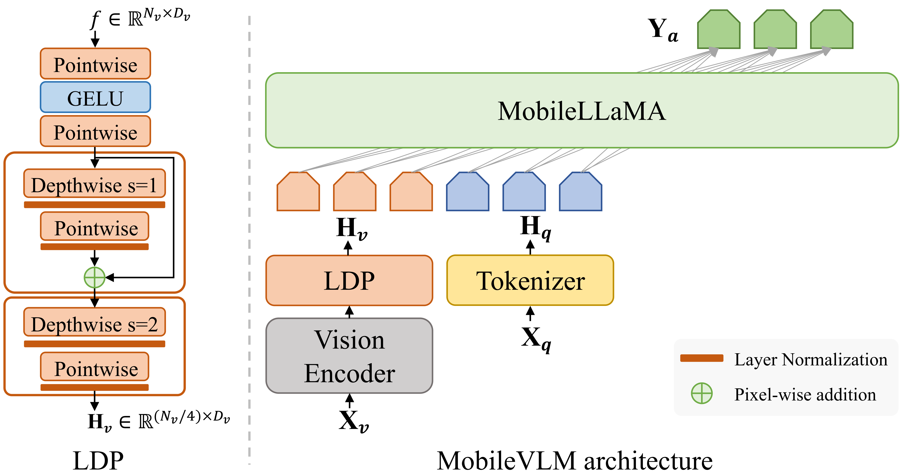

#### MobileVLM V2

MobileVLM V2 continues to explore the direction of low-resource VLMs, with the following improvements over MobileVLM:

1. **Enhanced Training Data**:

   - MobileVLM V2 uses 1.2 million high-quality image-text aligned data pairs from ShareGPT4V during the pre-training stage. The improved data quality enhances training efficiency and model performance.

     > The ShareGPT4V dataset is generated from GPT-4V (Vision), which has been trained on extensive high-quality data, capable of producing accurate and detailed image-text aligned data. The ShareGPT4V dataset covers multiple domains and scenarios and is meticulously annotated. This broad coverage and annotation accuracy help the model perform well across different tasks.

   - Additional academic task datasets, such as ScienceQA, TextVQA, and SBU, were introduced to increase data diversity and instruction-following capabilities.

2. **Optimized Projector Structure**: The new projector includes three components—feature transformation, token reduction, and position information enhancement.

   - **Feature Transformation**: Uses two pointwise convolution layers to transform the image tokens so that their feature dimensions match those of the large language model (LLM).
   - **Token Reduction**: Introduces an average pooling layer to significantly compress the image tokens. Specifically, a 2×2 average pooling layer is used to reduce the number of image tokens to one-quarter of the original.
   - **Position Information Enhancement**: Applies a simple yet effective module, PEG (Position Encoding Generator), and uses skip connections to enhance positional information. This method significantly reduces the number of parameters while slightly improving runtime speed.

3. **New Training Strategy**:

   - **Pre-training**:
     - **Initialization**: The visual end uses the pre-trained CLIP ViT-L/14 model weights. The language end uses the pre-trained MobileLLaMA model weights. The projector parameters are randomly initialized.
     - **Activation and Freezing**: Freezes the visual encoder and trains only the projector and the language model, focusing the training objective on predicting the next token.
   - **Multitask Training and Fine-Tuning**: Introduces several visual-language related downstream tasks, **unfreezing and training all components, including the projector and the language model**.
     - Visual Dialog: 123K samples
     - Text-VQA: 35K samples
     - VSR: 13K samples
     - VIGC: 37K samples
     - IConQA: 107K samples
     - SQA: 13K samples
     - COCO: 592K samples
     - SBU: 844K samples
     - ShareGPT4V: 665K samples
     - **Total Samples**: 3.6 million samples

##### Architecture

  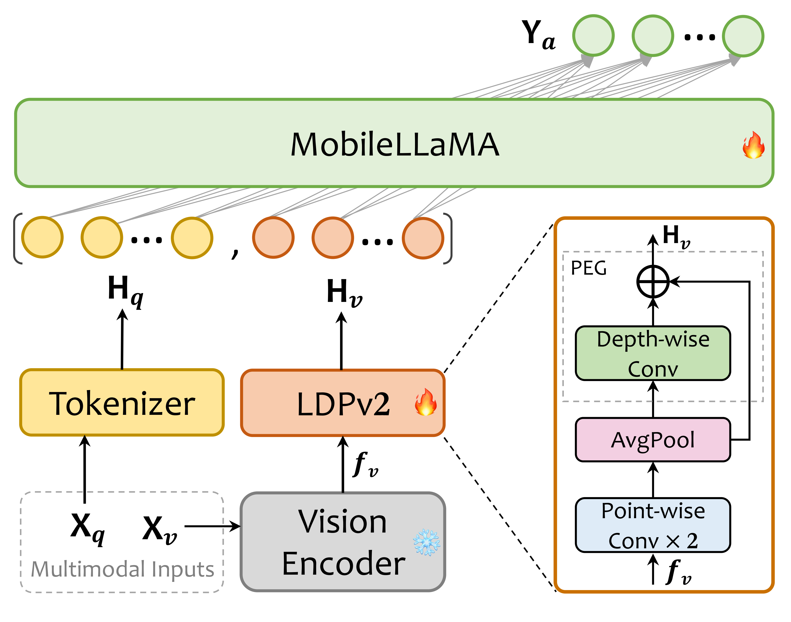

---

### LLaVA-Phi

LLaVA-Phi (also known as LLaVA-φ) is a multimodal small model composed of smaller models for both the visual and language ends. It replaces Vicuna in LLaVA with Phi, achieving SOTA results on many benchmarks. LLaVA-Phi accepts images sized 336x336 (using a pre-trained CLIP ViT-L/14 with a resolution of 336x336) and employs a two-layer MLP as the linking component between the visual and language ends.

LLaVA-Phi also fine-tunes phi-2, using instruction templates organized similarly to the Vicuna format.

**Detailed Two-Stage Training Strategy**:

- **Pre-training Stage**: One round of pre-training using a filtered subset of the CC-595K dataset with a learning rate of 1e-3 and a batch size of 256.
- **Instruction Fine-Tuning Stage**: One round of fine-tuning on the LLaVA-Instruct-150K dataset with a learning rate of 2e-5 and a batch size of 256. The fine-tuning process uses the Adam optimizer, with a weight decay of 0.1, momentum parameters of 0.9 and 0.98, and an epsilon value of 1e-7.

---

### LLaVA-Phi-3-mini

LLaVA-Phi-3-Mini series models are further fine-tuned versions of LLaVA-Phi, utilizing Phi-3-mini and CLIP-ViT-Large-patch14-336. These models are trained using the ShareGPT4V-PT and InternVL-SFT datasets and support various quantization methods.

---

### IMP

 

IMP is build upon a small yet powerful SLM [Phi-2](https://huggingface.co/microsoft/phi-2) (2.7B) and a powerful visual encoder [SigLIP](https://huggingface.co/google/siglip-so400m-patch14-384) (0.4B), and trained on the [LLaVA-v1.5](https://github.com/haotian-liu/LLaVA) training set.`imp-v1-3b`

The implementation on the Qualcomm Snapdragon 8Gen3 mobile chip achieves a high inference speed of approximately 13 tokens per second, enabling the efficient operation of the model on mobile devices.

**Two-Stage Training Strategy**:

- **First Stage: Multimodal Alignment Pre-training**. This stage involves training only the multimodal connector while freezing both the vision encoder and the language model.
- **Second Stage: Multimodal Instruction Fine-tuning**. This stage optimizes both the language model and the multimodal connector concurrently, enhancing the model's ability to follow instructions.

**Model Architecture Optimization**:

- By selecting and optimizing appropriate language models and vision encoders, the overall performance and efficiency of the model are improved.

**Training Strategy Improvements**:

- Utilizing the LoRA (Low-Rank Adaptation) fine-tuning mechanism and optimized training iterations, the model achieves optimal performance with limited resources.

**Data Augmentation**:

- Incorporating OCR and chart data, GPT4V annotated data, and more, enriches the diversity and quality of the training data, thereby enhancing the model's generalization capability.

🔥IMP has recently launched the [Imp-v1.5](https://huggingface.co/collections/MILVLG/imp-v15-664c07c27a71afa504f69cec) series models. This includes Imp-v1.5-2B, Imp-v1.5-3B, and Imp-v1.5-4B, further extending the capabilities of the Imp model range.

---

### MoE-LLaVA

 

MoE-LLaVA is a VLM based on MoE (Mixture of Experts), which integrates multiple expert models (expert networks) to enhance its multimodal capabilities and generalization performance. However, for large VLMs, while an increase in parameters can lead to performance improvements, the computational resources required for training and inference also increase rapidly. This work addresses this issue.

##### Motivation

To train a high-performance VLM with limited computational resources, MoE-LLaVA, developed by institutions such as Peking University and Sun Yat-sen University, proposes an ingenious and novel training strategy called MoE-Tuning. This strategy achieves a large parameter size while maintaining constant computational resource requirements.

##### Innovations

1. **Three-Stage MoE-Tuning Training Strategy** (Refer to the illustration [link](#train process-2))

   - **Stage I: Adapting to Visual Input**: The main goal is to adapt image tokens to the LLM so that the LLM can understand instances within images.
     - A multilayer perceptron (MLP) is used to project image tokens into the input domain of the LLM, treating image patches as pseudo-text tokens.
     - In this stage, only the MLP layer is trained, and other parameters of the LLM are not trained.
   - **Stage II: Enhancing Multimodal Understanding**: The goal is to fine-tune the LLM with multimodal instruction data to endow it with multimodal understanding capabilities.
     - All parameters of the LLM are unfrozen and trained to enhance its ability to process multimodal data.
     - Training is conducted using multimodal instruction data involving complex tasks such as image logical reasoning and text recognition, which require stronger multimodal understanding.
     - Upon completion of this stage, the LVLM possesses preliminary multimodal understanding capabilities, laying the groundwork for sparsification in the next stage.
   - **Stage III: Introducing Sparsification with MoE Layers**: The goal is to reduce computational costs while maintaining high performance by introducing sparsification mechanisms, which involve the following steps:
     - **Initializing Expert Weights**: Copying the FFN weights from Stage II as the initialization weights for each expert.
     - **Training MoE Layers**: Only the MoE layers are trained, ensuring each token is processed by the top-k experts with the highest probabilities, while the remaining experts remain inactive.
     - **Router Weight Calculation**: A linear layer router predicts the probability of each token being assigned to each expert, normalized using the softmax function. Each token is processed by the top-k experts, with outputs weighted by the router's weights.

2. **Sparse LVLM Architecture Based on MoE**

   - Initially, images are processed by the vision encoder to obtain a sequence of visual tokens Z, and text is processed by the word embedding layer to obtain a sequence of text tokens T. The visual and text tokens are concatenated into a single sequence and input into the LLM.
   - Subsequently, during the forward propagation of the model, in each MoE layer, the router calculates the probability of each token being assigned to each expert, selects the top-k experts for processing, and obtains the final output through weighted summation.
   - This approach significantly expands the number of model parameters while keeping computational costs constant.

3. **Mechanism of MoE Layers and Details of FFN**: The MoE layer introduces multiple experts (each being an independent FFN) and dynamically selects the most suitable experts to process the current input, thereby enhancing model performance.

   - **Initialization**: In the third stage of the training strategy, the FFN weights are copied and initialized as the weights for multiple experts. These experts form a set E = [e1, e2, ..., eE].
   - **Router Weight Calculation**: The router, a linear layer, receives input tokens and generates weight logits for each expert. These weights are then normalized using softmax to obtain the probability of selecting each expert.
   - **Expert Selection**: The top-k experts with the highest probabilities are selected for processing, known as "active experts."
   - **Expert Processing**: Each active expert processes the input tokens and calculates the output. The outputs of the active experts are combined through weighted summation to obtain the final output of the MoE layer.

   > Experts not selected remain inactive and do not participate in computation, thereby reducing computational overhead.

   

##### Architecture

  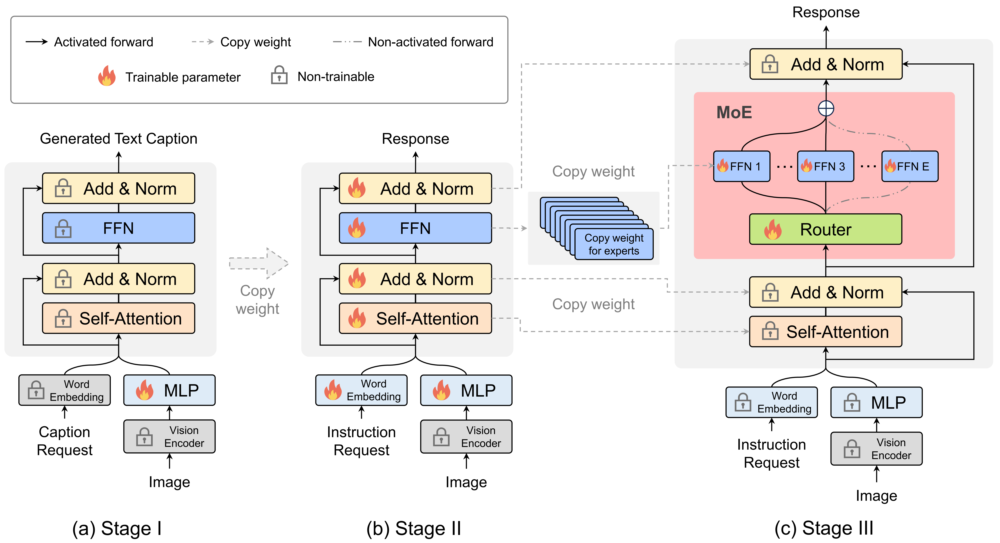

The overall architecture consists of the following components:

1. **Vision Encoder**:
   - Takes RGB images as input and processes them into a sequence of visual tokens. The original image resolution is H×W, and the vision encoder converts it into P visual tokens, each with a dimension of C.

2. **Visual Projection Layer (MLP)**:
   - Maps the sequence of visual tokens from dimension C to the hidden size D of the LLM.

3. **Word Embedding Layer**:
   - Projects text tokens into the hidden size D of the LLM.

4. **Large Language Model (LLM)**:
   - Composed of multiple stacked multi-head self-attention (MSA) layers and feedforward neural network (FFN) layers, with layer normalization (LN) and residual connections applied to each block.

5. **MoE Layer**:
   - Consists of multiple FFN experts, with each token assigned to the top-k experts via a learnable router. The inactive experts remain inactivated.

##### Train process

  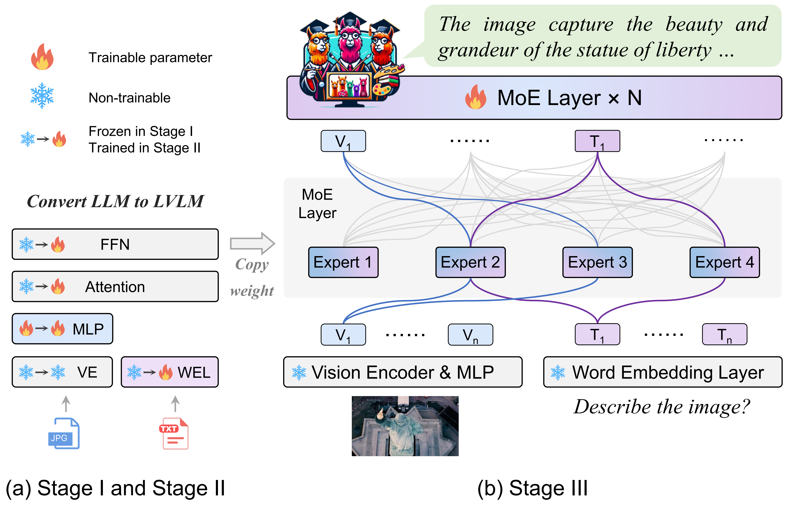

---

### Cobra

 

Cobra, a multimodal large model, is a collaborative research project developed by Westlake University and Zhejiang University. It integrates the [Mamba](https://github.com/HuBocheng/awesome-list-of-LLM_VLMs/?tab=readme-ov-file#mamba) language model with vision encoders such as DINOv2 and SigLIP. Despite Cobra's parameter count being approximately 43% of LLaVA's, its performance on various benchmarks is very close to, and sometimes exceeds, that of advanced models like LLaVA.

##### Innovations

1. **State Space Model (SSM) Replacing Transformer**: By directly using Mamba as the language backbone, Cobra optimizes the quadratic computational complexity to linear. This enhancement results in Cobra being 3 to 4 times faster than models like MobileVLM v2 and TinyLLaVA, with only about 43% of the parameters of LLaVA.

2. **Combination of Vision Encoders**: Cobra integrates DINOv2 and SigLIP vision encoders to capture both low-level spatial features and high-level semantic features of images, merging the results to form the output of the image encoder. This approach allows Cobra to accurately capture low-level spatial features (such as edges and shapes) while also understanding the semantic content of images (such as object classes and scenes).
   - **DINOv2**: DINOv2 captures low-level spatial features in images using a **self-supervised learning method**, extracting robust visual features from unlabelled data.
   - **SigLIP**: SigLIP provides rich semantic information as a vision encoder. It **combines language-supervised information**, enabling deeper semantic understanding of images.
   - **Fusion Method**: In Cobra, these two vision encoders process the input image in parallel, each extracting its features. Specifically, the input image is divided into equal-sized patches, which are processed as input token sequences by each encoder. The output features of both encoders are then concatenated to form a compact visual representation.

3. **Unique Training Scheme**: Cobra introduces improvements and innovations to the commonly used training schemes of popular VLMs.
   - **Discarding the Pre-Alignment Stage**: Cobra's training scheme abandons the traditional pre-alignment stage (used in LLaVA's training scheme), directly fine-tuning the entire LLM backbone and projection layer. This method is based on recent research indicating that training a pre-alignment stage separately may be unnecessary, and directly fine-tuning the entire model can prevent it from being underfitted.
   - **Mixed Dataset Training**: Cobra utilizes a mixed dataset composed of multiple datasets during training. These datasets include academic VQA data, LLaVA-Instruct data, and pure text dialogue data, totaling approximately 1.2 million images and corresponding multi-turn dialogue data.
   - **Efficient Data Parallel Processing**: During training, Cobra employs the Pytorch Fully Sharded Data Parallel framework, enabling FP32 and BF16 automatic mixed precision to enhance the efficiency of distributed training.

##### Architecture

  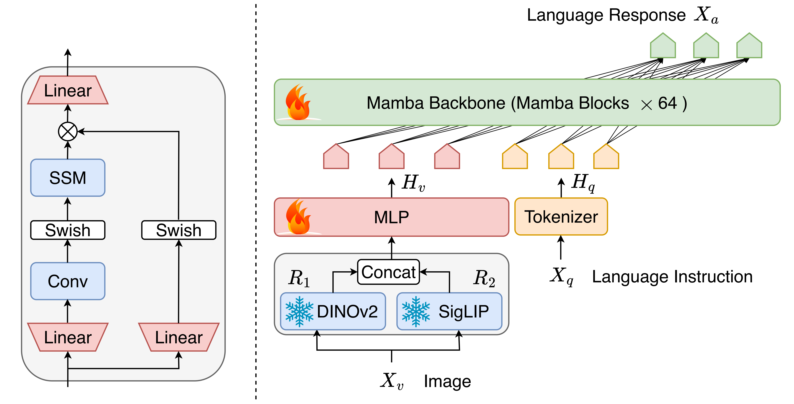

---

### Vary-toy

 

Vary-toy is an optimized and improved multimodal large model based on **[Vary](https://varybase.github.io/)**, developed to address the excessive computational resource requirements of the original Vary model. The Vary development team introduced the smaller model, Vary-toy, which not only has fewer parameters but also utilizes an optimized visual vocabulary network, reducing network capacity wastage during PDF OCR tasks. Vary-toy can be trained on consumer-grade GPUs and run inference on older GPUs with 8GB VRAM, and **supports both Chinese and English**.

Vary-toy is lauded as **"the first multimodal large model for young people"** for its open-source nature, lightweight design, ease of deployment, and high performance.

##### Innovations

1. **Remarkable Miniaturization**: Compared to current popular large vision-language models (LVLMs), Vary-toy has significantly fewer parameters, with an LLM backbone of only 1.8B parameters (e.g., Qwen-1.8B). It can be trained and deployed on consumer-grade GPUs (such as the GTX1080ti), drastically lowering the barrier to training and usage.

2. **Improved Visual Vocabulary Network**: Vary-toy introduces an improved visual vocabulary network that not only retains all the features of the Vary model but also enhances the perception of natural objects. Specifically, it replaces negative sample data from natural images with positive sample data (based on object detection tasks) when generating visual vocabulary, thus more fully utilizing the network's capacity and improving the efficiency of visual information encoding.
   - **Before Improvement**: In traditional visual language models (such as Vary), the visual vocabulary network typically uses negative sample data from natural images to generate visual vocabulary. This approach can lead to network capacity wastage, as negative sample data does not fully leverage the network's ability to encode visual information.
   - **After Improvement**: Vary-toy introduces a new method, replacing negative sample data with positive sample data when generating visual vocabulary.

3. **Multitask Training with Broad Coverage**: During the pre-training phase, Vary-toy incorporates various data formats, including weakly supervised image caption data, PDF document OCR data, object detection data, pure text dialogue data, and VQA data. These data are organized in a dialogue format, enabling the model to excel in different tasks. Consequently, Vary-toy, despite being a "small" VLM, encompasses all the capabilities of mainstream LVLM research: Document OCR, Visual Grounding, Image Captioning, VQA, etc.

##### Architecture

1. **Small Autoregressive Model (OPT-125M)**
   - Vary-toy employs a small autoregressive model, OPT-125M, to generate visual vocabulary. Inputs include PDF documents and natural images. Different prompts are provided for different inputs, such as "provide OCR results" and "detect teddy bear."

2. **Visual Vocabulary Generation**
   - In the process of generating visual vocabulary, Vary-toy adopts an improved method using positive sample data instead of negative sample data.
   - The visual vocabulary network leverages data from object detection tasks to fully utilize network capacity, enhancing the efficiency of visual information encoding.

3. **Integration of Visual Vocabulary and CLIP**
   - Vary-toy integrates the generated visual vocabulary with CLIP.
   - CLIP processes images of 224×224 resolution, while the visual vocabulary network handles images of 1024×1024 resolution.
   - The outputs of both (256 tokens each) are concatenated to form the input image tokens for the language model.

4. **1.8B "Large" Language Model (Qwen-1.8B)**
   - Vary-toy uses Qwen-1.8B as the base language model.
   - By combining the outputs of the improved visual vocabulary network and CLIP, Qwen-1.8B can more effectively handle multimodal tasks.

5. **Multitask Input and Output**
   - The input format follows a dialogue template, such as: `USER: "<image>"</img> "texts input" ASSISTANT: "texts output" </s>`
   - Tasks include OCR, object detection, image description, and general dialogue.

  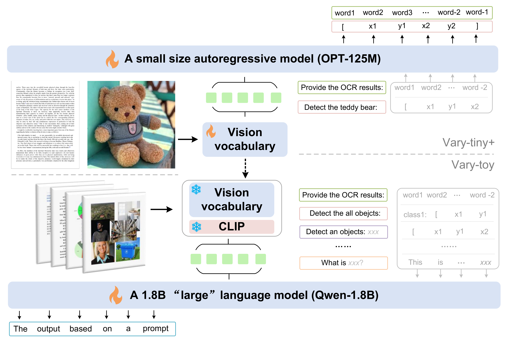

---

### ALLaVA-Longer

 

ALLaVA-Longer is an open-source VLM launched by the Chinese University of Hong Kong, Shenzhen. The research team trained it using high-quality data generated by GPT-4V, which includes detailed image descriptions, complex question instructions, and comprehensive answers. **This focus on data quality is a key aspect of this work**. Leveraging this data, ALLaVA-Longer was developed. The design of ALLaVA-Longer is based on the "input determines output principle," mainly attempting to refine the details of "multimodal alignment" and "visual instruction fine-tuning" at the data level (the former primarily aims to help the language model recognize visual objects and enhance its visual reasoning ability, while the latter focuses on enabling LVLMs to generalize across a wider range of instructions).

##### Details of Dataset Construction

1. **Construction of Multimodal Alignment Dataset**:

   - **Drawbacks of Existing Multimodal Alignment Datasets**: Existing work typically uses caption data to align images and text, but these datasets often contain short and coarse-grained captions. These brief captions introduce noisy signals, hindering the effectiveness of the visual-language alignment process. For example, the commonly used COCO dataset (Microsoft Common Objects in Context) includes many short image descriptions that may lack sufficient detail to effectively help the model understand and associate images with text.

   - **New Dataset Construction Method**: By using GPT-4V to generate high-quality caption data. GPT-4V can produce detailed image descriptions, complex instructions, and comprehensive answers, which are more informative and precise than the brief descriptions found in traditional datasets.

     > Essentially, this is a PLUS version of the dataset construction method used by [MiniGPT4/MiniGPT-v2](#minigpt4-series). The method can be referenced accordingly.

2. **Construction of Visual Instruction Fine-Tuning Dataset**:

   - **Drawbacks of Existing Visual Instruction Fine-Tuning Datasets**: The main issues are the relative simplicity of the questions and the brief and less informative answers. For instance, Vision-FLAN contains relatively simple questions, focusing more on basic tasks rather than complex reasoning problems. Additionally, although the answers are human-annotated, they are often very brief and lack detailed background and reasoning processes.
   
   - **New Dataset Construction Method**: First, GPT-4V generates detailed descriptions for each image, including primary objects, background elements, colors, and prominent features. Subsequently, GPT-4V formulates multiple complex questions based on the image descriptions, which require careful observation and strong reasoning abilities to answer. To ensure diversity, GPT-4V generates multiple candidate questions and then randomly selects one for answering. Finally, GPT-4V provides detailed answers to the selected questions, including not only the direct response but also the process of solving the problem and relevant background information.

   > **Example**: For an image containing a squirrel and a bird, the model would generate the following description, question, and answer:
   > **Description**: The image shows a squirrel standing in front of the camera, appearing to take a photo of the bird, with a mushroom-shaped object in the background.
   > **Question**: What is the source of humor in this image?
   > **Answer**: The humor comes from the role reversal and anthropomorphism. Usually, humans take photos of wildlife, but here the squirrel appears to be operating the camera to photograph the bird. This unusual scenario and the anthropomorphic behavior of the animals create a whimsical and amusing scene.

---

### MM1

 

A significant highlight of Apple's MM1 is its extensive and comprehensive ablation experiments conducted to determine the optimal combination of model design and data selection. Overall, MM1 conducted ablation experiments on the following aspects, subsequently proposing the overall VLM structure of MM1.

1. **Model Architecture Decisions**
   - Impact of Different Image Encoders and Vision-Language Connectors: Comparing different image encoders (e.g., ViT-L and ViT-H) and image resolutions (224px vs. 336px) on model performance.
   - Impact of Image Resolution and Image Token Count: Comparing different vision-language connector designs (e.g., average pooling, attention pooling, convolutional mapping) and different image token counts (64 and 144).

2. **Pre-Training Data Selection**:
   - Combination of Different Types of Pre-Training Data (image-text pairs, interleaved image-text documents, and pure text data): Comparing different pre-training data types (image-text pairs, interleaved image-text documents, pure text data) and different mixing ratios on model performance.
   - Impact of Data Mixing Ratios.

3. **Training Process**:
   - Impact of Hyperparameter Selection on Model Training: Performing grid searches for learning rates and weight decay on models of different scales to determine the optimal training hyperparameters.

The following conclusions were drawn:

1. **High image resolution and an appropriate number of image tokens are crucial for improving model performance**.
2. **C-Abstractor performs best as the vision-language connector under high-resolution settings**.
3. **A reasonable mixture ratio of pre-training data can achieve a good balance in multimodal and text understanding tasks**.
4. **Learning rate and weight decay parameters determined through grid search can significantly enhance model training effectiveness**.

Subsequently, the overall architecture of MM1 was determined:

- **Image Encoder**: ViT-H.
- **Language Model**: Transformer decoder models with parameters ranging from 3B to 30B, supporting larger-scale MoE (Mixture-of-Experts) models.
- **Vision-Language Connector**: C-Abstractor, using convolutional mapping to preserve local information of images and adaptive pooling to adjust the number of image tokens. Utilizing 144 image tokens.
- **Pre-Training Data Selection and Mixing Ratio**: 45% image-text pairs, 45% interleaved image-text documents, 10% pure text data.
- MoE Strategy: Details can be found at [link](#创新点-9).

##### Innovations

1. **Scalable Expert Model**:

   - The MM1 model expands the total parameters by increasing the number of experts in the language model. Specifically, MM1 designed two MoE models:
     - A 3B-MoE model with 64 experts, replacing every two standard dense layers with a sparse layer (MoE layer), totaling 64B parameters.
     - A 7B-MoE model with 32 experts, replacing every four standard dense layers with a sparse layer (MoE layer), totaling 47B parameters.
   - **Expert Selection and Load Balancing**: The MoE model employs a top-2 gating strategy, meaning only two experts are activated in each forward pass. Additionally, a load balance loss term with a coefficient of 0.01 is introduced to encourage an even distribution of load among the experts.

2. **Flexible Vision-Language Connector Design**: The primary function of the vision-language connector is to convert visual representations into a space that the language model can process. The MM1 team experimented with several different vision-language connector designs (including **average pooling**, **attention pooling**, **convolutional mapping**). However, it was found that while the connector design had a minor impact on the final performance, the image resolution and the number of image tokens had a significant impact.

   - To flexibly handle the number of image tokens and retain more detailed image information through convolution operations, MM1 chose C-Abstractor as the main vision-language connector.

3. **Refined Pre-Training Data Selection**

   - The MM1 team determined the optimal mixture ratio of different data types through the aforementioned ablation experiments: 45% image-text pairs, 45% interleaved image-text documents, 10% pure text data.
   - Specifically, the experiments adjusted the ratio of image-text pairs and interleaved document data, observing the model's performance in zero-shot and few-shot tasks, and then added or removed pure text data to observe its impact on few-shot and text understanding tasks. Finally, various combinations of image-text pairs, interleaved documents, and pure text data were used for training, observing their overall impact on various tasks.

4. **Support for High-Resolution Images**: MM1 employed a series of techniques to handle high-resolution images, including image scaling, positional embedding interpolation, and sub-image decomposition:

   - **Image Scaling**: First, the input image is scaled down to 672×672 for high-level representation. Simultaneously, the input image is adjusted to a resolution of 1344×1344 and then decomposed into four 672×672 sub-images.
   - **Sub-Image Decomposition**: For high-resolution input images (e.g., 1344×1344), they are decomposed into five 672×672 sub-images, each input independently into the vision encoder. This method has been shown in experiments to support image resolutions up to 1792×1792.
   - **Positional Embedding Interpolation**: In high-resolution image processing, MM1 adopts positional embedding interpolation to accommodate the new resolution. This method allows the visual Transformer backbone to adapt to new image resolutions during fine-tuning.

   > Research indicates that supporting a 1344×1344 image resolution can achieve a 15% relative improvement in SFT (Supervised Fine-Tuning) evaluation metrics. However, for the maximum image resolution of 1792×1792, the average performance slightly decreases, which may be due to many evaluation images being smaller than this resolution, and artifacts generated during resizing potentially affecting model performance.

---

### MiniCPM-V 2.0

 

MiniCPM-V is notably distinguished by its **OCR capabilities**, with the technical report claiming, "the model achieves the best performance in the open-source community on the comprehensive OCR ability evaluation benchmark OCRBench, and even approaches Gemini Pro in scene text understanding."

##### Summary of MiniCPM-V 2.0 Features (excerpted from the technical report):

1. **Leading OCR and Multimodal Understanding Capabilities**: MiniCPM-V 2.0 significantly enhances OCR and multimodal understanding capabilities, achieving scene text understanding performance close to Gemini Pro. It outperforms larger parameter models (e.g., 17-34B) on several mainstream evaluation benchmarks.
2. **Trustworthy Behavior**: MiniCPM-V 2.0 is the first edge multimodal large model aligned through multimodal RLHF, leveraging [RLHF-V](https://rlhf-v.github.io/) [CVPR'24] technologies. The model achieves performance comparable to GPT-4V on Object HalBench.
3. **Efficient Encoding of High-Resolution Images with Arbitrary Aspect Ratios**: MiniCPM-V 2.0 can process images up to 1.8 million pixels with any aspect ratio (based on the latest [LLaVA-UHD](https://arxiv.org/pdf/2403.11703.pdf) technology), allowing the model to perceive finer visual details such as small objects and dense text.
4. **Efficient Deployment**: MiniCPM-V 2.0 can be efficiently deployed on most consumer-grade graphics cards, personal computers, and mobile devices.
5. **Bilingual Support**: MiniCPM-V 2.0 offers leading bilingual multimodal capability support in Chinese and English. This capability is achieved through cross-lingual generalization techniques in multimodal capabilities proposed in the [VisCPM](https://arxiv.org/abs/2308.12038) [ICLR'24] paper.

##### MiniCPM-Llama3-V 2.5🔥

The latest model in the MiniCPM series, featuring the following new characteristics:

1. **Powerful Edge Multimodal Model**: With only 8B active parameters, it surpasses many larger parameter multimodal models—such as Gemini Pro and GPT-4V—in various benchmarks.
   - The visual encoder uses SigLIP-400M; the compression layer uses the perceiver resampler structure; the language model uses Llama-3 8B.
   - **Handling High-Resolution and Variable Aspect Ratio Images**: MiniCPM-Llama3-V 2.5 employs the adaptive visual encoding method proposed in the LLaVA-UHD paper. Each input image is first optimally sliced based on its size and aspect ratio, then each slice is adapted according to the ViT's pre-training resolution. Finally, MiniCPM-Llama3-V 2.5 processes each slice through the visual encoder.
2. **Further Enhanced OCR Capabilities**: Achieving an OCRBench score of 725, it surpasses GPT-4o, GPT-4V, Gemini Pro, Qwen-VL-Max, and other commercial closed-source models, reaching the highest level.
3. **Friendly to Low Computational Resource Users**: With a quantized version, it requires only 8GB VRAM for deployment. It can run inference smoothly on consumer-grade graphics cards and achieve 6-8 tokens/s inference speed on mobile devices.
4. **Supports 30+ Languages**.
5. **Trustworthy Behavior**: The hallucination rate on Object HalBench is reduced to 10.3%, significantly lower than GPT-4V-1106 (13.6%), achieving the best level in the open-source community.
6. **Mobile Optimization**: MiniCPM-Llama3-V 2.5 systematically employs model quantization, CPU, NPU, and compilation optimization techniques for efficient acceleration. Through 4-bit quantization and cooperation with the llama.cpp framework, it can **achieve a language model encoding speed of 8-9 tokens per second and a decoding speed of 3-4 tokens per second**.

---

### DeepSeek-VL

 

The primary design goal of DeepSeek-VL is to extend multimodal capabilities without compromising NLP performance, ensuring that the generated text is more human-like and capable of completing various downstream tasks in the field of computer vision. DeepSeek-VL possesses the following innovations and features:

1. **Data Construction**

   - **Diversity and Scalability**: The dataset for DeepSeek-VL encompasses real-world scenarios, including web page screenshots, PDFs, OCR, charts, and knowledge-based content (such as expert knowledge and textbooks), ensuring diversity and comprehensiveness in the data.
   
   - **Practical Application Scenarios**: Use case categories were created based on real user scenarios, and corresponding instruction tuning datasets were constructed. Fine-tuning with these datasets significantly enhances the model's user experience in practical applications.

2. **Model Architecture**

   - **Hybrid Vision Encoder**: DeepSeek-VL employs a hybrid vision encoder capable of efficiently processing high-resolution images (1024 x 1024) with low computational overhead, capturing key semantic and detailed information. This design enhances inference efficiency while maintaining rich visual information.
   
   - **Combination of High and Low Resolution**: The model integrates the capabilities to process both low-resolution (384 x 384) and high-resolution (1024 x 1024) images, ensuring that it can capture sufficient detail and semantic information when handling complex visual tasks.

3. **Training Strategy**

   - **Priority on Language Capability**: During multimodal pre-training, DeepSeek-VL retains a majority of language data (at least 70%), ensuring the preservation and enhancement of language model capabilities. Gradually increasing the proportion of vision-language data balances the development of multimodal and language capabilities.
   
   - **Modality Warm-up Strategy**: A "modality warm-up" strategy is introduced, which gradually adjusts the ratio of different modality data during training. This ensures balanced development of visual and language capabilities, avoiding the degradation of abilities due to the overtraining of a single modality.

