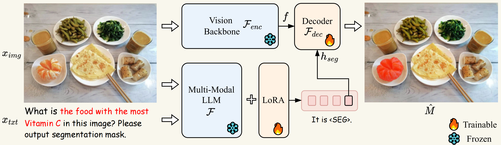

# Visual Perception via Large Language Models

This page compiles recent works on **applying large models to the field of image segmentation**. Image segmentation empowered by large models has acquired the ability to understand complex instructions, recognize images, and organically integrate the two. The effect achieved by such models is that there is no need to explicitly specify the name of the object you want to segment; instead, you can obtain segmentation of the object by providing cues about its properties. This demonstrates the realization of **visual perception via large language models**.

### LISA

#### Motivation

Current visual perception systems still possess certain limitations. These systems rely on explicit user instructions or predefined categories to identify target objects and cannot actively reason and understand implicit user intentions. This reasoning capability is crucial for developing next-generation intelligent perception systems and holds significant potential for industrial applications, particularly in robotics. Therefore, the authors introduce a new segmentation task—reasoning segmentation—which requires generating binary segmentation masks based on implicit query texts involving complex reasoning. Notably, the query text is not limited to simple references (e.g., “the orange”), but includes more complex descriptions involving intricate reasoning or world knowledge (e.g., “food rich in Vitamin C”).

#### Innovations

1. **Reasoning Segmentation Task**: The reasoning segmentation task involves generating a binary segmentation mask based on an input image and an implicit query text involving complex reasoning. Unlike referring segmentation tasks, the query text in reasoning segmentation is more complex, involving intricate expressions or world knowledge.
2. **Model Architecture**:
   - **Embedding as Mask**: The LISA model introduces a <SEG> token into the existing vocabulary, representing the segmentation mask as an embedding. This method allows LISA to perform end-to-end training within the framework of existing multimodal large language models (LLMs), endowing the model with segmentation capabilities.
   - **LoRA Fine-Tuning**: Utilizing the Low-Rank Adaptation (LoRA) method for efficient fine-tuning, the model keeps the vision backbone frozen and only fine-tunes the decoder and certain embedding layers. This approach prevents catastrophic forgetting, maintaining the model's text generation and conversational capabilities.
3. **Benchmark Establishment**: The authors have created a benchmark named ReasonSeg, comprising over a thousand image-instruction-mask data samples to evaluate the model’s reasoning segmentation capabilities.

#### Model Architecture

  

---