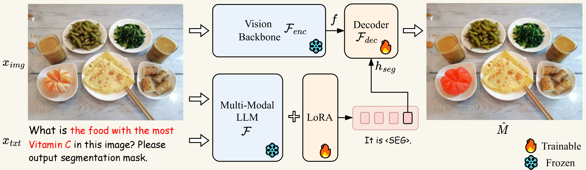

# 将大模型应用于图像分割

本页面统计了近期的一些关于将大模型应用于图像分割领域的一些工作，大模型赋能下的图像分割拥有了理解复杂指令、识别图像并将两者有机结合的能力。这种模型可以达到的效果是：不需要显示地指定出你想要分割非物品名称，而是给予你想分割对象的提示（可以是对象的各种性质）即可获得对该对象的分割。达到了通过大型语言模型实现视觉感知的效果。

### LISA

#### 动机

当前视觉感知系统还是具有一定局限性，这些系统依赖于明确的用户指令或预定义的类别来识别目标对象，不能**主动推理和理解隐含的用户意图**。这种推理能力对于开发下一代智能感知系统至关重要，并且在工业应用中具有巨大的潜力，尤其是在机器人技术领域。所以作者引入了一种新的分割任务——推理分割，该任务需要基于涉及复杂推理的隐式查询文本生成二进制分割掩码。值得注意的是，查询文本不限于简单的引用（例如，“橙子”），而是涉及复杂推理或世界知识的更复杂的描述（例如，“富含维生素C的食物”）。

#### 创新点

1. **推理分割任务**：推理分割任务是生成一个二值分割掩码，输入为图像和包含复杂推理的隐式查询文本。与引用分割任务不同，推理分割任务的查询文本更复杂，涉及复杂的表达或世界知识。
2. **模型架构**：
   - **嵌入即掩码**：LISA模型通过在原有词汇表中引入<SEG>标记，将分割掩码作为嵌入表示。这种方法使得LISA能够在现有多模态大语言模型（LLM）的框架内进行端到端训练，赋予模型分割能力。
   - **LoRA微调**：采用LoRA（低秩自适应）方法进行高效微调，保持视觉骨干网络冻结，仅微调解码器和部分嵌入层。这避免了灾难性遗忘，保持了模型的文本生成和对话能力。
3. **提出一个benchmark**：建立了一个名为ReasonSeg的基准测试，包含超过一千个图像-指令-掩码数据样本，用于评估模型的推理分割能力。

#### 模型架构

  

---
